# 进销存系统软件体系结构描述文档

1. ##引言

    ####1.1编制目的

   本报告详细完成对进销存系统的概要设计，达到指导详细设计和开发的目的，同时实现和测试人员及用户的沟通。
   本报告面向开发人员、测试人员及最终用户而编写，是了解系统的导航。

  ### 1.2词汇表

| 词汇名称        | 词汇含义             | 备注   |
| ----------- | ---------------- | ---- |
| *ui         | 表示某展示层           |      |
| *bl         | 表示某逻辑层           |      |
| *data       | 表示某数据层           |      |
| RMI         | 表示远程方法调用         |      |
| utilitybl   | 表示初始化和业务逻辑上下文的工作 |      |
| datafactory | 表示调用其他数据库的方法     |      |

###   1.3参考资料

1.IEEE std 1471-2000

2.丁二玉，刘钦.计算与软件工程（卷二）[M]机械工业出版2012：134—182

##2. 产品概述

  参考进销存系统用例文档和进销存系统需求规格说明文档中对产品的概括描述。

##3. 逻辑视角

  进销存管理系统中，选择了分层体系结构风格，将系统分为三层（展示层、业务逻辑层、数据层）能够很好的示意整个高层抽象。展示层包含GUI界面的实现，业务逻辑层包含业务逻辑的处理实现，数据层包括数据的持久化和访问。分层体系结构的逻辑视角和逻辑设计方案如图1图2（文档外）所示。

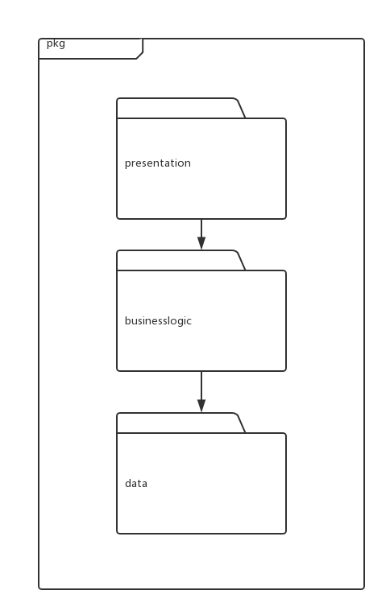

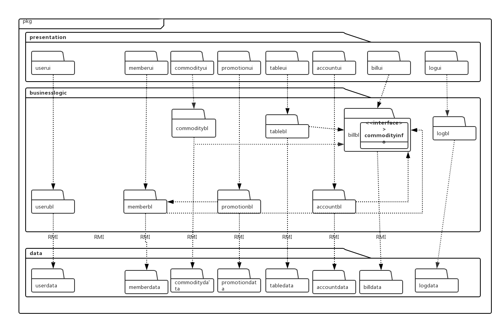

## 4.组合视角

[软工2 166]与抽象的逻辑设计相比，实现物理设计要考虑更多的实现细节，这些细节有：

1）presentation层与logic层被置于客户端，data层被置于服务器端，那么logic层的开发包不可能依赖于data层的开发包。使用RMI技术，将data层开发包分解为置于客户端的data_service接口包和置于服务器端的data层开发包。这样一来，logic层开发包依赖于data_service包，data_service包和data层的开发包都依赖于RMI类库包。

2）所有的data层开发包都需要进行数据持久化（例如读写数据库、读写文件等），所以它们会有一些重复代码，可以将重复代码独立为新的开发包，然后所有的data层开发包都依赖于databaseutility。datavaseutility会依赖于JDBC类库包。

3）所有的presentation层开发包都需要使用图形类型建立界面，都要依赖于图形界面类库包。

4）此外，presentation层实现时，由main_ui包负责整个页面之间的跳转逻辑。其他各包负责各自页面自身的功能。

5）在分层风格的典型设计中，不希望高层直接依赖于低层，而是为低层建立接口包，实现依赖倒置原则，所以应该调整为：各presentation层开发包（调用）依赖于logic层接口包businesslogicservice包，logic层开发包也依赖于（实现了）logic层接口包businesslogicservice包。

6）在分层风格的典型设计中，presentation层与logic层之间、logic层与data层之间可能会传递复杂数据对象，那么相邻两层都需要使用数据对象声明，所以需要将数据对象声明独立为开发包（VO包和PO包）。

7） 使用依赖倒置原则来消除包的循环依赖问题，将循环依赖变为单向依赖：

- ​	Commodity和Bill：将部分Bill类抽象接口置入Commodity类，这样Bill单向依赖于Commodity

8） 在logic层中，初始化和业务逻辑层上下文的工作被分配到utilitybl包中。

 ###  4.1开发包图

进销存系统的最终开发包图的设计如表1所示

##### 表1   进销存管理系统的最终开发包设计

| 开发（物理）包              | 依赖的其他开发包                                 |
| -------------------- | ---------------------------------------- |
| mainui               | commdityui，memberui，promotionui，userui，accountui，tableui，billui，vo |
| commodityui          | commodityblservice，界面类库包                 |
| commodityblservice   |                                          |
| commoditybl          | commodityblservice，commoditydataservice，po，billbl,logbl |
| commoditydataservice | Java RMI，po                              |
| commoditydata        | Java RMI，po，databaseutility              |
| memberui             | memberblservice，界面类库包                    |
| memberblservice      |                                          |
| memberbl             | memberblservice，memberdataservice，po，commditybl， billbl,logbl |
| memberdataservice    | Java RMI，po                              |
| memberdata           | Java RMI，po，databaseutility              |
| promotionui          | promotionblservice，界面类库包                 |
| promotionblservice   |                                          |
| promotionbl          | promotionblservice，promotiondataservice，commditybl，memberbl， vo,logbl |
| promotiondataservice | Java RMI，po                              |
| promotiondata        | Java RMI，po，databaseutility              |
| userui               | userblservice，界面类库包                      |
| userblservice        |                                          |
| userbl               | Userinterface，Userdataclient，Userpo,logbl |
| userdataservice      | Java RMI，po                              |
| userdata             | RMI，po，databaseutiity                    |
| accountui            | accountblservice，界面类库包                   |
| accountblservice     |                                          |
| accountbl            | accountblservice，accountdataservice，po， billbl,logbl |
| accountdataservice   | Java RMI，po                              |
| accountdata          | Java RMI，po，databaseutility              |
| tableui              | tableblservice，界面类库包                     |
| tableblservice       |                                          |
| tablebl              | tableblservice，tabledataservice，po，billbl，commoditybl,logbl |
| tabledataservice     | Java RMI，po                              |
| tabledata            | Java RMI，po，databaseutility              |
| billui               | billblservice，界面类库包                      |
| billblservice        |                                          |
| billbl               | billblservice，billdataservice，po，salebl,logbl |
| billdataservice      | Java RMI，po                              |
| billdata             | Java RMI，po，databaseutility              |
| logui                | logbl,界面类库包                              |
| logbl                | logdataservice,logblservice              |
| logdata              | Java RMI,po                              |
| logdataservice       | Java RMI，po，databaseutility              |
| vo                   |                                          |
| po                   |                                          |
| utilitybl            |                                          |
| 界面类库包                |                                          |
| Java RMI             |                                          |
| databaseutility      | JDBC                                     |

进销存管理系统客户端开发包图如图3所示，服务器端开发包图如图4所示。

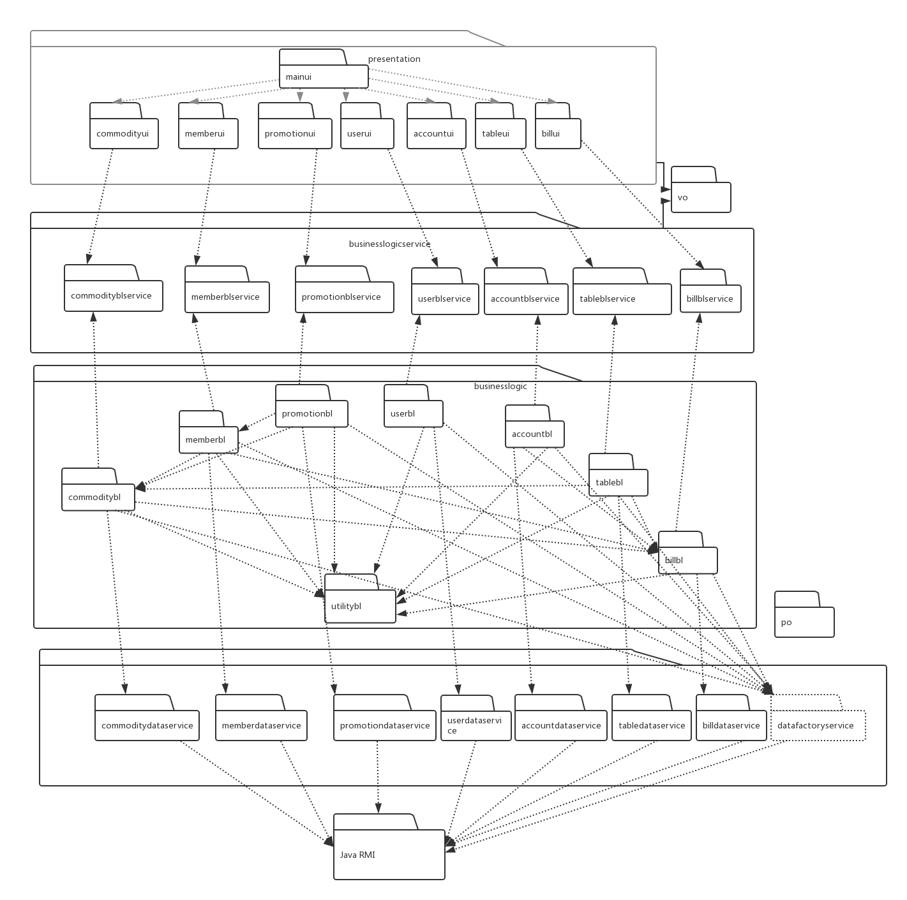

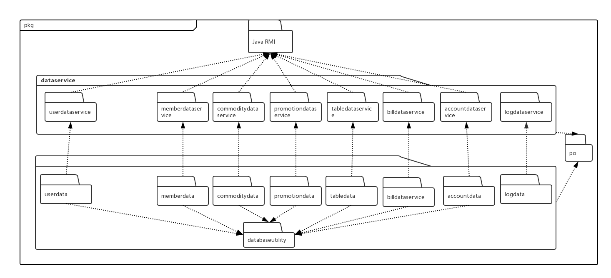

### 4.2运行时进程

​	在进销存管理系统中，会有多个客户端进程和一个服务器进程，其进程图如文档外进程图（图5）所示。结合部署图，客户端进程是在客户端机器上运行，服务器进程在服务器端机器上运行。

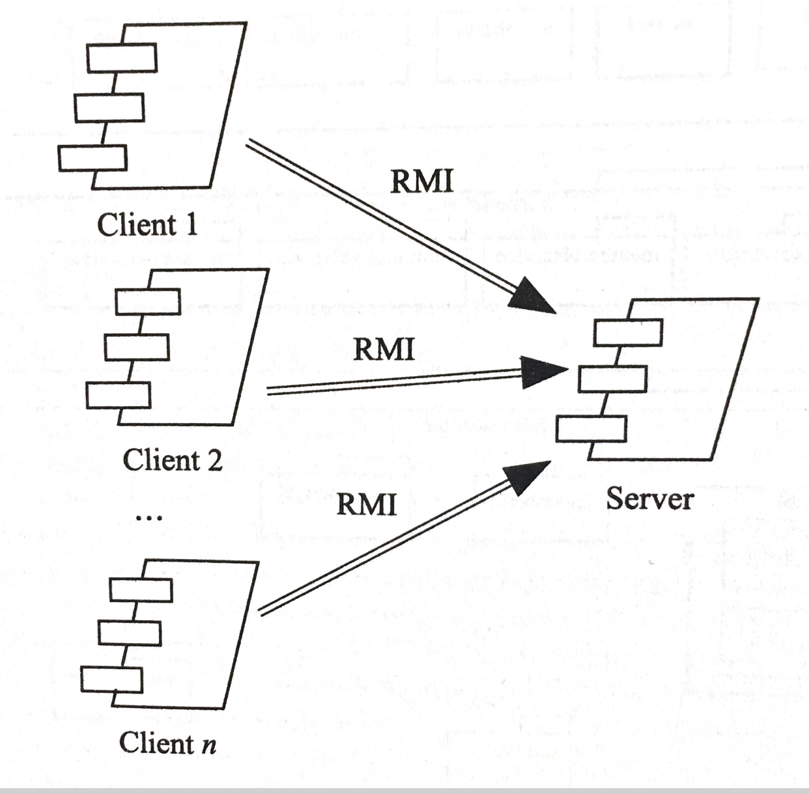

### 4.3物理部署

进销存管理系统中客户端构件是放在客户端机器上，服务器端构件是放在服务器机器上。在客户端节点上，还要部署RMIStub构件。由于Java RMI构件属于JDK 6.0 的一部分。所以，在系统JDK环境已经设置好的情况下，不需要再独立部署。部署图如文档外部署图（图6）所示。

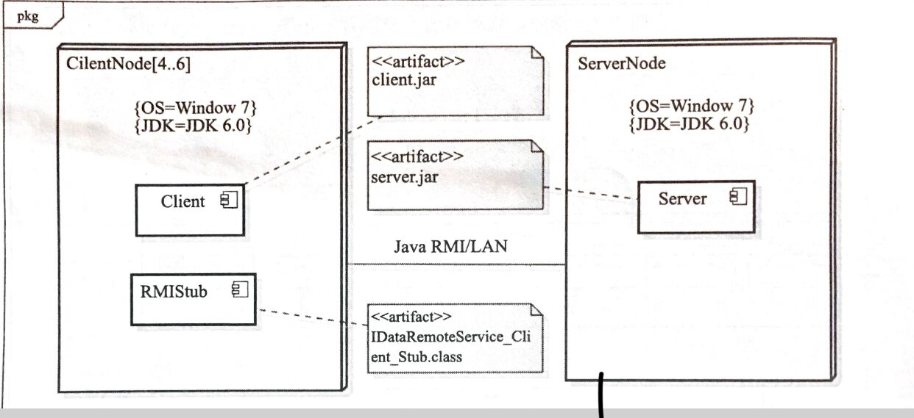

##5.接口视角

### 5.1模块的职责

客户端模块和服务器模块视图如文档外模块视图(图7 图8)所示

客户端各层和服务器各层的职责分别如表2和表3所示

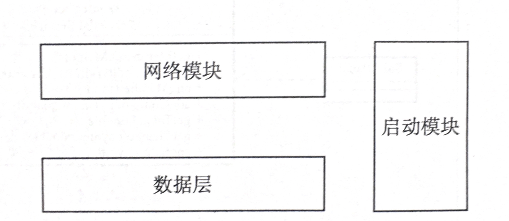

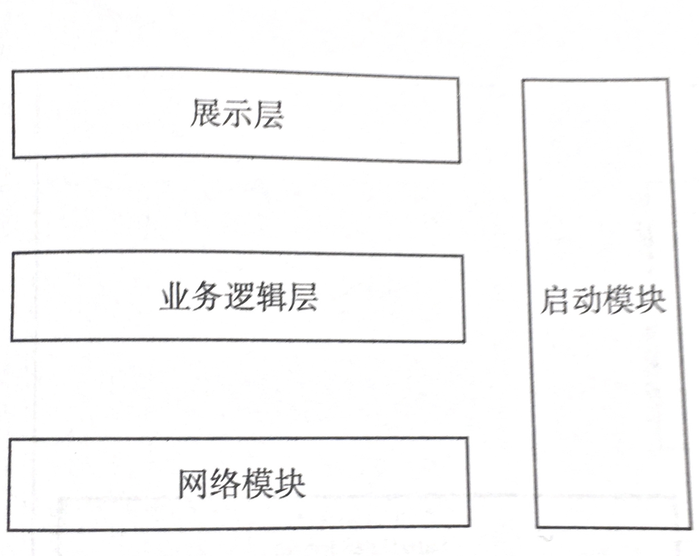

#####                                                                                              表2 客户端各层的职责

|    层    |                  职责                  |
| :-----: | :----------------------------------: |
|  启动模块   |          负责初始化网路通信机制，启动用户界面          |
|  用户界面层  |          基于窗口的进销存系统客户端用户界面           |
|  业务逻辑层  |        对于用户界面的输入进行响应并进行业务处理逻辑        |
| 客户端网络模块 | 利用Java RMI机制查找RMI服务，，检测网络连接状态，进行短线重连 |

#####                                                                                             表3 服务器端各层的职责

|    层     |             职责              |
| :------: | :-------------------------: |
|   启动模块   |     负责初始化网路通信机制，启动用户界面      |
|   数据层    |      负责数据的持久化以及数据访问接口       |
| 服务器端网络模块 | 利用Java RMI机制查找RMI服务，注册RMI服务 |

每层只是使用下方直接接触的层。层与层之间仅仅是通过接口的调用来完成的。层之间调用的接口如表4所示。

##### 表4 层之间调用的接口

| 接口                                       | 服务调用方    | 服务提供方    |
| ---------------------------------------- | -------- | -------- |
| userblservice saleblservice memberblservice commodityblservice promotionblservice tableblservice billblservice accountblservice | 客户端展示层   | 客户端业务逻辑层 |
| userdataservice saledataservice memberdataservice commoditydataservice promotiondataservice tabledataservice billdataservice accountdataservice datafactoryservice | 客户端业务逻辑层 | 服务器端数据层  |

借用库存管理用例来说明层与层之间的调用，如文档外图“库存管理层与层之间调用的接口”（图9）所示。每一层之间都是由上层依赖了一个接口（需接口),而下层实现了这个接口（供接口）。CommodityBlService提供了Commodity界面所需要的业务逻辑功能。CommodityDataService提供了对数据库的增删查改等操作。这样的实现就大大降低了层与层之间的耦合度。

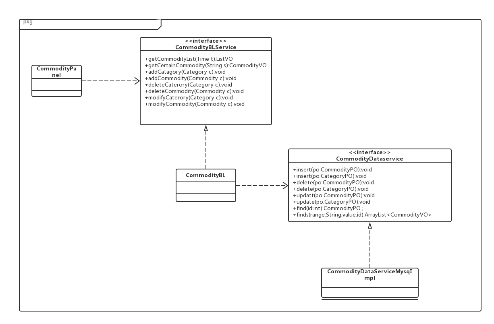

### 5.2用户界面层的分解

根据需求，系统存在27个用户界面，界面跳转如图10所示。

服务器端和客户端用户界面设计接口一直，只是具体界面不一样。用户界面类如图11所示。

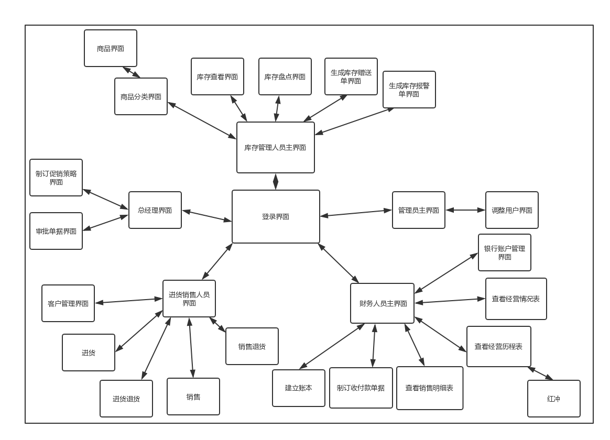

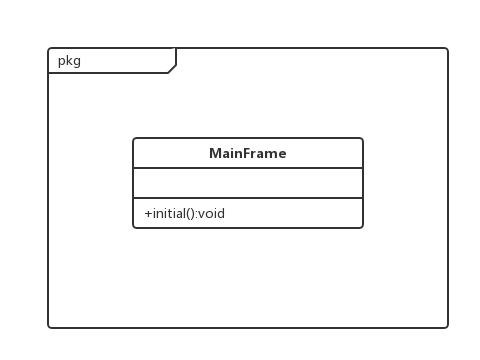

####5.2.1用户界面层模块的职责

如表5所示为用户界面层模块职责。

##### 表5 用户界面层模块职责

| 模块                   | 职责                     |
| -------------------- | ---------------------- |
| MainFrame            | 界面Frame，负责界面的显示和界面的跳转  |
| SaleMainPanel        | 负责销售活动界面的显示和销售相关界面间的跳转 |
| MemberPanel          | 负责客户管理界面的显示            |
| ImportPanel          | 负责进货（制定进货单据）界面的显示      |
| Import_ReturnPanel   | 负责进货退货界面的显示（制定进货单据）    |
| SalePanel            | 负责销售界面的显示（制定销售单据）      |
| Sale_ReturnPanel     | 负责销售退货界面的显显示（制定销售退货单）  |
| StockMainPanel       | 负责库存界面的显示和库存相关界面间的跳转   |
| CategoryPanel        | 负责商品分类界面的显示            |
| CommodityPanel       | 负责商品信息界面的显示            |
| StockWarningPanel    | 负责库存报警单界面的显示（生成库存报警单）  |
| StockCheckPanel      | 负责库存查看界面的显示            |
| StockInventoryPanel  | 负责库存盘点界面的显示            |
| StockPresentPanel    | 负责库存赠送单界面的显示           |
| FinanceMainPanel     | 负责财务活动的显示和财务相关的界面的跳转   |
| Pay/GetBillPanel     | 负责制定收付款单界面的显示          |
| SaleDetailsPanel     | 负责查看销售明细表界面的显示         |
| ManageCoursePanel    | 负责查看经营历程表界面的显示         |
| ManageSituationPanel | 负责查看经营情况表界面的显示         |
| AccountPanel         | 负责管理银行账户界面的显示          |
| RedPanel             | 负责对账单进行红冲界面的显示         |
| ManagerMainPanel     | 负责总经理活动的显示和其相关界面的跳转    |
| StrategyPanel        | 负责制定促销策略界面的显示          |
| ExaminePanel         | 负责审批单据界面的显示            |
| AdministratorPanel   | 负责管理员活动界面的显示和其相关界面的跳转  |
| UserChangePanel      | 负责修改用户界面的显示            |
| AccountBookPanel     | 负责期初建账界面的显示            |
| LogPanel             | 负责日志查看界面的显示            |

####5.2.2 用户界面层模块的接口规范

用户界面层模块的接口规范如表6所示。

##### 表6 用户界面层模块接口规范

LoginPanel：

| 语法   | public static  void showLoginUI() |
| ---- | --------------------------------- |
| 前置条件 | 无                                 |
| 后置条件 | 显示Frame以及LoginPanel               |

SaleMainUI:

| 语法   | public static  void showSaleMainUI() |
| ---- | ------------------------------------ |
| 前置条件 | 销售进货人员登录                             |
| 后置条件 | 显示销售人员主界面（SaleMainPanel）             |

MemberUI:

| 语法   | public static  void showMemberUI() |
| ---- | ---------------------------------- |
| 前置条件 | 进货销售人员选择管理客户                       |
| 后置条件 | 显示客户管理界面（MemberPanel）              |

ImportUI:

| 语法   | public static  void showImportUI() |
| ---- | ---------------------------------- |
| 前置条件 | 销售进货人员选择制定进货单据                     |
| 后置条件 | 显示销售界面（制定销售单据）(ImportUI)           |

Import_ReturnUI:

| 语法   | public static  void showImportReturnUI() |
| ---- | ---------------------------------------- |
| 前置条件 | 进货销售人员选择进货退货                             |
| 后置条件 | 显示制定进货退货单据界面（Import_ReturnUI）            |

SaleUI:
| 语法   | public static  void showSaleUI() |
| ---- | -------------------------------- |
| 前置条件 | 进货销售人员选择销售                       |
| 后置条件 | 显示制定销售单据界面（SaleUI）               |

Sale_ReturnUI:
| 语法   | public static  void showSaleReturnUI() |
| ---- | -------------------------------------- |
| 前置条件 | 进货销售人员选择销售退货                           |
| 后置条件 | 显示制定销售退货单界面（Sale_ReturnUI）             |

StockMainUI:

| 语法   | public static  void showStockMainUI() |
| ---- | ------------------------------------- |
| 前置条件 | 库存管理人员登录                              |
| 后置条件 | 显示库存管理人员主界面（StockMainPanel）           |

CategoryUI:

| 语法   | public static  void showCategoryUI() |
| ---- | ------------------------------------ |
| 前置条件 | 库存管理人员人员选择商品分类                       |
| 后置条件 | 显示商品分类界面（CategoryPanel）              |

CommodityUI:

| 语法   | public static  void showCommodityUI() |
| ---- | ------------------------------------- |
| 前置条件 | 库存管理人员选择商品信息                          |
| 后置条件 | 显示商品信息界面(CommodityPanel)              |

StockCheckUI:
| 语法   | public static  void showStockCheckUI() |
| ---- | -------------------------------------- |
| 前置条件 | 库存管理人员选择库存查看                           |
| 后置条件 | 显示制定库存查看界面（StockCheckPanel）            |

StockInventoryUI:
| 语法   | showStockInventoryUI()  |
| ---- | ----------------------- |
| 前置条件 | 库存管理人员选择库存盘点            |
| 后置条件 | 显示库存盘点界面（Sale_ReturnUI） |

FinanceMainUI

| 语法   | public static  void showFianceMainUI() |
| ---- | -------------------------------------- |
| 前置条件 | 财务人员登录                                 |
| 后置条件 | 显示销售人员主界面（FinanceMainPanel）            |

ReceiveBillUI

| 语法   | public static  void showReceiveBillUI() |
| ---- | --------------------------------------- |
| 前置条件 | 财务人员选择制定收款单                             |
| 后置条件 | 显示制定收款单据的界面（ReceiveBillPanel）           |

CashBillUI

| 语法   | public static  void showCashBillUI() |
| ---- | ------------------------------------ |
| 前置条件 | 财务人员选择制定现金费用单                        |
| 后置条件 | 显示制定现金费用单据的界面（CashBillPanel）         |

PayBillUI

| 语法   | public static  void showPayBillUI() |
| ---- | ----------------------------------- |
| 前置条件 | 财务人员选择制定付款单                         |
| 后置条件 | 显示制定付款单据的界面（PayBillPanel）           |

SaleDetailsUI

| 语法   | public static  void showSaleDetailsUI() |
| ---- | --------------------------------------- |
| 前置条件 | 财务人员/总经理选择查看销售明细表                       |
| 后置条件 | 显示销售明细表界面的界面（SaleDetailsPanel）          |

ManageCourseUI

| 语法   | public static  void showManageCourseUI() |
| ---- | ---------------------------------------- |
| 前置条件 | 财务人员/总经理选择查看经营历程表                        |
| 后置条件 | 显示经营历程表的界面（ManageCoursePanel）            |

ManageSituationUI

| 语法   | public static  void showManageSituationUI() |
| ---- | ---------------------------------------- |
| 前置条件 | 财务人员/总经理选择查看经营情况表                        |
| 后置条件 | 显示经营情况表的界面（ManageSituationPanel）         |

AccountUI

| 语法   | public static  void showAccountUI() |
| ---- | ----------------------------------- |
| 前置条件 | 财务人员选择管理银行账户                        |
| 后置条件 | 显示银行账户管理的界面（AccountPanel）           |

ManagerMainUI

| 语法   | public static  void showManagerMainUI() |
| ---- | --------------------------------------- |
| 前置条件 | 总经理登录                                   |
| 后置条件 | 显示总经理的主界面（ManagerMainPanel）             |

StrategyUI

| 语法   | public static  void showStrategyUI() |
| ---- | ------------------------------------ |
| 前置条件 | 总经理选择制定促销策略                          |
| 后置条件 | 显示制定促销策略的界面（StrategyPanel）           |

ExamineUI

| 语法   | public static  void showExamineUI() |
| ---- | ----------------------------------- |
| 前置条件 | 总经理选择审批单据                           |
| 后置条件 | 显示审批单据的界面（ExaminePanel）             |

AdministratorMainUI

| 语法   | public static  void showAdministerMainUI() |
| ---- | ---------------------------------------- |
| 前置条件 | 管理员已登录                                   |
| 后置条件 | 显示管理员主界面（AdministratorMainPanel）         |

UserChangeUI

| 语法   | public static  void showUserChangeUI() |
| ---- | -------------------------------------- |
| 前置条件 | 管理员选择用户管理                              |
| 后置条件 | 显示用户管理的界面（UserChangePanel）             |

AccountBookUI

| 语法   | public static  void showAccountBookUI() |
| ---- | --------------------------------------- |
| 前置条件 | 财务人员选择期初建账                              |
| 后置条件 | 显示期初建账的界面（AccountBookPanel）             |

LogUI

| 语法   | public static  void showLogUI() |
| ---- | ------------------------------- |
| 前置条件 | 管理员或总经理选择查看操作日志                 |
| 后置条件 | 显示操作日志的界面（LogPanel）             |

EmailUI

| 语法   | public static  void showLogUI() |
| ---- | ------------------------------- |
| 前置条件 | 用户登陆选择查看信箱                      |
| 后置条件 | 显示信箱的界面（EmailUI）                |

用户界面所需的服务接口如表7所示

##### 表7 用户界面层模块所需的服务接口

| 服务名                                      | 服务                |
| ---------------------------------------- | ----------------- |
| businesslogicservice.LoginBLService      | 登录界面的业务逻辑接口       |
| businesslogicservice.SaleMainBLService   | 销售人员主界面业务逻辑接口     |
| businesslogicservice.MemberBLService     | 客户管理界面的业务逻辑接口     |
| businesslogicservice.ImportBLService     | 进货界面的业务逻辑接口       |
| businesslogicservice.Import_ReturnBLService | 进货退货界面的业务逻辑       |
| businesslogicservice.SaleBLService       | 销售界面的业务逻辑接口       |
| businesslogicservice.Sale_ReturnBLService | 销售退货界面的业务逻辑接口     |
| businesslogicservice.StockMainBLService  | 库存管理人员主界面业务逻辑接口   |
| businesslogicservice.CommodityBLService  | 商品信息界面的业务逻辑接口     |
| businesslogicservice.CategoryBLService   | 商品分类界面的业务逻辑接口     |
| businesslogicservice.StockWarningBLService | 库存报警单界面的业务逻辑接口    |
| businesslogicservice.StockCheckService   | 库存查看界面的业务逻辑接口     |
| businesslogicservice.StockInventoryBLService | 库存盘点界面的业务逻辑接口     |
| businesslogicservice.StockPresentBLService | 库存赠送单界面的业务逻辑接口    |
| businesslogicservice.Pay/GetBillBLService | 制定收付款单界面业务逻辑接口    |
| businesslogicservice.SaleDetailsBLService | 查看销售明细表界面界面业务逻辑接口 |
| businesslogicservice.ManageCourseBLService | 查看经营历程表界面业务逻辑接口   |
| businesslogicservice.ManageSituationBLService | 查看经营情况界面业务逻辑接口    |
| businesslogicservice.AccountBLService    | 银行账户管理界面业务逻辑接口    |
| businesslogicservice.RedBLService        | 红冲界面业务逻辑接口        |
| businesslogicservice.ManagerMainBLService | 总经理主界面业务逻辑接口      |
| businesslogicservice.StrategyBLService   | 制定促销策略界面业务逻辑接口    |
| businesslogicservice.ExamineBLService    | 审批单据界面业务逻辑接口      |
| businesslogicservice.AdministratorBLService | 管理员主界面业务逻辑接口      |
| businesslogicservice.UserChangeBLService | 用户管理界面业务逻辑接口      |
| businesslogicservice.AccountBookBLService | 期初建账界面业务逻辑接口      |
| businesslogicservice.LogBLService        | 日志查看界面业务逻辑接口      |

#### 5.2.3 用户界面模块设计原理

用户界面利用Java的JavaFx库来实现。

### 5.3 业务逻辑层的分解

业务逻辑层包括多个针对界面的业务逻辑处理对象。例如，User对象负责处理登录界面的业务逻辑；Sales对象负责销售界面的业务逻辑。业务逻辑层的设计如文档外“业务逻辑层的设计”（图12）所示。

####5.3.1 业务逻辑层模块的职责

业务逻辑层模块的职责如表8所示

##### 表8 业务逻辑层模块的职责

| 模块          | 职责                   |
| ----------- | -------------------- |
| userbl      | 负责实现用户管理界面与登录界面所需的服务 |
| commoditybl | 负责实现库存管理与商品管理界面所需的服务 |
| tablebl     | 负责实现表格查看界面所需的服务      |
| billbl      | 负责实现表单制定与查看界面所需的服务   |
| accountbl   | 负责实现银行账户管理界面所需的服务    |
| memberbl    | 负责实现客户管理界面所需的服务      |
| promotionbl | 负责实现制定促销策略界面所需的服务    |
| logbl       | 负责实现查看日志界面所需要的服务     |

#### 5.3.2 业务逻辑层模块的接口规范

业务逻辑层模块的接口规范如表9所示

##### 表9 业务逻辑层模块的接口规范

##### commoditybl模块的接口规范

提供的服务（供接口）                               

Commodity.findCommodityByField

| 语法   | public ArrayList<CommodityVO> findCommodityByField(String field) |
| ---- | ---------------------------------------- |
| 前置条件 | 查询关键字正确，库存管理人员已登录                        |
| 后置条件 | 返回商品列表信息                                 |

Commodity.addCommodity

| 语法   | public boolean addCommodity(CommodityVO commodityVO) |
| ---- | ---------------------------------------- |
| 前置条件 | 选择新增商品且商品信息填写完整且符合要求，库存管理人员已登录           |
| 后置条件 | 新增商品并将其作为持久化对象插入数据库，返回维护结果               |

Commodity.addCategory

| 语法   | public boolean addCategory(CategoryVO categoryVO) |
| ---- | ---------------------------------------- |
| 前置条件 | 选择新增分类，分类信息填写完整，库存管理人员已登录                |
| 后置条件 | 新增分类并将其作为持久化对象插入数据库，返回维护结果               |

Commodity.deleteCommodity
| 语法   | public boolean deleteCommodity(CommodityVO commodityVO) |
| ---- | ---------------------------------------- |
| 前置条件 | 选择删除商品，库存管理人员已登录                         |
| 后置条件 | 删除商品并从数据库中删除单一持久化对象，返回维护结果               |

Commodity.deleteCategory

| 语法   | public boolean deleteCategory(CategoryVO categoryVO) |
| ---- | ---------------------------------------- |
| 前置条件 | 选择删除分类，库存管理人员已登录                         |
| 后置条件 | 删除分类并从数据库中删除单一持久化对象，返回维护结果               |

Commodity.updateCommodity

| 语法   | public boolean updateCommodity(CommodityVO commodityVO) |
| ---- | ---------------------------------------- |
| 前置条件 | 选择修改商品，库存管理人员已登录                         |
| 后置条件 | 更新商品并从数据库中更新单一持久化对象，返回维护结果               |

Commodity.updateCategory

| 语法   | public boolean updateCategory(CategoryVO categoryVO) |
| ---- | ---------------------------------------- |
| 前置条件 | 选择修改分类，库存管理人员已登录                         |
| 后置条件 | 更新分类并从数据库中更新单一持久化对象，返回维护结果               |

Commodity.findCommodityByName

| 语法   | public CommodityVO findCommodityByName(String name) |
| ---- | ---------------------------------------- |
| 前置条件 | 输入类型正确，库存管理人员已登录                         |
| 后置条件 | 返回符合条件的商品信息                              |

Commodity.findCommodityByID

| 语法   | public CommodityVO findCommodityByID(long id) |
| ---- | ---------------------------------------- |
| 前置条件 | 输入类型正确，库存管理人员已登录                         |
| 后置条件 | 返回符合条件的商品信息                              |

Commodity.findCategoryByName

| 语法   | public CategoryVO findCategoryByName(String name) |
| ---- | ---------------------------------------- |
| 前置条件 | 输入类型正确，库存管理人员已登录                         |
| 后置条件 | 返回符合条件的分类信息                              |

Commodity.findCategoryByID

| 语法   | public CategoryVO findCategoryByID(long id) |
| ---- | ---------------------------------------- |
| 前置条件 | 输入类型正确，库存管理人员已登录                         |
| 后置条件 | 返回符合条件的分类信息                              |

Commodity.toCommodityVO

| 语法   | public CommodityVO toCommodityVO(CommodityPO commodityPO) |
| ---- | ---------------------------------------- |
| 前置条件 | 库存管理人员已登录，已选择持久化对象                       |
| 后置条件 | 返回商品信息                                   |

Commodity.toCategoryVO

| 语法   | public CategoryVO toCategoryVO(CategoryPO categoryPO) |
| ---- | ---------------------------------------- |
| 前置条件 | 库存管理人员已登录，已选择持久化对象                       |
| 后置条件 | 返回分类信息                                   |

Commodity.findUpCategory

| 语法   | public ArrayList<CategoryVO> findUpCategory(CategoryVO vo) |
| ---- | ---------------------------------------- |
| 前置条件 | 库存管理人员已登录，分类存在父节点                        |
| 后置条件 | 返回父类分类信息                                 |

Commodity.findDownCategory

| 语法   | public ArrayList<CategoryVO> findDownCategory(CategoryVO vo) |
| ---- | ---------------------------------------- |
| 前置条件 | 库存管理人员已登录，分类存在子节点                        |
| 后置条件 | 返回子类分类信息                                 |

Commodity.findDownCommodity

| 语法   | public ArrayList<CommodityVO> findDownCommodity(CategoryVO vo); |
| ---- | ---------------------------------------- |
| 前置条件 | 库存管理人员已登录，分类存在所属于他的商品                    |
| 后置条件 | 返回商品列表信息                                 |

Commodity.getStockInfo

| 语法   | public ArrayList<StockCheckInfoVO> getStockInfo(Date start,Date end) |
| ---- | ---------------------------------------- |
| 前置条件 | 库存管理人员已登录，时间符合现实条件                       |
| 后置条件 | 返回商品列表信息                                 |

Commodity.getInventoryInfo

| 语法   | public ArrayList<StockInventoryInfoVO> getInventoryInfo(); |
| ---- | ---------------------------------------- |
| 前置条件 | 库存管理人员已登录，当天销售已结束                        |
| 后置条件 | 返回商品列表信息                                 |

Commodity.findCommodities

| 语法   | public ArrayList<CommodityVO> findCommodities(); |
| ---- | ---------------------------------------- |
| 前置条件 | 库存管理人员已登录                                |
| 后置条件 | 返回所有商品列表信息                               |

Commodity.findLargestIDofCommodity

| 语法   | public long findLargestIDofCommodity(); |
| ---- | --------------------------------------- |
| 前置条件 | 库存管理人员已登录                               |
| 后置条件 | 返回最新商品的编号                               |

Commodity.findLargestIDofCategory

| 语法   | public long findLargestIDofCategory() |
| ---- | ------------------------------------- |
| 前置条件 | 库存管理人员已登录                             |
| 后置条件 | 返回最新商分类的编号                            |

需要的接口（需接口）

| 服务名                                      | 服务                  |
| ---------------------------------------- | ------------------- |
| CommodityDataService.findCommoditybyID(long id) | 根据ID查找单一持久化对象       |
| CommodityDataService.findCommoditiesbyField(String field) | 根据字段名称和值查找多个持久化对象   |
| CommodityDataService.insert(CommodityPO po) | 插入单一持久化对象           |
| CommodityDataService.delete(CommodityPO po) | 删除单一持久化对象           |
| CommodityDataService.update(CommodityPO p) | 更新单一持久化对象           |
| CommodityDataService.findCommodities()   | 得到Commodity所有的持久化对象 |
| CommodityDataService.findCommoditybyName(String name) | 根据名称查找单一持久化对象       |
| CommodityDataService.findCommoditiesbyParent(long parentid) | 根据所属分类查找多个持久化对象     |
| CommodityDataService.getLargestIDofCommodity() | 得到最新的单一持久化对象的编号     |
| CategoryDataService.findCategorybyID(long id) | 根据ID查找单一持久化对象       |
| CategoryDataService.findCategorybyName(String Name) | 根据名称得到单一化持久对象       |
| CategoryDataService.insert(CategoryPO po) | 插入单一持久化对象           |
| CategoryDataService.delete(CategoryPO po) | 删除单一持久化对象           |
| CategoryDataService.update(CategoryPO po) | 更新单一持久化对象           |
| CategoryDataService.findCategories()     | 得到Category所有的持久化对象  |
| CategoryDataService.findCategorybyParent(long parentid) | 根据父类查找多个持久化对象       |
| CategoryDataService.getLargestIDofCategory() | 得到最新的单一持久化对象的编号     |

##### accountbl模块的接口规范

提供的服务（供接口）

Account.findAccountByID

| 语法   | public AccountVO findAccountByID(long id) |
| ---- | ---------------------------------------- |
| 前置条件 | 选择查看某具体银行账户信息，财务人员已登录                    |
| 后置条件 | 返回账户信息                                   |

Account.addAccount

| 语法   | public boolean addAccount(AccountVO accountVO) |
| ---- | ---------------------------------------- |
| 前置条件 | 选择增加银行账户信息，财务人员已登录                       |
| 后置条件 | 增加账户信息，向数据库插入单一持久化对象，返回维护结果              |

Account.deleteAccount

| 语法   | public boolean deleteAccount(AccountVO accountVO) |
| ---- | ---------------------------------------- |
| 前置条件 | 选择删除银行账户信息，财务人员已登录                       |
| 后置条件 | 删除账户信息，从数据库删除单一持久化对象，返回维护结果              |

Account.updateAccount
| 语法   | public boolean updateAccount(AccountVO accountVO); |
| ---- | ---------------------------------------- |
| 前置条件 | 选择更新银行账户信息，财务人员已登录                       |
| 后置条件 | 更新账户信息，从数据库更新单一持久化对象，返回维护结果              |

Account.findAccounts()

| 语法   | public ArrayList<AccountVO> findAccounts() |
| ---- | ---------------------------------------- |
| 前置条件 | 选择查看账户列表，财务人员已登录                         |
| 后置条件 | 返回账户列表信息                                 |

Account.findAccountByField

| 语法   | public ArrayList<AccountVO> findAccountByField(String field) |
| ---- | ---------------------------------------- |
| 前置条件 | 关键词类型正确，财务人员已登录                          |
| 后置条件 | 返回账户列表信息                                 |

Account.toAccountVO

| 语法   | public AccountVO toAccountVO(AccountPO accountPO) |
| ---- | ---------------------------------------- |
| 前置条件 | 财务人员已登录，存在此持久化对象                         |
| 后置条件 | 返回账户信息                                   |

Account.backUpDataBase

| 语法   | public boolean backUpDataBase(Date time) |
| ---- | ---------------------------------------- |
| 前置条件 | 财务人员已登录                                  |
| 后置条件 | 返回维护结果                                   |

Account.retore

| 语法   | public ArrayList<AccountBookData> retore() |
| ---- | ---------------------------------------- |
| 前置条件 | 财务人员已登录                                  |
| 后置条件 | 显示此时刻的账户信息                               |

需要的接口（需接口）

| 服务名                                      | 服务                   |
| ---------------------------------------- | -------------------- |
| AccountDataService.findAccountbyID(long id) | 根据ID查找单一持久化对象        |
| AccountDataService.findAcountbyField(String field) | 根据字段名称和值查找多个持久化对象    |
| AccountDataService.insert(AccountPO po)  | 插入单一持久化对象            |
| AccountDataService.delete(AccountPO p)   | 删除单一持久化对象            |
| AccountDataService.update(AccountPOp)    | 更新单一持久化对象            |
| AccountDataService.findAccounts()        | 得到Commodity数据库的服务的引用 |
| AccountDataService.backUpDataBase(Date time) | 保存为单一持久化对象           |
| AccountDataService.restore()             | 得到单一持久化对象            |

##### promotionbl模块的接口规范

提供的服务（供接口）

Promotion.addMemberPromotion

| 语法   | public boolean addMemberPromotion(MemberPromotionVO memberPromotionVO) |
| ---- | ---------------------------------------- |
| 前置条件 | 选择新增客户促销策略，总经理已登录                        |
| 后置条件 | 增加策略信息，向数据库插入单一持久化对象，返回维护结果              |

Promotion.addPackagePromotion

| 语法   | public boolean addPackagePromotion(PackagePromotionVO packagePromotionVO) |
| ---- | ---------------------------------------- |
| 前置条件 | 选择新增促销包促销策略，总经理已登录                       |
| 后置条件 | 增加策略信息，向数据库插入单一持久化对象，返回维护结果              |

Promotion.addPricePromotion

| 语法   | public boolean addPricePromotion(PricePromotionVO pricePromoionVO) |
| ---- | ---------------------------------------- |
| 前置条件 | 选择新增总价促销策略，总经理已登录                        |
| 后置条件 | 增加策略信息，向数据库插入单一持久化对象，返回维护结果              |

Promotion.deleteMemberPromotion

| 语法   | public boolean deleteMemberPromotion(MemberPromotionVO memberPromotionVO) |
| ---- | ---------------------------------------- |
| 前置条件 | 选择停用促销策略，总经理已登录                          |
| 后置条件 | 删除账户信息，向数据库删除单一持久化对象，返回维护结果              |

Promotion.PackagePromotion

| 语法   | public boolean deletePackagePromotion(PackagePromotionVO packagePromotionVO) |
| ---- | ---------------------------------------- |
| 前置条件 | 选择停用促销策略，总经理已登录                          |
| 后置条件 | 删除账户信息，向数据库删除单一持久化对象，返回维护结果              |

Promotion.deletePricePromotion

| 语法   | public boolean deletePricePromotion(PricePromotionVO pricePromoionVO) |
| ---- | ---------------------------------------- |
| 前置条件 | 选择停用促销策略，总经理已登录                          |
| 后置条件 | 删除账户信息，向数据库删除单一持久化对象，返回维护结果              |

Promotion.findMemberPromotions

| 语法   | public ArrayList<MemberPromotionVO> findMemberPromotions() |
| ---- | ---------------------------------------- |
| 前置条件 | 选择查看客户促销策略，总经理已登录                        |
| 后置条件 | 返回客户策略信息列表                               |

Promotion.findPackagePromotions
| 语法   | public ArrayList<PackagePromotionVO> findPackagePromotions() |
| ---- | ---------------------------------------- |
| 前置条件 | 选择查看促销包促销策略，总经理已登录                       |
| 后置条件 | 返回促销包促销策略列表                              |

Promotion.findPricePromotions

| 语法   | ArrayList<PricePromotionVO> findPricePromotions() |
| ---- | ---------------------------------------- |
| 前置条件 | 选择查看总价促销策略，总经理已登录                        |
| 后置条件 | 返回总价促销策略列表                               |

Promotion.toPackagePromotion

| 语法   | public PackagePromotionVO toPackagePromotion(PackagePromotionPO packagePromotionPO) |
| ---- | ---------------------------------------- |
| 前置条件 | 选择查看促销包促销策略，存在持久化对象，总经理已登录               |
| 后置条件 | 返回促销包促销策略                                |

Promotion.toPricePromotion

| 语法   | public PricePromotionVO toPricePromotion(PricePromotionPO pricePromotionPO); |
| ---- | ---------------------------------------- |
| 前置条件 | 选择查看总价促销策略，存在持久化对象，总经理已登录                |
| 后置条件 | 返回客户促销策略                                 |

Promotion.toMemberPromotion

| 语法   | public MemberPromotionVO toMemberPromotion(MemberPromotionPO memberPromotionPO) |
| ---- | ---------------------------------------- |
| 前置条件 | 选择查看客户促销策略，存在持久化对象，总经理已登录                |
| 后置条件 | 返回客户促销策略                                 |

Promotion.findMemberPromotionByRank

| 语法   | public ArrayList<MemberPromotionVO> findMemberPromotionByRank(int rank); |
| ---- | ---------------------------------------- |
| 前置条件 | 总经理已登录，等级符合要求                            |
| 后置条件 | 返回相应的客户促销策略                              |

需要的接口（需接口）

| 服务名                                      | 服务                 |
| ---------------------------------------- | ------------------ |
| PromotionDataService.update(MemberPromotionPO po) | 更新单一持久化对象          |
| PromotionDataService.insert(MemberPromotionPO po) | 插入单一持久化对象          |
| PromotionDataService.delete(MemberPromotionPO po) | 删除单一持久化对象          |
| PromotionDataService.update(PackagePromotionPO po) | 更新单一持久化对象          |
| PromotionDataService.insert(PackagePromotionPO po) | 插入单一持久化对象          |
| PromotionDataService.delete(PackagePromotionPO po) | 删除单一持久化对象          |
| PromotionDataService.update(PricePromotionPO po) | 更新单一持久化对象          |
| PromotionDataService.insert(PricePromotionPO po) | 插入单一持久化对象          |
| PromotionDataService.delete(PricePromotionPO po) | 删除单一持久化对象          |
| PromotionDataService.findMemberPromotions() | 得到所有的持久化对象         |
| PromotionDataService.findPackagePromotions() | 得到所有的持久化对象         |
| PromotionDataService.findPricePromotions() | 得到所有的持久化对象         |
| PromotionDataService.findMemberPromotionsbyRank(int rank) | 根据等级得到符合条件的多个持久化对象 |

##### memberbl模块的接口规范

提供的服务（供接口）

Member.addMember

| 语法   | public boolean addMember(MemberVO a) |
| ---- | ------------------------------------ |
| 前置条件 | 进货销售人员已登录                            |
| 后置条件 | 增添一个客户信息                             |

Member.deleteMember

| 语法   | public boolean deleteMember(MemberVO a) |
| ---- | --------------------------------------- |
| 前置条件 | 进货销售人员已登录                               |
| 后置条件 | 删除一个客户信息                                |

Member.findMemberByName

| 语法   | public MemberVO findMemberByName(String name) |
| ---- | ---------------------------------------- |
| 前置条件 | 输入的名称正确，进货销售人员已登录                        |
| 后置条件 | 显示查询客户的信息                                |

Member.updateMember

| 语法   | public boolean updateMember(MemberVO a) |
| ---- | --------------------------------------- |
| 前置条件 | 此客户存在，进货销售人员已登录                         |
| 后置条件 | 更改客户的信息                                 |

Member.findMembersByField

| 语法   | public ArrayList<MemberVO> findMembersByField(String field) |
| ---- | ---------------------------------------- |
| 前置条件 | 输入关键词类型相符，进货销售人员已登录                      |
| 后置条件 | 返回客户信息列表                                 |

Member.findMembers

| 语法   | public ArrayList<MemberVO> findMembers(); |
| ---- | ---------------------------------------- |
| 前置条件 | 进货销售人员已登录                                |
| 后置条件 | 返回所有客户信息列表                               |

Member.findMemberByID

| 语法   | public MemberVO findMemberByID(long id) |
| ---- | --------------------------------------- |
| 前置条件 | 进货销售人员已登录，输入信息扶符合条件                     |
| 后置条件 | 返回客户信息列表                                |

Member.toMemberVO

| 语法   | ppublic MemberVO toMemberVO(MemberPO memberPO) |
| ---- | ---------------------------------------- |
| 前置条件 | 进货销售人员已登录，持久化对象存在                        |
| 后置条件 | 返回客户信息                                   |

需要的服务（需接口）

| 服务名                                      | 服务                |
| ---------------------------------------- | ----------------- |
| MemberDataService.findMemberbyID(long id) | 根据客户编号进行查找单一持久化对象 |
| MemberDataService.findMemberbyName(String name) | 根据名称找单一持久化对象      |
| MemberDataService.insert(MemberPO po)    | 插入单一持久化对象         |
| MemberDataService.delete(MemberPO po)    | 删除单一持久化对象         |
| MemberDataService.update(MemberPO po)    | 更新单一持久化对象         |
| MemberDataService.findMembers()          | 得到所有持久化对象         |
| MemberDataService.findMembersbyField(String field) | 根据关键词得到多个持久化对象    |

##### tablebl模块的接口规范

提供的服务（供接口）

ManageConditionTable. findByInterval

| 语法   | public OperateConditionTableVO findByInterval(Date begin,Date end) |
| ---- | ---------------------------------------- |
| 前置条件 | 筛选条件选择，财务人员/总经理已登录                       |
| 后置条件 | 返回符合筛选条件的信息                              |

ManageConditionTable.exportAsExcel

| 语法   | public boolean exportAsExcel(OperateConditionTableVO vo,String path) |
| ---- | ---------------------------------------- |
| 前置条件 | 路径存在，财务人员/总经理已登录                         |
| 后置条件 | 导出为excel                                 |

ManageCourseTable. findByInterval

| 语法   | public OperateCourseTableVO findByInterval(Date begin,Date end) |
| ---- | ---------------------------------------- |
| 前置条件 | 筛选条件选择，财务人员/总经理已登录                       |
| 后置条件 | 返回符合筛选条件的信息                              |

ManageCourseTable.exportAsExcel

| 语法   | public OperateCourseTableVO findByField(Date begin,Date end,String type,String memberName,String userName) |
| ---- | ---------------------------------------- |
| 前置条件 | 路径存在，财务人员/总经理已登录                         |
| 后置条件 | 导出为excel                                 |

SaleDetailsTable. findByInterval

| 语法   | public SaleDetailsTableVO findByDate(Date begin,Date end) |
| ---- | ---------------------------------------- |
| 前置条件 | 筛选条件选择，财务人员/总经理已登录                       |
| 后置条件 | 返回符合筛选条件的信息                              |

SaleDetailsTable.exportAsExcel

| 语法   | public boolean exportAsExcel(SaleDetailsTableVO vo,String path) |
| ---- | ---------------------------------------- |
| 前置条件 | 路径存在，财务人员/总经理已登录                         |
| 后置条件 | 导出为excel                                 |

SaleDetailsTable. findByField

| 语法   | public SaleDetailsTableVO findByField(Date begin,Date end,String commodityName,String memberName,String userName) |
| ---- | ---------------------------------------- |
| 前置条件 | 筛选条件选择，财务人员/总经理已登录                       |
| 后置条件 | 返回符合筛选条件的信息                              |

需要的服务（需接口）

无

##### userbl模块的接口规范

提供的服务（供接口）

User.addUser

| 语法   | public boolean addUser(UserVO a) |
| ---- | -------------------------------- |
| 前置条件 | 管理员已登录，                          |
| 后置条件 | 增添一个用户信息                         |

User.deleteUser

| 语法   | public boolean deleteUser(UserVO a) |
| ---- | ----------------------------------- |
| 前置条件 | 管理员已登录                              |
| 后置条件 | 删除一个用户信息                            |

User.findUserbyName

| 语法   | public UserVO findUserbyName (String name) |
| ---- | ---------------------------------------- |
| 前置条件 | 输入的名称正确，管理员已登录                           |
| 后置条件 | 显示查询用户的信息                                |

User.findUserByID

| 语法   | public UserVO findUserByID(long id) |
| ---- | ----------------------------------- |
| 前置条件 | 输入的ID正确，管理员已登录                      |
| 后置条件 | 显示查询用户的信息                           |

User.findUsersbyField

| 语法   | public ArrayList<UserVO> findUsersbyField(String field) |
| ---- | ---------------------------------------- |
| 前置条件 | 输入关键词类型正确，管理员已登录                         |
| 后置条件 | 显示查询用户的信息列表                              |

User.updateUser

| 语法   | public boolean updateUser (UserVO a) |
| ---- | ------------------------------------ |
| 前置条件 | 此用户存在，管理员已登录                         |
| 后置条件 | 更改用户的信息                              |

User. findUsers

| 语法   | public ArrayList<UserVO> findUsers() |
| ---- | ------------------------------------ |
| 前置条件 | 管理员已登录                               |
| 后置条件 | 显示所有用户的信息                            |

User.toUserVO

| 语法   | public UserVO toUserVO(UserPO userPO); |
| ---- | -------------------------------------- |
| 前置条件 | 存在此持久化对象，管理员已登录                        |
| 后置条件 | 显示用户信息                                 |

需要的服务（需接口）

| 服务名                                      | 服务                |
| ---------------------------------------- | ----------------- |
| UserDataService.findUserbyID(long id)    | 根据客户编号进行查找单一持久化对象 |
| UserDataService.findUserbyField(String field) | 根据关键词查找多个持久化对象    |
| UserDataService.insert(UserPO po)        | 插入单一持久化对象         |
| UserDataService.delete(UserPO po)        | 删除单一持久化对象         |
| UserDataService.update(UserPO po)        | 更新单一持久化对象         |
| UserDataService.findUsers()              | 得到所有的持久化对象        |
| UserDataService.findUserbyName(String name) | 根据名称查找单一持久化对象     |

##### billbl模块的接口规范

提供的服务（供接口）

CashBill.submitCashBill

| 语法   | public boolean submitCashBill(CashBillVO cashbill) |
| ---- | ---------------------------------------- |
| 前置条件 | 财务人员人员已登录，信息填写完整                         |
| 后置条件 | 生成单据                                     |

CashBill.checkCashBill

| 语法   | public boolean checkCashBill(boolean pass,String id) |
| ---- | ---------------------------------------- |
| 前置条件 | 总经理已登录                                   |
| 后置条件 | 更改单据状态                                   |

CashBill.toCashBillVO

| 语法   | public CashBillVO toCashBillVO (CashBillPO po) |
| ---- | ---------------------------------------- |
| 前置条件 | 总经理/财务人员已登录，存在持久化对象                      |
| 后置条件 | 显示单据信息                                   |

CashBill.deleteCashBill

| 语法   | public boolean deleteCashBill(CashBillVO cashbill) |
| ---- | ---------------------------------------- |
| 前置条件 | 总经理/财务人员已登录                              |
| 后置条件 | 删除单据                                     |

CashBill.findCashBillByID

| 语法   | public CashBillVO findCashBillByID(String id) |
| ---- | ---------------------------------------- |
| 前置条件 | 总经理/财务人员已登录，id存在                         |
| 后置条件 | 显示相应单据列表                                 |

CashBill. findCashBillByTime

| 语法   | public ArrayList<CashBillVO> findCashBillByTime(Date time) |
| ---- | ---------------------------------------- |
| 前置条件 | 总经理/财务人员已登录，时间符合条件                       |
| 后置条件 | 显示相应单据列表                                 |

CashBill.findCashBills

| 语法   | public ArrayList<CashBillVO> findCashBills() |
| ---- | ---------------------------------------- |
| 前置条件 | 总经理/财务人员已登录                              |
| 后置条件 | 显示此类型所有单据                                |

CashBill.findCashBillsByInterval

| 语法   | public ArrayList<CashBillVO> findCashBillsByInterval(Date begin,Date end) |
| ---- | ---------------------------------------- |
| 前置条件 | 总经理/财务人员已登录，时间区间存在                       |
| 后置条件 | 显示相关单据                                   |

CashBill.findCashBillsByField

| 语法   | public ArrayList<CashBillVO> findCashBillsByField(Date begin,Date end,String userName) |
| ---- | ---------------------------------------- |
| 前置条件 | 总经理/财务人员已登录，时间区间存在，名称存在                  |
| 后置条件 | 显示相关单据                                   |

CashBill.findCashBillsByState

| 语法   | public ArrayList<CashBillVO> findCashBillsByState(int state) |
| ---- | ---------------------------------------- |
| 前置条件 | 总经理/财务人员已登录                              |
| 后置条件 | 显示相关单据                                   |

CashBill.findCashBillsByUser

| 语法   | public ArrayList<CashBillVO> findCashBillsByUser(long userid) |
| ---- | ---------------------------------------- |
| 前置条件 | 总经理/财务人员已登录，id存在                         |
| 后置条件 | 显示相关单据                                   |

CashBill.fakeDelete

| 语法   | public boolean fakeDelete(String id) |
| ---- | ------------------------------------ |
| 前置条件 | 财务人员已登录，id存在                         |
| 后置条件 | 单据状态改变                               |

GiftBill.submitGiftBill

| 语法   | public boolean submitGiftBill(GiftBillVO Giftbill) |
| ---- | ---------------------------------------- |
| 前置条件 | 进货销售人员已登录，信息填写完整                         |
| 后置条件 | 生成单据                                     |

GiftBill.checkGiftBill

| 语法   | public boolean checkGiftBill(boolean pass,long id) |
| ---- | ---------------------------------------- |
| 前置条件 | 总经理已登录                                   |
| 后置条件 | 更改单据状态                                   |

GiftBill.toGiftBillVO

| 语法   | public GiftBillVO toGiftBillVO (GiftBillPO po) |
| ---- | ---------------------------------------- |
| 前置条件 | 总经理/财务人员/进货销售人员已登录，存在持久化对象               |
| 后置条件 | 显示单据信息                                   |

GiftBill.deleteGiftBill

| 语法   | public boolean deleteGiftBill(GiftBillVO Giftbill) |
| ---- | ---------------------------------------- |
| 前置条件 | 总经理/进货销售人员已登录                            |
| 后置条件 | 删除单据                                     |

GiftBill.findGiftBillByID

| 语法   | public GiftBillVO findGiftBillByID(long id) |
| ---- | ---------------------------------------- |
| 前置条件 | 总经理/财务人员已登录，id存在                         |
| 后置条件 | 显示相应单据列表                                 |

GiftBill. findGiftBillByTime

| 语法   | public ArrayList<GiftBillVO> findGiftBillByTime(Date time) |
| ---- | ---------------------------------------- |
| 前置条件 | 总经理/财务人员已登录，时间符合条件                       |
| 后置条件 | 显示相应单据列表                                 |

GiftBill.findGiftBills

| 语法   | public ArrayList<GiftBillVO> findGiftBills() |
| ---- | ---------------------------------------- |
| 前置条件 | 总经理//财务人员已登录                             |
| 后置条件 | 显示此类型所有单据                                |

GiftBill.findGiftBillsByInterval

| 语法   | public ArrayList<GiftBillVO> findGiftBillsByInterval(Date begin,Date end) |
| ---- | ---------------------------------------- |
| 前置条件 | 总经理/财务人员已登录，时间区间存在                       |
| 后置条件 | 显示相关单据                                   |

GiftBill.findGiftBillsByField

| 语法   | public ArrayList<GiftBillVO> findGiftBillsByField(Date begin,Date end,String userName) |
| ---- | ---------------------------------------- |
| 前置条件 | 总经理/财务人员已登录，时间区间存在，名称存在                  |
| 后置条件 | 显示相关单据                                   |

GiftBill.findGiftBillsByState

| 语法   | public ArrayList<GiftBillVO> findGiftBillsByState(int state) |
| ---- | ---------------------------------------- |
| 前置条件 | 总经理/财务人员已登录                              |
| 后置条件 | 显示相关单据                                   |

GiftBill.findGiftBillsByUser

| 语法   | public ArrayList<GiftBillVO> findGiftBillsByUser(long userid) |
| ---- | ---------------------------------------- |
| 前置条件 | 总经理/财务人员已登录，id存在                         |
| 后置条件 | 显示相关单据                                   |

GiftBill.fakeDelete

| 语法   | public boolean fakeDelete(String id) |
| ---- | ------------------------------------ |
| 前置条件 | 库存管理人员已登录，id存在                       |
| 后置条件 | 单据状态改变                               |

ImportBill.submitImportBill

| 语法   | public boolean submitImportBill(ImportBillVO Importbill) |
| ---- | ---------------------------------------- |
| 前置条件 | 进货销售人员已登录，信息填写完整                         |
| 后置条件 | 生成单据                                     |

ImportBill.checkImportBill

| 语法   | public boolean checkImportBill(boolean pass,String id) |
| ---- | ---------------------------------------- |
| 前置条件 | 总经理已登录                                   |
| 后置条件 | 更改单据状态                                   |

ImportBill.toImportBillVO

| 语法   | public ImportBillVO toImportBillVO (ImportBillPO po) |
| ---- | ---------------------------------------- |
| 前置条件 | 总经理/财务人员/进货销售人员已登录，存在持久化对象               |
| 后置条件 | 显示单据信息                                   |

ImportBill.deleteImportBill

| 语法   | public boolean deleteImportBill(ImportBillVO Importbill) |
| ---- | ---------------------------------------- |
| 前置条件 | 总经理/进货销售人员已登录                            |
| 后置条件 | 删除单据                                     |

ImportBill.findImportBillByID

| 语法   | public ImportBillVO findImportBillByID(String id) |
| ---- | ---------------------------------------- |
| 前置条件 | 总经理/财务人员已登录，id存在                         |
| 后置条件 | 显示相应单据列表                                 |

ImportBill. findImportBillByTime

| 语法   | public ArrayList<ImportBillVO> findImportBillByTime(Date time) |
| ---- | ---------------------------------------- |
| 前置条件 | 总经理/财务人员已登录，时间符合条件                       |
| 后置条件 | 显示相应单据列表                                 |

ImportBill.findImportBills

| 语法   | public ArrayList<ImportBillVO> findImportBills() |
| ---- | ---------------------------------------- |
| 前置条件 | 总经理//财务人员已登录                             |
| 后置条件 | 显示此类型所有单据                                |

ImportBill.findImportBillsByInterval

| 语法   | public ArrayList<ImportBillVO> findImportBillsByInterval(Date begin,Date end) |
| ---- | ---------------------------------------- |
| 前置条件 | 总经理/财务人员已登录，时间区间存在                       |
| 后置条件 | 显示相关单据                                   |

ImportBill.findImportBillsByField

| 语法   | public ArrayList<ImportBillVO> findImportBillsByField(Date begin,Date end,String userName) |
| ---- | ---------------------------------------- |
| 前置条件 | 总经理/财务人员已登录，时间区间存在，名称存在                  |
| 后置条件 | 显示相关单据                                   |

ImportBill.findImportBillsByState

| 语法   | public ArrayList<ImportBillVO> findImportBillsByState(int state) |
| ---- | ---------------------------------------- |
| 前置条件 | 总经理/财务人员已登录                              |
| 后置条件 | 显示相关单据                                   |

ImportBill.findImportBillsByUser

| 语法   | public ArrayList<ImportBillVO> findImportBillsByUser(long userid) |
| ---- | ---------------------------------------- |
| 前置条件 | 总经理/财务人员已登录，id存在                         |
| 后置条件 | 显示相关单据                                   |

ImportBill.fakeDelete

| 语法   | public boolean fakeDelete(String id) |
| ---- | ------------------------------------ |
| 前置条件 | 进货销售人员已登录，id存在                       |
| 后置条件 | 单据状态改变                               |

ImportReturnBill.submitImportReturnBill

| 语法   | public boolean submitImportReturnBill(ImportReturnBillVO ImportReturnbill) |
| ---- | ---------------------------------------- |
| 前置条件 | 进货销售人员已登录，信息填写完整                         |
| 后置条件 | 生成单据                                     |

ImportReturnBill.checkImportReturnBill

| 语法   | public boolean checkImportReturnBill(boolean pass,String id) |
| ---- | ---------------------------------------- |
| 前置条件 | 总经理已登录                                   |
| 后置条件 | 更改单据状态                                   |

ImportReturnBill.toImportReturnBillVO

| 语法   | public ImportReturnBillVO toImportReturnBillVO (ImportReturnBillPO po) |
| ---- | ---------------------------------------- |
| 前置条件 | 总经理/财务人员/进货销售人员已登录，存在持久化对象               |
| 后置条件 | 显示单据信息                                   |

ImportReturnBill.deleteImportReturnBill

| 语法   | public boolean deleteImportReturnBill(ImportReturnBillVO ImportReturnbill) |
| ---- | ---------------------------------------- |
| 前置条件 | 总经理/进货销售人员已登录                            |
| 后置条件 | 删除单据                                     |

ImportReturnBill.findImportReturnBillByID

| 语法   | public ImportReturnBillVO findImportReturnBillByID(String id) |
| ---- | ---------------------------------------- |
| 前置条件 | 总经理/财务人员已登录，id存在                         |
| 后置条件 | 显示相应单据列表                                 |

ImportReturnBill. findImportReturnBillByTime

| 语法   | public ArrayList<ImportReturnBillVO> findImportReturnBillByTime(Date time) |
| ---- | ---------------------------------------- |
| 前置条件 | 总经理/财务人员已登录，时间符合条件                       |
| 后置条件 | 显示相应单据列表                                 |

ImportReturnBill.findImportReturnBills

| 语法   | public ArrayList<ImportReturnBillVO> findImportReturnBills() |
| ---- | ---------------------------------------- |
| 前置条件 | 总经理//财务人员已登录                             |
| 后置条件 | 显示此类型所有单据                                |

ImportReturnBill.findImportReturnBillsByInterval

| 语法   | public ArrayList<ImportReturnBillVO> findImportReturnBillsByInterval(Date begin,Date end) |
| ---- | ---------------------------------------- |
| 前置条件 | 总经理/财务人员已登录，时间区间存在                       |
| 后置条件 | 显示相关单据                                   |

ImportReturnBill.findImportReturnBillsByField

| 语法   | public ArrayList<ImportReturnBillVO> findImportReturnBillsByField(Date begin,Date end,String userName) |
| ---- | ---------------------------------------- |
| 前置条件 | 总经理/财务人员已登录，时间区间存在，名称存在                  |
| 后置条件 | 显示相关单据                                   |

ImportReturnBill.findImportReturnBillsByState

| 语法   | public ArrayList<ImportReturnBillVO> findImportReturnBillsByState(int state) |
| ---- | ---------------------------------------- |
| 前置条件 | 总经理/财务人员已登录                              |
| 后置条件 | 显示相关单据                                   |

ImportReturnBill.findImportReturnBillsByUser

| 语法   | public ArrayList<ImportReturnBillVO> findImportReturnBillsByUser(long userid) |
| ---- | ---------------------------------------- |
| 前置条件 | 总经理/财务人员已登录，id存在                         |
| 后置条件 | 显示相关单据                                   |

ImportReturnBill.fakeDelete

| 语法   | public boolean fakeDelete(String id) |
| ---- | ------------------------------------ |
| 前置条件 | 进货销售人员已登录，id存在                       |
| 后置条件 | 单据状态改变                               |

SaleBill.submitSaleBill

| 语法   | public boolean submitSaleBill(SaleBillVO Salebill) |
| ---- | ---------------------------------------- |
| 前置条件 | 进货销售人员已登录，信息填写完整                         |
| 后置条件 | 生成单据                                     |

SaleBill.checkSaleBill

| 语法   | public boolean checkSaleBill(boolean pass,String id) |
| ---- | ---------------------------------------- |
| 前置条件 | 总经理已登录                                   |
| 后置条件 | 更改单据状态                                   |

SaleBill.toSaleBillVO

| 语法   | public SaleBillVO toSaleBillVO (SaleBillPO po) |
| ---- | ---------------------------------------- |
| 前置条件 | 总经理/财务人员/进货销售人员已登录，存在持久化对象               |
| 后置条件 | 显示单据信息                                   |

Saleill.deleteSaleBill

| 语法   | public boolean deleteSaleBill(SaleBillVO Salebill) |
| ---- | ---------------------------------------- |
| 前置条件 | 总经理/进货销售人员已登录                            |
| 后置条件 | 删除单据                                     |

SaleBill.findSaleBillByID

| 语法   | public SaleBillVO findSaleBillByID(String id) |
| ---- | ---------------------------------------- |
| 前置条件 | 总经理/财务人员已登录，id存在                         |
| 后置条件 | 显示相应单据列表                                 |

SaleBill. findSaleBillByTime

| 语法   | public ArrayList<SaleBillVO> findSaleBillByTime(Date time) |
| ---- | ---------------------------------------- |
| 前置条件 | 总经理/财务人员已登录，时间符合条件                       |
| 后置条件 | 显示相应单据列表                                 |

SaleBill.findSaleBills

| 语法   | public ArrayList<SaleBillVO> findSaleBills() |
| ---- | ---------------------------------------- |
| 前置条件 | 总经理//财务人员已登录                             |
| 后置条件 | 显示此类型所有单据                                |

SaleBill.findSaleBillsByInterval

| 语法   | public ArrayList<SaleBillVO> findSaleBillsByInterval(Date begin,Date end) |
| ---- | ---------------------------------------- |
| 前置条件 | 总经理/财务人员已登录，时间区间存在                       |
| 后置条件 | 显示相关单据                                   |

SaleBill.findSaleBillsByField

| 语法   | public ArrayList<SaleBillVO> findSaleBillsByField(Date begin,Date end,String userName) |
| ---- | ---------------------------------------- |
| 前置条件 | 总经理/财务人员已登录，时间区间存在，名称存在                  |
| 后置条件 | 显示相关单据                                   |

SaleBill.findSaleBillsByState

| 语法   | public ArrayList<SaleBillVO> findSaleBillsByState(int state) |
| ---- | ---------------------------------------- |
| 前置条件 | 总经理/财务人员已登录                              |
| 后置条件 | 显示相关单据                                   |

SaleBill.findSaleBillsByUser

| 语法   | public ArrayList<SaleBillVO> findSaleBillsByUser(long userid) |
| ---- | ---------------------------------------- |
| 前置条件 | 总经理/财务人员已登录，id存在                         |
| 后置条件 | 显示相关单据                                   |

SaleBill.fakeDelete

| 语法   | public boolean fakeDelete(String id) |
| ---- | ------------------------------------ |
| 前置条件 | 进货销售人员已登录，id存在                       |
| 后置条件 | 单据状态改变                               |

SaleReturnBill.submitSaleReturnBill

| 语法   | public boolean submitSaleBill(SaleBillVO Salebill) |
| ---- | ---------------------------------------- |
| 前置条件 | 进货销售人员已登录，信息填写完整                         |
| 后置条件 | 生成单据                                     |

SaleReturnBill.checkSaleReturnBill

| 语法   | public boolean checkSaleReturnBill(boolean pass,String id) |
| ---- | ---------------------------------------- |
| 前置条件 | 总经理已登录                                   |
| 后置条件 | 更改单据状态                                   |

SaleReturnBill.toSaleReturnBillVO

| 语法   | public SaleBillVO toSaleReturnBillVO (SaleReturnBillPO po) |
| ---- | ---------------------------------------- |
| 前置条件 | 总经理/财务人员/进货销售人员已登录，存在持久化对象               |
| 后置条件 | 显示单据信息                                   |

SaleReturnBill.deleteSaleReturnBill

| 语法   | public boolean deleteSaleReturnBill(SaleReturnBillVO SaleReturnbill) |
| ---- | ---------------------------------------- |
| 前置条件 | 总经理/进货销售人员已登录                            |
| 后置条件 | 删除单据                                     |

SaleReturnBill.findSaleReturnBillByID

| 语法   | public SaleReturnBillVO findSaleReturnBillByID(String id) |
| ---- | ---------------------------------------- |
| 前置条件 | 总经理/财务人员已登录，id存在                         |
| 后置条件 | 显示相应单据列表                                 |

SaleReturnBill. findSaleReturnBillByTime

| 语法   | public ArrayList<SaleReturnBillVO> findSaleReturnBillByTime(Date time) |
| ---- | ---------------------------------------- |
| 前置条件 | 总经理/财务人员已登录，时间符合条件                       |
| 后置条件 | 显示相应单据列表                                 |

SaleBill.findSaleReturnBills

| 语法   | public ArrayList<SaleReturnBillVO> findSaleReturnBills() |
| ---- | ---------------------------------------- |
| 前置条件 | 总经理//财务人员已登录                             |
| 后置条件 | 显示此类型所有单据                                |

SaleReturnBill.findSaleReturnBillsByInterval

| 语法   | public ArrayList<SaleReturnBillVO> findSaleReturnBillsByInterval(Date begin,Date end) |
| ---- | ---------------------------------------- |
| 前置条件 | 总经理/财务人员已登录，时间区间存在                       |
| 后置条件 | 显示相关单据                                   |

SaleBill.findSaleBillsByField

| 语法   | public ArrayList<SaleBillVO> findSaleBillsByField(Date begin,Date end,String userName) |
| ---- | ---------------------------------------- |
| 前置条件 | 总经理/财务人员已登录，时间区间存在，名称存在                  |
| 后置条件 | 显示相关单据                                   |

SaleReturnBill.findSaleReturnBillsByState

| 语法   | public ArrayList<SaleReturnBillVO> findSaleReturnBillsByState(int state) |
| ---- | ---------------------------------------- |
| 前置条件 | 总经理/财务人员已登录                              |
| 后置条件 | 显示相关单据                                   |

SaleReturnBill.findSaleReturnBillsByUser

| 语法   | public ArrayList<SaleReturnBillVO> findSaleReturnBillsByUser(long userid) |
| ---- | ---------------------------------------- |
| 前置条件 | 总经理/财务人员已登录，id存在                         |
| 后置条件 | 显示相关单据                                   |

SaleReturnBill.fakeDelete

| 语法   | public boolean fakeDelete(String id) |
| ---- | ------------------------------------ |
| 前置条件 | 进货销售人员已登录，id存在                       |
| 后置条件 | 单据状态改                                |

LossBill.submitLossBill

| 语法   | public boolean submitLossBill(LossBillVO Lossbill) |
| ---- | ---------------------------------------- |
| 前置条件 | 库存管理人员人员已登录，信息填写完整                       |
| 后置条件 | 生成单据                                     |

LossBill.checkILossBill

| 语法   | public boolean checkLossBill(boolean pass,long id) |
| ---- | ---------------------------------------- |
| 前置条件 | 总经理已登录                                   |
| 后置条件 | 更改单据状态                                   |

LossBill.toLossBillVO

| 语法   | public LossBillVO toLossBillVO (LossBillPO po) |
| ---- | ---------------------------------------- |
| 前置条件 | 总经理/财务人员/库存人员已登录，存在持久化对象                 |
| 后置条件 | 显示单据信息                                   |

LossBill.deleteLossBill

| 语法   | public boolean deleteLossBill(LossBillVO Lossbill) |
| ---- | ---------------------------------------- |
| 前置条件 | 总经理/库存人员已登录                              |
| 后置条件 | 删除单据                                     |

LossBill.findLossBillByID

| 语法   | public LossBillVO findLossBillByID(long id) |
| ---- | ---------------------------------------- |
| 前置条件 | 总经理/财务人员已登录，id存在                         |
| 后置条件 | 显示相应单据列表                                 |

LossBill. findLossBillByTime

| 语法   | public ArrayList<LossBillVO> findLossBillByTime(Date time) |
| ---- | ---------------------------------------- |
| 前置条件 | 总经理/财务人员已登录，时间符合条件                       |
| 后置条件 | 显示相应单据列表                                 |

LossBill.findLossBills

| 语法   | public ArrayList<LossBillVO> findLossBills() |
| ---- | ---------------------------------------- |
| 前置条件 | 总经理/财务人员已登录                              |
| 后置条件 | 显示此类型所有单据                                |

LossBill.findLossBillsByInterval

| 语法   | public ArrayList<LossBillVO> LossBillsByInterval(Date begin,Date end) |
| ---- | ---------------------------------------- |
| 前置条件 | 总经理/财务人员已登录，时间区间存在                       |
| 后置条件 | 显示相关单据                                   |

LossBill.findLossBillsByField

| 语法   | public ArrayList<LossBillVO> findLossBillsByField(Date begin,Date end,String userName) |
| ---- | ---------------------------------------- |
| 前置条件 | 总经理/财务人员已登录，时间区间存在，名称存在                  |
| 后置条件 | 显示相关单据                                   |

LossBill.findLossBillsByState

| 语法   | public ArrayList<LossBillVO> findLossBillsByState(int state) |
| ---- | ---------------------------------------- |
| 前置条件 | 总经理/财务人员已登录                              |
| 后置条件 | 显示相关单据                                   |

LossBill.findLossBillsByUser

| 语法   | public ArrayList<LossBillVO> findLossBillsByUser(long userid) |
| ---- | ---------------------------------------- |
| 前置条件 | 总经理/财务人员已登录，id存在                         |
| 后置条件 | 显示相关单据                                   |

LossBill.fakeDelete

| 语法   | public boolean fakeDelete(String id) |
| ---- | ------------------------------------ |
| 前置条件 | 库存管理人员已登录，id存在                       |
| 后置条件 | 单据状态改变                               |

OverBill.submitOverBill

| 语法   | public boolean submitOverBill(OverBillVO Overbill) |
| ---- | ---------------------------------------- |
| 前置条件 | 库存管理人员已登录，信息填写完整                         |
| 后置条件 | 生成单据                                     |

OverBill.checkOverBill

| 语法   | public boolean checkOverBill(boolean pass,long id) |
| ---- | ---------------------------------------- |
| 前置条件 | 总经理已登录                                   |
| 后置条件 | 更改单据状态                                   |

OverBill.toOverBillVO

| 语法   | public OverBillVO toOverBillVO (OverBillPO po) |
| ---- | ---------------------------------------- |
| 前置条件 | 总经理/财务人员/库存管理人员已登录，存在持久化对象               |
| 后置条件 | 显示单据信息                                   |

OverBill.deleteOverBill

| 语法   | public boolean deleteOverBill(OverBillVO Overbill) |
| ---- | ---------------------------------------- |
| 前置条件 | 总经理/库存管理人员已登录                            |
| 后置条件 | 删除单据                                     |

OverBill.findOverBillByID

| 语法   | public OverBillVO findOverBillByID(long id) |
| ---- | ---------------------------------------- |
| 前置条件 | 总经理/财务人员已登录，id存在                         |
| 后置条件 | 显示相应单据列表                                 |

OverBill. findOverBillByTime

| 语法   | public ArrayList<OverBillVO> findOverBillByTime(Date time) |
| ---- | ---------------------------------------- |
| 前置条件 | 总经理/财务人员已登录，时间符合条件                       |
| 后置条件 | 显示相应单据列表                                 |

OverBill.findOverBills

| 语法   | public ArrayList<OverBillVO> findOverBills() |
| ---- | ---------------------------------------- |
| 前置条件 | 总经理//财务人员已登录                             |
| 后置条件 | 显示此类型所有单据                                |

OverBill.findOverBillsByInterval

| 语法   | public ArrayList<OverBillVO> OverBillsByInterval(Date begin,Date end) |
| ---- | ---------------------------------------- |
| 前置条件 | 总经理/财务人员已登录，时间区间存在                       |
| 后置条件 | 显示相关单据                                   |

OverBill.findOverBillsByField

| 语法   | public ArrayList<OverBillVO> findOverBillsByField(Date begin,Date end,String userName) |
| ---- | ---------------------------------------- |
| 前置条件 | 总经理/财务人员已登录，时间区间存在，名称存在                  |
| 后置条件 | 显示相关单据                                   |

OverBill.findOverBillsByState

| 语法   | public ArrayList<OverBillVO> findOverBillsByState(int state) |
| ---- | ---------------------------------------- |
| 前置条件 | 总经理/财务人员已登录                              |
| 后置条件 | 显示相关单据                                   |

OverBill.findOverBillsByUser

| 语法   | public ArrayList<OverBillVO> findOverBillsByUser(long userid) |
| ---- | ---------------------------------------- |
| 前置条件 | 总经理/财务人员已登录，id存在                         |
| 后置条件 | 显示相关单据                                   |

OverBill.fakeDelete

| 语法   | public boolean fakeDelete(String id) |
| ---- | ------------------------------------ |
| 前置条件 | 库存管理人员已登录，id存在                       |
| 后置条件 | 单据状态改变                               |

WarningBill.submitWarningBill

| 语法   | public boolean submitWarningBill(WarningBillVO Warningbill) |
| ---- | ---------------------------------------- |
| 前置条件 | 进货销售人员销售账单提交                             |
| 后置条件 | 生成单据                                     |

WarningBill.checkWarningBill

| 语法   | public boolean checkWarningBill(boolean pass,long id) |
| ---- | ---------------------------------------- |
| 前置条件 | 总经理已登录                                   |
| 后置条件 | 更改单据状态                                   |

WarningBill.toWarningBillVO

| 语法   | public WarningBillVO toWarningBillVO (WarningBillPO po) |
| ---- | ---------------------------------------- |
| 前置条件 | 总经理/财务人员/库存管理人员已登录，存在持久化对象               |
| 后置条件 | 显示单据信息                                   |

WarningBill.deleteWarningBill

| 语法   | public boolean deleteWarningBill(WarningBillVO Warningbill) |
| ---- | ---------------------------------------- |
| 前置条件 | 总经理/进货销售人员已登录                            |
| 后置条件 | 删除单据                                     |

WarningBill.findWarningBillByID

| 语法   | public WarningBillVO findWarningBillByID(long id) |
| ---- | ---------------------------------------- |
| 前置条件 | 总经理/财务人员已登录，id存在                         |
| 后置条件 | 显示相应单据列表                                 |

WarningBill. findWarningBillByTime

| 语法   | public ArrayList<WarningBillVO> findWarningBillByTime(Date time) |
| ---- | ---------------------------------------- |
| 前置条件 | 总经理/财务人员已登录，时间符合条件                       |
| 后置条件 | 显示相应单据列表                                 |

WarningBill.findWarningBills

| 语法   | public ArrayList<WarningBillVO> findWarningBills() |
| ---- | ---------------------------------------- |
| 前置条件 | 总经理//财务人员已登录                             |
| 后置条件 | 显示此类型所有单据                                |

WarningBill.findWarningBillsByInterval

| 语法   | public ArrayList<WarningBillVO> WarningBillsByInterval(Date begin,Date end) |
| ---- | ---------------------------------------- |
| 前置条件 | 总经理/财务人员已登录，时间区间存在                       |
| 后置条件 | 显示相关单据                                   |

WarningBill.finWarningBillsByField

| 语法   | public ArrayList<WarningBillVO> findWarningBillsByField(Date begin,Date end,String userName) |
| ---- | ---------------------------------------- |
| 前置条件 | 总经理/财务人员已登录，时间区间存在，名称存在                  |
| 后置条件 | 显示相关单据                                   |

WarningBill.findWarningBillsByState

| 语法   | public ArrayList<WarningBillVO> findWarningBillsByState(int state) |
| ---- | ---------------------------------------- |
| 前置条件 | 总经理/财务人员已登录                              |
| 后置条件 | 显示相关单据                                   |

WarningBill.findWarningBillsByUser

| 语法   | public ArrayList<WarningBillVO> findWarningBillsByUser(long userid) |
| ---- | ---------------------------------------- |
| 前置条件 | 总经理/财务人员已登录，id存在                         |
| 后置条件 | 显示相关单据                                   |

WarningBill.fakeDelete

| 语法   | public boolean fakeDelete(String id) |
| ---- | ------------------------------------ |
| 前置条件 | 库存管理人员已登录，id存在                       |
| 后置条件 | 单据状态改变                               |

PayBill.submitPayBill

| 语法   | public boolean submitPayBill(PayBillVO Paybill) |
| ---- | ---------------------------------------- |
| 前置条件 | 财务人员人员已登录，信息填写完整                         |
| 后置条件 | 生成单据                                     |

PayBill.checkPayBill

| 语法   | public boolean checkPayBill(boolean pass,String id) |
| ---- | ---------------------------------------- |
| 前置条件 | 总经理已登录                                   |
| 后置条件 | 更改单据状态                                   |

PayBill.toPayBillVO

| 语法   | public PayBillVO toPayBillVO (PayBillPO po) |
| ---- | ---------------------------------------- |
| 前置条件 | 总经理/财务人员已登录，存在持久化对象                      |
| 后置条件 | 显示单据信息                                   |

PayBill.deletePayBill

| 语法   | public boolean deletePayBill(PayBillVO Paybill) |
| ---- | ---------------------------------------- |
| 前置条件 | 总经理/财务人员已登录                              |
| 后置条件 | 删除单据                                     |

PayBill.findPayBillByID

| 语法   | public PayBillVO findPayBillByID(String id) |
| ---- | ---------------------------------------- |
| 前置条件 | 总经理/财务人员已登录，id存在                         |
| 后置条件 | 显示相应单据列表                                 |

PayBill. findPayBillByTime

| 语法   | public ArrayList<PayBillVO> findPayBillByTime(Date time) |
| ---- | ---------------------------------------- |
| 前置条件 | 总经理/财务人员已登录，时间符合条件                       |
| 后置条件 | 显示相应单据列表                                 |

PayBill.findPayBills

| 语法   | public ArrayList<PayBillVO> findPayBills() |
| ---- | ---------------------------------------- |
| 前置条件 | 总经理/财务人员已登录                              |
| 后置条件 | 显示此类型所有单据                                |

PayBill.findPayBillsByInterval

| 语法   | public ArrayList<PayBillVO> findPayBillsByInterval(Date begin,Date end) |
| ---- | ---------------------------------------- |
| 前置条件 | 总经理/财务人员已登录，时间区间存在                       |
| 后置条件 | 显示相关单据                                   |

PayBill.findPayBillsByField

| 语法   | public ArrayList<PayBillVO> findPayBillsByField(Date begin,Date end,String userName) |
| ---- | ---------------------------------------- |
| 前置条件 | 总经理/财务人员已登录，时间区间存在，名称存在                  |
| 后置条件 | 显示相关单据                                   |

PayBill.findPayBillsByState

| 语法   | public ArrayList<PayBillVO> findPayBillsByState(int state) |
| ---- | ---------------------------------------- |
| 前置条件 | 总经理/财务人员已登录                              |
| 后置条件 | 显示相关单据                                   |

PayBill.findPayBillsByUser

| 语法   | public ArrayList<PayBillVO> findPayBillsByUser(long userid) |
| ---- | ---------------------------------------- |
| 前置条件 | 总经理/财务人员已登录，id存在                         |
| 后置条件 | 显示相关单据                                   |

PayBill.fakeDelete

| 语法   | public boolean fakeDelete(String id) |
| ---- | ------------------------------------ |
| 前置条件 | 财务人员已登录，id存在                         |
| 后置条件 | 单据状态改变                               |

ReceiveBill.submitReceiveBill

| 语法   | public boolean submitReceiveBill(ReceiveBillVO Receivebill) |
| ---- | ---------------------------------------- |
| 前置条件 | 财务人员人员已登录，信息填写完整                         |
| 后置条件 | 生成单据                                     |

ReceiveBill.checkReceiveBill

| 语法   | public boolean checkReceiveBill(boolean pass,String id) |
| ---- | ---------------------------------------- |
| 前置条件 | 总经理已登录                                   |
| 后置条件 | 更改单据状态                                   |

ReceiveBill.toReceiveBillVO

| 语法   | public ReceiveBillVO toReceiveBillVO (ReceiveBillPO po) |
| ---- | ---------------------------------------- |
| 前置条件 | 总经理/财务人员已登录，存在持久化对象                      |
| 后置条件 | 显示单据信息                                   |

ReceiveBill.deleteReceiveBill

| 语法   | public boolean deleteReceiveBill(ReceiveBillVO Receivebill) |
| ---- | ---------------------------------------- |
| 前置条件 | 总经理/财务人员已登录                              |
| 后置条件 | 删除单据                                     |

ReceiveBill.findReceiveBillByID

| 语法   | public ReceiveBillVO findReceiveBillByID(String id) |
| ---- | ---------------------------------------- |
| 前置条件 | 总经理/财务人员已登录，id存在                         |
| 后置条件 | 显示相应单据列表                                 |

ReceiveBill. findReceiveBillByTime

| 语法   | public ArrayList<ReceiveBillVO> findReceiveBillByTime(Date time) |
| ---- | ---------------------------------------- |
| 前置条件 | 总经理/财务人员已登录，时间符合条件                       |
| 后置条件 | 显示相应单据列表                                 |

ReceiveBill.findReceiveBills

| 语法   | public ArrayList<ReceiveBillVO> findReceiveBills() |
| ---- | ---------------------------------------- |
| 前置条件 | 总经理/财务人员已登录                              |
| 后置条件 | 显示此类型所有单据                                |

ReceiveBill.findReceiveBillsByInterval

| 语法   | public ArrayList<ReceiveBillVO> findReceiveBillsByInterval(Date begin,Date end) |
| ---- | ---------------------------------------- |
| 前置条件 | 总经理/财务人员已登录，时间区间存在                       |
| 后置条件 | 显示相关单据                                   |

ReceiveBill.findReceiveBillsByField

| 语法   | public ArrayList<ReceiveBillVO> findReceiveBillsByField(Date begin,Date end,String userName) |
| ---- | ---------------------------------------- |
| 前置条件 | 总经理/财务人员已登录，时间区间存在，名称存在                  |
| 后置条件 | 显示相关单据                                   |

ReceiveBill.findReceiveBillsByState

| 语法   | public ArrayList<ReceiveBillVO> findReceiveBillsByState(int state) |
| ---- | ---------------------------------------- |
| 前置条件 | 总经理/财务人员已登录                              |
| 后置条件 | 显示相关单据                                   |

ReceiveBill.findReceiveBillsByUser

| 语法   | public ArrayList<ReceiveBillVO> findReceiveBillsByUser(long userid) |
| ---- | ---------------------------------------- |
| 前置条件 | 总经理/财务人员已登录，id存在                         |
| 后置条件 | 显示相关单据                                   |

ReceiveBill.fakeDelete

| 语法   | public boolean fakeDelete(String id) |
| ---- | ------------------------------------ |
| 前置条件 | 财务人员已登录，id存在                         |
| 后置条件 | 单据状态改变                               |

需要的服务（需接口）

| 服务名                                      | 服务              |
| ---------------------------------------- | --------------- |
| CashBillDataService.insert(CashBillPO po) | 插入单一持久化对象       |
| CashBillDataService.delete(CashBillPO po) | 删除单一持久化对象       |
| CashBillDataService.update(CashBillPO po) | 更新单一持久化对象       |
| CashBillDataService.findCashBillbyID(String id) | 根据ID返回单一持久化对象   |
| CashBillDataService.findCashBills()      | 得到所有的持久化对象      |
| CashBillDataService.findCashBillbyTime(Date time) | 根据时间得到多个持久化对象   |
| CashBillDataService.findCashBillbyState(int state) | 根据状态得到多个持久化对象   |
| CashBillDataService.findCashBillbyField(String user) | 根据用户名得到多个持久化对象  |
| CashBillDataService.findCashBillbyUser(long userid) | 根据用户ID得到多个持久化对象 |
| PayBillDataService.insert(PayBillPO po)  | 插入单一持久化对象       |
| PayBillDataService.delete(PayBillPO po)  | 删除单一持久化对象       |
| PayBillDataService.update(PayBillPO po)  | 更新单一持久化对象       |
| PayBillDataService.findPayBillbyID(String id) | 根据ID返回单一持久化对象   |
| PayBillDataService.findPayBills()        | 得到所有的持久化对象      |
| PayBillDataService.findPayBillbyTime(Date time) | 根据时间得到多个持久化对象   |
| PayBillDataService.findPayBillbyState(int state) | 根据状态得到多个持久化对象   |
| PayBillDataService.findPayBillbyField(String user) | 根据用户名得到多个持久化对象  |
| PayBillDataService.findPayBillbyUser(long userid) | 根据用户ID得到多个持久化对象 |
| ReceiveBillDataService.insert(ReceiveBillPO po) | 插入单一持久化对象       |
| ReceiveBillDataService.delete(ReceiveBillPO po) | 删除单一持久化对象       |
| ReceiveBillDataService.update(ReceiveBillPO po) | 更新单一持久化对象       |
| ReceiveBillDataService.findReceiveBillbyID(String id) | 根据ID返回单一持久化对象   |
| ReceiveBillDataService.findReceiveBills() | 得到所有的持久化对象      |
| ReceiveBillDataService.findReceiveBillbyTime(Date time) | 根据时间得到多个持久化对象   |
| ReceiveBillDataService.findReceiveBillbyState(int state) | 根据状态得到多个持久化对象   |
| ReceiveBillDataService.findReceiveBillbyField(String user) | 根据用户名得到多个持久化对象  |
| ReceiveBillDataService.findReceiveBillbyUser(long userid) | 根据用户ID得到多个持久化对象 |
| GiftBillDataService.insert(GiftBillPO po) | 插入单一持久化对象       |
| GiftBillDataService.delete(GiftBillPO po) | 删除单一持久化对象       |
| GiftBillDataService.update(GiftBillPO po) | 更新单一持久化对象       |
| GiftBillDataService.findGiftBillbyID(long id) | 根据ID返回单一持久化对象   |
| GiftBillDataService.findGiftBills()      | 得到所有的持久化对象      |
| GiftBillDataService.findGiftBillbyTime(Date time) | 根据时间得到多个持久化对象   |
| GiftBillDataService.findGiftBillbyState(int state) | 根据状态得到多个持久化对象   |
| GiftBillDataService.findGiftBillbyField(String user) | 根据用户名得到多个持久化对象  |
| GiftBillDataService.findGiftBillbyUser(long userid) | 根据用户ID得到单一持久化对象 |
| LossBillDataService.insert(LossBillPO po) | 插入单一持久化对象       |
| LossBillDataService.delete(LossBillPO po) | 删除单一持久化对象       |
| LossBillDataService.update(LossBillPO po) | 更新单一持久化对象       |
| LossBillDataService.findLossBillbyID(long id) | 根据ID返回单一持久化对象   |
| LossBillDataService.findLossBills()      | 得到所有的持久化对象      |
| LossBillDataService.findLossBillbyTime(Date time) | 根据时间得到多个持久化对象   |
| LossBillDataService.findLossBillbyState(int state) | 根据状态得到多个持久化对象   |
| LossBillDataService.findLossBillbyField(String user) | 根据用户名得到多个持久化对象  |
| LossBillDataService.findLossBillbyUser(long userid) | 根据用户ID得到单一持久化对象 |
| OverBillDataService.insert(OverBillPO po) | 插入单一持久化对象       |
| OverBillDataService.delete(OverBillPO po) | 删除单一持久化对象       |
| OverBillDataService.update(OverBillPO po) | 更新单一持久化对象       |
| OverBillDataService.findOverBillbyID(long id) | 根据ID返回单一持久化对象   |
| OverBillDataService.findOverBills()      | 得到所有的持久化对象      |
| OverBillDataService.findOverBillbyTime(Date time) | 根据时间得到多个持久化对象   |
| OverBillDataService.findOverBillbyState(int state) | 根据状态得到多个持久化对象   |
| OverBillDataService.findOverBillbyField(String user) | 根据用户名得到多个持久化对象  |
| OverBillDataService.findOverBillbyUser(long userid) | 根据用户ID得到单一持久化对象 |
| WarningBillDataService.insert(WarningBillPO po) | 插入单一持久化对象       |
| WarningBillDataService.delete(WarningBillPO po) | 删除单一持久化对象       |
| WarningBillDataService.update(WarningBillPO po) | 更新单一持久化对象       |
| WarningBillDataService.findWarningBillbyID(long id) | 根据ID返回单一持久化对象   |
| WarningBillDataService.findWarningBills() | 得到所有的持久化对象      |
| WarningBillDataService.findWarningBillbyTime(Date time) | 根据时间得到多个持久化对象   |
| WarningBillDataService.findWarningBillbyState(int state) | 根据状态得到多个持久化对象   |
| WarningBillDataService.findWarningBillbyField(String user) | 根据用户名得到多个持久化对象  |
| WarningBillDataService.findWarningBillbyUser(long userid) | 根据用户ID得到单一持久化对象 |
| SaleBillDataService.insert(SaleBillPO po) | 插入单一持久化对象       |
| SaleBillDataService.delete(SaleBillPO po) | 删除单一持久化对象       |
| SaleBillDataService.update(SaleBillPO po) | 更新单一持久化对象       |
| SaleBillDataService.findSaleBillbyID(String id) | 根据ID返回单一持久化对象   |
| SaleBillDataService.findSaleBills()      | 得到所有的持久化对象      |
| SaleBillDataService.findSaleBillbyTime(Date time) | 根据时间得到多个持久化对象   |
| SaleBillDataService.findSaleBillbyState(int state) | 根据状态得到多个持久化对象   |
| SaleBillDataService.findSaleBillbyField(String user) | 根据用户名得到多个持久化对象  |
| SaleBillDataService.findSaleBillbyUser(long userid) | 根据用户ID得到单一持久化对象 |
| SaleReturnBillDataService.insert(SaleReturnBillPO po) | 插入单一持久化对象       |
| SaleReturnBillDataService.delete(SaleReturnBillPO po) | 删除单一持久化对象       |
| SaleReturnBillDataService.update(SaleReturnBillPO po) | 更新单一持久化对象       |
| SaleReturnBillDataService.findSaleReturnBillbyID(String id) | 根据ID返回单一持久化对象   |
| SaleReturnBillDataService.findSaleReturnBills() | 得到所有的持久化对象      |
| SaleReturnBillDataService.findSaleReturnBillbyTime(Date time) | 根据时间得到多个持久化对象   |
| SaleReturnBillDataService.findCSaleReturnBillbyState(int state) | 根据状态得到多个持久化对象   |
| SaleReturnBillDataService.findSaleReturnBillbyField(String user) | 根据用户名得到多个持久化对象  |
| SaleReturnBillDataService.findSaleReturnBillbyUser(long userid) | 根据用户ID得到单一持久化对象 |
| ImportBillDataService.insert(ImportBillPO po) | 插入单一持久化对象       |
| ImportBillDataService.delete(ImportBillPO po) | 删除单一持久化对象       |
| ImportBillDataService.update(ImportBillPO po) | 更新单一持久化对象       |
| ImportBillDataService.findImportBillbyID(String id) | 根据ID返回单一持久化对象   |
| ImportBillDataService.findImportBills()  | 得到所有的持久化对象      |
| ImportBillDataService.findImportBillbyTime(Date time) | 根据时间得到多个持久化对象   |
| ImportBillDataService.findImportBillbyState(int state) | 根据状态得到多个持久化对象   |
| ImportBillDataService.findImportBillbyField(String user) | 根据用户名得到多个持久化对象  |
| ImportBillDataService.findImportBillbyUser(long userid) | 根据用户ID得到单一持久化对象 |
| ImportReturnBillDataService.insert(ImportReturnBillPO po) | 插入单一持久化对象       |
| ImportReturnBillDataService.delete(ImportReturnBillPO po) | 删除单一持久化对象       |
| ImportReturnBillDataService.update(ImportReturnBillPO po) | 更新单一持久化对象       |
| ImportReturnBillDataService.findImportReturnBillbyID(String id) | 根据ID返回单一持久化对象   |
| ImportReturnBillDataService.findImportReturnBills() | 得到所有的持久化对象      |
| ImportReturnBillDataService.findImportReturnBillbyTime(Date time) | 根据时间得到多个持久化对象   |
| ImportReturnBillDataService.findImportReturnBillbyState(int state) | 根据状态得到多个持久化对象   |
| ImportReturnBillDataService.findImportReturnBillbyField(String user) | 根据用户名得到多个持久化对象  |

ImportReturnBillDataService.findImportReturnBillbyID(String id)根据用户ID得到单一持久化对象

##### logbl模块的接口规范

提供的服务（供接口）

log.addLog
| 语法   | public boolean addLog(LogVO logVO) |
| ---- | ---------------------------------- |
| 前置条件 | 用户进行了某项操作                          |
| 后置条件 | 记录操作的持久化数据对象到数据库                   |

log. findLogs
| 语法   | public ArrayList<LogVO> findLogs() |
| ---- | ---------------------------------- |
| 前置条件 | 财务人员或总经理已登录                        |
| 后置条件 | 显示记录中的历史日志                         |

log. findLogByUserID

| 语法   | public ArrayList<LogVO> findLogByUserID(long userid) |
| ---- | ---------------------------------------- |
| 前置条件 | 财务人员或总经理已登录，ID存在                         |
| 后置条件 | 显示相关历史日志                                 |

log.findLogByField

| 语法   | public ArrayList<LogVO> findLogByField(String field) |
| ---- | ---------------------------------------- |
| 前置条件 | 财务人员或总经理已登录，关键词类型相符                      |
| 后置条件 | 显示相关的历史日志                                |

log.findLargestID

| 语法   | public long findLargestID() |
| ---- | --------------------------- |
| 前置条件 | 财务人员或总经理已登录                 |
| 后置条件 | 得到最新的日志的编号                  |

log.toLogVO

| 语法   | public LogVO toLogVO(LogPO logPO) |
| ---- | --------------------------------- |
| 前置条件 | 财务人员或总经理已登录，持久化对象存在               |
| 后置条件 | 显示日志的信息                           |

需要的服务（需接口）

| 服务名                                      | 服务            |
| ---------------------------------------- | ------------- |
| LogDataService.findLogs()                | 得到所有持久化对象     |
| LogDataService.insert(LogPO po)          | 插入单一持久化对象     |
| LogDataService.findLogbyOperator(long operatorID) | 根据ID查找多个持久化对象 |
| LogDataService.findLogbyType(String type) | 根据类型查找多个持久化对象 |
| LogDataService.getLogNum()               | 得到对象个数        |
| LogDataService.delete(LogPO po)          | 删除单一持久化对象     |
| LogDataService.update(LogPO po)          | 更新单一持久化对象     |
| LogDataService.getLargestIDofLog()       | 得到最新持久化对象的编号  |

### 5.4数据层的分解

​	数据层主要给业务逻辑层提供数据访问服务，包括对持久化数据的增删查改。例如Sale业务逻辑所需要的服务由SaleDataService接口提供。由于持久化数据的保存可能存在多种形式：Txt问文件，序列化文件，数据库等，所示抽象了数据服务。数据层模块的描述具体如图13。

#### 5.4.1数据层模块的职责

数据层模块的职责如表所示

| 模块                      | 职责                                  |
| ----------------------- | ----------------------------------- |
| DataService             | 持久化数据库的接口，提供集体载入、集体保存、增删查改的功能       |
| DataServiceTxtFileImpl  | 基于Txt文件的持久化数据接口，提供集体载入、集体保存、增删查改的功能 |
| DataServiceDatabaseImpl | 基于数据库的持久化数据接口，提供集体载入、集体保存、增删查改的功能   |

#### 5.4.1数据层模块的职责

数据层模块的职责如表11所示
##### 表11 数据层模块的职责
| 模块                      | 职责                                  |
| ----------------------- | ----------------------------------- |
| DataService             | 持久化数据库的接口，提供集体载入、集体保存、增删查改的功能       |
| DataServiceTxtFileImpl  | 基于Txt文件的持久化数据接口，提供集体载入、集体保存、增删查改的功能 |
| DataServiceDatabaseImpl | 基于数据库的持久化数据接口，提供集体载入、集体保存、增删查改的功能   |

#### 5.4.2数据层模块的接口规范
数据层模块的接口规范如表12所示
##### 表12 数据层模块的接口规范
MemberDataService. findMemberbyID
| 语法   | public MemberPO findMemberbyID(long id) throws RemoteException |
| ---- | ---------------------------------------- |
| 前置条件 | 无                                        |
| 后置条件 | 按id进行查找返回响应的MemberPO结果                   |

MemberDataService.findMemberbyName

| 语法   | public MemberPO findMemberbyName(String name) throws RemoteException |
| ---- | ---------------------------------------- |
| 前置条件 | 无                                        |
| 后置条件 | 按姓名进行查找返回响应的MemberPO结果                   |

MemberDataService.insert

| 语法   | public void insert(MemberPO po) throws RemoteException |
| ---- | ---------------------------------------- |
| 前置条件 | 同样id的po在Mapper中不存在                       |
| 后置条件 | 在数据库中增加一个po记录                            |

MemberDataService.delete

| 语法   | public void delete(MemberPO po) throws RemoteException |
| ---- | ---------------------------------------- |
| 前置条件 | 数据库中存在同样id的po                            |
| 后置条件 | 删除一个po                                   |

MemberDataService.update

| 语法   | public void update(MemberPO po) throws RemoteException |
| ---- | ---------------------------------------- |
| 前置条件 | 数据库中存在同样id的po                            |
| 后置条件 | 更新一个po                                   |

MemberDataService.findMembers

| 语法   | public ArrayList<MemberPO> findMembers() throws RemoteException |
| ---- | ---------------------------------------- |
| 前置条件 | 无                                        |
| 后置条件 | 得到数据库中memberpo所有对象                       |

MemberDataService.findMembersbyField

| 语法   | public ArrayList<MemberPO> findMembersbyField(String field) throws RemoteException |
| ---- | ---------------------------------------- |
| 前置条件 | 无                                        |
| 后置条件 | 返回符合条件的PO                                |

AccountDataService.findAccountbyID

| 语法   | public AccountPO findAccountbyID(long id) throws RemoteException |
| ---- | ---------------------------------------- |
| 前置条件 | 无                                        |
| 后置条件 | 按id进行查找返回响应的AccountPO结果                  |

AccountDataService.insert

| 语法   | public void insert(AccountPO po) throws RemoteException |
| ---- | ---------------------------------------- |
| 前置条件 | 同样id的po在Mapper中不存在                       |
| 后置条件 | 在数据库中增加一个po记录                            |

AccountDataService.delete

| 语法   | public void delete(AccountPO po) throws RemoteException |
| ---- | ---------------------------------------- |
| 前置条件 | 数据库中存在同样id的po                            |
| 后置条件 | 删除一个po                                   |

AccountDataService.update

| 语法   | public void update(AccountPO po) throws RemoteException |
| ---- | ---------------------------------------- |
| 前置条件 | 数据库中存在同样id的po                            |
| 后置条件 | 更新一个po                                   |

AccountDataService.findAccounts

| 语法   | public ArrayList<AccountPO> findAccounts() throws RemoteException |
| ---- | ---------------------------------------- |
| 前置条件 | 无                                        |
| 后置条件 | 得到持久化数据库所有AccountPO对象                    |

AccountDataService.findAcountbyField

| 语法   | public ArrayList<AccountPO> findAcountbyField(String field) throws RemoteException |
| ---- | ---------------------------------------- |
| 前置条件 | 无                                        |
| 后置条件 | 得到符合条件的PO对象                              |

AccountDataService.backUpDataBase

| 语法   | public boolean backUpDataBase(Date time) throws RemoteException |
| ---- | ---------------------------------------- |
| 前置条件 | 无                                        |
| 后置条件 | 数据库存储这时期的AccountPO数据                     |

AccountDataService.restore

| 语法   | public ArrayList<BookPO> restore() throws RemoteException |
| ---- | ---------------------------------------- |
| 前置条件 | 无                                        |
| 后置条件 | 得到所有BookPO对象                             |

UserDataService.findUserbyID

| 语法   | public UserPO findUserbyID(long id) throws RemoteException |
| ---- | ---------------------------------------- |
| 前置条件 | 无                                        |
| 后置条件 | 按id进行查找返回响应的UserPO结果                     |

UserDataService.findUserbyName

| 语法   | public UserPO findUserbyName(String name) throws RemoteException |
| ---- | ---------------------------------------- |
| 前置条件 | 无                                        |
| 后置条件 | 按员工姓名进行查找返回响应的UserPO结果                   |

UserDataService.insert

| 语法   | public void insert(UserPO po) throws RemoteException |
| ---- | ---------------------------------------- |
| 前置条件 | 同样id的po在Mapper中不存在                       |
| 后置条件 | 在数据库中增加一个po记录                            |

UserDataService.delete

| 语法   | public void delete(UserPO po) throws RemoteException |
| ---- | ---------------------------------------- |
| 前置条件 | 数据库中存在同样id的po                            |
| 后置条件 | 删除一个po                                   |

UserDataService.update

| 语法   | public void update(UserPO po) throws RemoteException |
| ---- | ---------------------------------------- |
| 前置条件 | 数据库中存在同样id的po                            |
| 后置条件 | 更新一个po                                   |

UserDataService.findUsers

| 语法   | public ArrayList<UserPO> findUsers() throws RemoteException |
| ---- | ---------------------------------------- |
| 前置条件 | 无                                        |
| 后置条件 | 得到数据库所有的UserPO对象                         |

UserDataService.findUserbyField

| 语法   | public ArrayList<UserPO> findUserbyField(String field) throws RemoteException |
| ---- | ---------------------------------------- |
| 前置条件 | 无                                        |
| 后置条件 | 根据管家此查找符合条件的UserPO对象                     |

CommodityDataService.findCommoditybyID

| 语法   | public CommodityPO findCommoditybyID(long id) throws RemoteException |
| ---- | ---------------------------------------- |
| 前置条件 | 无                                        |
| 后置条件 | 按ID进行查找返回相应的持久化数据对象                      |

CommodityDataService.findCommoditiesbyField

| 语法   | public ArrayList<CommodityPO> findCommoditiesbyField(String field) throws RemoteException |
| ---- | ---------------------------------------- |
| 前置条件 | 无                                        |
| 后置条件 | 按关键词进行查找相关的持久化数据对象                       |

CommodityDataService.insert

| 语法   | public void insert(CommodityPO po) throws RemoteException |
| ---- | ---------------------------------------- |
| 前置条件 | 同样的持久化数据对象在数据库中不存在                       |
| 后置条件 | 在数据库中增加一个持久化数据对象                         |

CommodityDataService.delete

| 语法   | public void delete(CommodityPO po) throws RemoteException |
| ---- | ---------------------------------------- |
| 前置条件 | 在数据库中存在一个相同的持久化数据对象                      |
| 后置条件 | 在数据库中删除该持久化数据对象                          |

CommodityDataService.update

| 语法   | public void update(CommodityPO po) throws RemoteException |
| ---- | ---------------------------------------- |
| 前置条件 | 在数据库中存在一个相同的持久化数据对象                      |
| 后置条件 | 更新数据库中该持久化数据对象的信息                        |

CommodityDataService.findCommoditybyName

| 语法   | public CommodityPO findCommoditybyName(String name) throws RemoteException |
| ---- | ---------------------------------------- |
| 前置条件 | 无                                        |
| 后置条件 | 根据名称查找相对应的CommodityPO对象                  |

CommodityDataService.findCommoditiesbyParent

| 语法   | public ArrayList<CommodityPO> findCommoditiesbyParent(long parentid) throws RemoteException |
| ---- | ---------------------------------------- |
| 前置条件 | 无                                        |
| 后置条件 | 根据分类查找所属的CommodityPO对象                   |

CommodityDataService.findCommodities

| 语法   | public ArrayList<CommodityPO> findCommodities() throws RemoteException |
| ---- | ---------------------------------------- |
| 前置条件 | 无                                        |
| 后置条件 | 得到数据库中所有的CommodityPO对象                   |

CommodityDataService.getLargestIDofCommodity

| 语法   | public long getLargestIDofCommodity() throws RemoteException |
| ---- | ---------------------------------------- |
| 前置条件 | 无                                        |
| 后置条件 | 得到数据库中CommodityPO中最大编号                   |

CategoryDataService.findCategorybyID

| 语法   | public CategoryPO findCategorybyID(long id) throws RemoteException |
| ---- | ---------------------------------------- |
| 前置条件 | 无                                        |
| 后置条件 | 按ID进行查找返回相应的持久化数据对象                      |

CategoryDataService.findCategoriesbyField

| 语法   | public ArrayList<CategoryPO> findCategoriesbyField(String field) throws RemoteException |
| ---- | ---------------------------------------- |
| 前置条件 | 无                                        |
| 后置条件 | 按关键词进行查找相关的持久化数据对象                       |

CategoryDataService.insert

| 语法   | public void insert(CategoryPO po) throws RemoteException |
| ---- | ---------------------------------------- |
| 前置条件 | 同样的持久化数据对象在数据库中不存在                       |
| 后置条件 | 在数据库中增加一个持久化数据对象                         |

CategoryDataService.delete

| 语法   | public void delete(CategoryPO po) throws RemoteException |
| ---- | ---------------------------------------- |
| 前置条件 | 在数据库中存在一个相同的持久化数据对象                      |
| 后置条件 | 在数据库中删除该持久化数据对象                          |

CategoryDataService.update

| 语法   | public void update(CategoryPO po) throws RemoteException |
| ---- | ---------------------------------------- |
| 前置条件 | 在数据库中存在一个相同的持久化数据对象                      |
| 后置条件 | 更新数据库中该持久化数据对象的信息                        |

CategoryDataService.findCategorybyName

| 语法   | public CategoryPO findCategorybyName(String name) throws RemoteException |
| ---- | ---------------------------------------- |
| 前置条件 | 无                                        |
| 后置条件 | 根据名称查找相对应的CategoryPO                     |

CategoryDataService.findCategoriesbyParent

| 语法   | public ArrayList<CategoryPO> findCategoriesbyParent(long parentid) throws RemoteException |
| ---- | ---------------------------------------- |
| 前置条件 | 无                                        |
| 后置条件 | 根据分类查找所属的CommodityPO                     |

CommodityDataService.findCommodities

| 语法   | public ArrayList<CommodityPO> findCommodities() throws RemoteException |
| ---- | ---------------------------------------- |
| 前置条件 | 无                                        |
| 后置条件 | 得到数据库中所有的CategoryPO对象                    |

CategoryDataService.getLargestIDofCategory

| 语法   | public long getLargestIDofCategory() throws RemoteException |
| ---- | ---------------------------------------- |
| 前置条件 | 无                                        |
| 后置条件 | 得到数据库中CommodityPO中最大编号                   |

LogDataService.findLogbyOperator

| 语法   | public ArrayList<LogPO> findLogbyOperator(long operatorID) throws RemoteException |
| ---- | ---------------------------------------- |
| 前置条件 | 无                                        |
| 后置条件 | 按用户ID进行查找返回相应的持久化数据对象                    |

LogDataService.insert

| 语法   | public void insert(LogPO po) throws RemoteException |
| ---- | ---------------------------------------- |
| 前置条件 | 同样的持久化数据对象在数据库中不存在                       |
| 后置条件 | 在数据库中增加一个持久化数据对象                         |

LogDataService.delete

| 语法   | public void delete(Date time) throws RemoteException |
| ---- | ---------------------------------------- |
| 前置条件 | 在数据库中存在此时间段的持久化数据对象                      |
| 后置条件 | 在数据库中删除该持久化数据对象                          |

LogDataService.update

| 语法   | public void update(LogPO po) throws RemoteException |
| ---- | ---------------------------------------- |
| 前置条件 | 在数据库中存在一个相同的持久化数据对象                      |
| 后置条件 | 更新数据库中该持久化数据对象的信息                        |

LogDataService. findLogbyType

| 语法   | public ArrayList<LogPO> findLogbyType(String type) throws RemoteException |
| ---- | ---------------------------------------- |
| 前置条件 | 无                                        |
| 后置条件 | 根据操作种类找相应的LogPO对象                        |

LogDataService.findLogs

| 语法   | public ArrayList<LogPO> findLogs() throws RemoteException |
| ---- | ---------------------------------------- |
| 前置条件 | 无                                        |
| 后置条件 | 得到数据库中所有LogVO对象                          |

LogDataService.getLogNum

| 语法   | public int getLogNum() throws RemoteException |
| ---- | ---------------------------------------- |
| 前置条件 | 无                                        |
| 后置条件 | 得到数据库中所有LogVO对象的个数                       |

LogDataService.getLargestIDofLog

| 语法   | public long getLargestIDofLog() throws RemoteException |
| ---- | ---------------------------------------- |
| 前置条件 | 无                                        |
| 后置条件 | 得到数据库中最新填入的LogVO对象的编号                    |

MemberPromotionDataService.insert

| 语法   | public MemberPromotionPO insert(MemberPromotionPO pp) throws RemoteException |
| ---- | ---------------------------------------- |
| 前置条件 | 同样id的PO不存在                               |
| 后置条件 | 在数据库增加一个PO记录                             |

MemberPromotionDataService.delete

| 语法   | public boolean delete(MemberPromotionPO po) throws RemoteException |
| ---- | ---------------------------------------- |
| 前置条件 | 同样id的PO存在                                |
| 后置条件 | 在数据库删除一个PO记录                             |

MemberPromotionDataService.update

| 语法   | public boolean update(MemberPromotionPO po) throws RemoteException |
| ---- | ---------------------------------------- |
| 前置条件 | 同样id的PO存在                                |
| 后置条件 | 在数据库更新一个PO记录                             |

MemberPromotionDataService.findMemberPromotions

| 语法   | public ArrayList<MemberPromotionPO> findMemberPromotions() throws RemoteException |
| ---- | ---------------------------------------- |
| 前置条件 | 无                                        |
| 后置条件 | 得到数据库中所有的MemberPromotionPO对象             |

MemberPromotionDataService.findMemberPromotionsbyRank

| 语法   | public ArrayList<MemberPromotionPO> findMemberPromotionsbyRank(int rank) throws RemoteException; |
| ---- | ---------------------------------------- |
| 前置条件 | 无                                        |
| 后置条件 | 得到数据库中符合条件的MemberPromotionPO对象           |

PackagePromotionDataService.insert

| 语法   | public PackagePromotionPO insert(PackagePromotionPO pp) throws RemoteException |
| ---- | ---------------------------------------- |
| 前置条件 | 同样id的PO不存在                               |
| 后置条件 | 在数据库增加一个PO记录                             |

PackagePromotionDataService.delete

| 语法   | public boolean delete(PackagePromotionPO po) throws RemoteException |
| ---- | ---------------------------------------- |
| 前置条件 | 同样id的PO存在                                |
| 后置条件 | 在数据库删除一个PO记录                             |

PackagePromotionDataService.update

| 语法   | public boolean update(PackagePromotionPO po) throws RemoteException |
| ---- | ---------------------------------------- |
| 前置条件 | 同样id的PO存在                                |
| 后置条件 | 在数据库更新一个PO记录                             |

PackagePromotionDataService.findPackagePromotions

| 语法   | public ArrayList<PackagePromotionPO> findPackagePromotions() throws RemoteException |
| ---- | ---------------------------------------- |
| 前置条件 | 无                                        |
| 后置条件 | 得到数据库中所有的PackagePromotionPO对象            |

PricePromotionDataService.insert

| 语法   | public PricePromotionPO insert(PricePromotionPO pp) throws RemoteException |
| ---- | ---------------------------------------- |
| 前置条件 | 同样id的PO不存在                               |
| 后置条件 | 在数据库增加一个PO记录                             |

PricePromotionDataService.delete

| 语法   | public boolean delete(PricePromotionPO po) throws RemoteException |
| ---- | ---------------------------------------- |
| 前置条件 | 同样id的PO存在                                |
| 后置条件 | 在数据库删除一个PO记录                             |

PricePromotionDataService.update

| 语法   | public boolean update(PricePromotionPO po) throws RemoteException |
| ---- | ---------------------------------------- |
| 前置条件 | 同样id的PO存在                                |
| 后置条件 | 在数据库更新一个PO记录                             |

PricePromotionDataService.findPricePromotions

| 语法   | public ArrayList<PricePromotionPO> findPricePromotions() throws RemoteException |
| ---- | ---------------------------------------- |
| 前置条件 | 无                                        |
| 后置条件 | 得到数据库中所有的PricePromotionPO对象              |

CashBillDataService.insert

| 语法   | public boolean insert(CashBillPO po) throws RemoteException |
| ---- | ---------------------------------------- |
| 前置条件 | 相同id的po不存在                               |
| 后置条件 | 在数据库中增加一个持久化数据对象                         |

CashBillDataService.update

| 语法   | public boolean update(CashBillPO po) throws RemoteException |
| ---- | ---------------------------------------- |
| 前置条件 | 相同id的po存在                                |
| 后置条件 | 在数据库中更改此持久化数据对象的数据                       |

CashBillDataService.delete

| 语法   | public boolean delete(CashBillPO po) throws RemoteException |
| ---- | ---------------------------------------- |
| 前置条件 | 相同id的po存在                                |
| 后置条件 | 在数据库中删除此持久化数据对象                          |

CashBillDataservice.findCashBillByID

| 语法   | public CashBillPO findCashBillByID(String id) throws RemoteException |
| ---- | ---------------------------------------- |
| 前置条件 | 相同id的PO存在                                |
| 后置条件 | 得到数据库中此持久化对象                             |

CashBillDataservice.findCashBillByTime

| 语法   | public ArrayList<CashBillPO> findCashBillByTime(Date time) throws RemoteException |
| ---- | ---------------------------------------- |
| 前置条件 | 相同时间的PO存在                                |
| 后置条件 | 得到数据库中符合添加的持久化对象列表                       |

CashBillDataService.findCashBills

| 语法   | public ArrayList<CashBillPO> findCashBills() throws RemoteException |
| ---- | ---------------------------------------- |
| 前置条件 | 无                                        |
| 后置条件 | 得到所有的CashBillPO对象                        |

CashBillDataService.findCashBillsByField

| 语法   | public ArrayList<CashBillPO> findCashBillsByField(String userName) throws RemoteException |
| ---- | ---------------------------------------- |
| 前置条件 | 相同用户名的po存在                               |
| 后置条件 | 得到符合条件的PO对象                              |

CashBillDataService.findCashBillsByState

| 语法   | public ArrayList<CashBillPO> findCashBillsByState(int state) throws RemoteException |
| ---- | ---------------------------------------- |
| 前置条件 | 相同状态的po存在                                |
| 后置条件 | 得到符合条件的PO对象                              |

CashBillDataService.findCashBillsByUser

| 语法   | public ArrayList<CashBillPO> findCashBillsByUser(long userid) throws RemoteException |
| ---- | ---------------------------------------- |
| 前置条件 | 相同用户id的PO存在                              |
| 后置条件 | 得到符合条件的PO对象                              |

PayBillDataService.insert

| 语法   | public boolean insert(PayBillPO po) throws RemoteException |
| ---- | ---------------------------------------- |
| 前置条件 | 相同id的po不存在                               |
| 后置条件 | 在数据库中增加一个持久化数据对象                         |

PayBillDataService.update

| 语法   | public boolean update(PayBillPO po) throws RemoteException |
| ---- | ---------------------------------------- |
| 前置条件 | 相同id的po存在                                |
| 后置条件 | 在数据库中更改此持久化数据对象的数据                       |

PayBillDataService.delete

| 语法   | public boolean delete(PayBillPO po) throws RemoteException |
| ---- | ---------------------------------------- |
| 前置条件 | 相同id的po存在                                |
| 后置条件 | 在数据库中删除此持久化数据对象                          |

PayBillDataservice.findPayBillByID

| 语法   | public PayBillPO findPayBillByID(String id) throws RemoteException |
| ---- | ---------------------------------------- |
| 前置条件 | 相同id的PO存在                                |
| 后置条件 | 得到数据库中此持久化对象                             |

PayBillDataservice.findPayBillByTime

| 语法   | public ArrayList<PayBillPO> findPayBillByTime(Date time) throws RemoteException |
| ---- | ---------------------------------------- |
| 前置条件 | 相同时间的PO存在                                |
| 后置条件 | 得到数据库中符合添加的持久化对象列表                       |

PayBillDataService.findPayBills

| 语法   | public ArrayList<PayBillPO> findPayBills() throws RemoteException |
| ---- | ---------------------------------------- |
| 前置条件 | 无                                        |
| 后置条件 | 得到所有的PayBillPO对象                         |

PayBillDataService.findPayBillsByField

| 语法   | public ArrayList<PayBillPO> findPayBillsByField(String userName) throws RemoteException |
| ---- | ---------------------------------------- |
| 前置条件 | 相同用户名的po存在                               |
| 后置条件 | 得到符合条件的PO对象                              |

PayBillDataService.findPayBillsByState

| 语法   | public ArrayList<PayBillPO> findPayBillsByState(int state) throws RemoteException |
| ---- | ---------------------------------------- |
| 前置条件 | 相同状态的po存在                                |
| 后置条件 | 得到符合条件的PO对象                              |

PayBillDataService.findPayBillsByUser

| 语法   | public ArrayList<PayBillPO> findPayBillsByUser(long userid) throws RemoteException |
| ---- | ---------------------------------------- |
| 前置条件 | 相同用户id的PO存在                              |
| 后置条件 | 得到符合条件的PO对象                              |

ReceiveBillDataService.insert

| 语法   | public boolean insert(ReceiveBillPO po) throws RemoteException |
| ---- | ---------------------------------------- |
| 前置条件 | 相同id的po不存在                               |
| 后置条件 | 在数据库中增加一个持久化数据对象                         |

ReceiveBillDataService.update

| 语法   | public boolean update(ReceiveBillPO po) throws RemoteException |
| ---- | ---------------------------------------- |
| 前置条件 | 相同id的po存在                                |
| 后置条件 | 在数据库中更改此持久化数据对象的数据                       |

ReceiveBillDataService.delete

| 语法   | public boolean delete(ReceiveBillPO po) throws RemoteException |
| ---- | ---------------------------------------- |
| 前置条件 | 相同id的po存在                                |
| 后置条件 | 在数据库中删除此持久化数据对象                          |

ReceiveBillDataservice.findReceiveBillByID

| 语法   | public ReceiveBillPO findReceiveBillByID(String id) throws RemoteException |
| ---- | ---------------------------------------- |
| 前置条件 | 相同id的PO存在                                |
| 后置条件 | 得到数据库中此持久化对象                             |

ReceiveBillDataservice.findReceiveBillByTime

| 语法   | public ArrayList<ReceiveBillPO> findReceiveBillByTime(Date time) throws RemoteException |
| ---- | ---------------------------------------- |
| 前置条件 | 相同时间的PO存在                                |
| 后置条件 | 得到数据库中符合添加的持久化对象列表                       |

ReceiveBillDataService.findReceiveBills

| 语法   | public ArrayList<ReceiveBillPO> findReceiveBills() throws RemoteException |
| ---- | ---------------------------------------- |
| 前置条件 | 无                                        |
| 后置条件 | 得到所有的ReceiveBillPO对象                     |

ReceiveBillDataService.findReceiveBillsByField

| 语法   | public ArrayList<ReceiveBillPO> findReceiveBillsByField(String userName) throws RemoteException |
| ---- | ---------------------------------------- |
| 前置条件 | 相同用户名的po存在                               |
| 后置条件 | 得到符合条件的PO对象                              |

ReceiveBillDataService.findReceiveBillsByState

| 语法   | public ArrayList<ReceiveBillPO> findReceiveBillsByState(int state) throws RemoteException |
| ---- | ---------------------------------------- |
| 前置条件 | 相同状态的po存在                                |
| 后置条件 | 得到符合条件的PO对象                              |

ReceiveBillDataService.findReceiveBillsByUser

| 语法   | public ArrayList<ReceiveBillPO> findReceiveBillsByUser(long userid) throws RemoteException |
| ---- | ---------------------------------------- |
| 前置条件 | 相同用户id的PO存在                              |
| 后置条件 | 得到符合条件的PO对象                              |

ImportBillDataService.insert

| 语法   | public boolean insert(ImportBillPO po) throws RemoteException |
| ---- | ---------------------------------------- |
| 前置条件 | 相同id的po不存在                               |
| 后置条件 | 在数据库中增加一个持久化数据对象                         |

ImportBillDataService.update

| 语法   | public boolean update(ImportBillPO po) throws RemoteException |
| ---- | ---------------------------------------- |
| 前置条件 | 相同id的po存在                                |
| 后置条件 | 在数据库中更改此持久化数据对象的数据                       |

ImportBillDataService.delete

| 语法   | public boolean delete(ImportBillPO po) throws RemoteException |
| ---- | ---------------------------------------- |
| 前置条件 | 相同id的po存在                                |
| 后置条件 | 在数据库中删除此持久化数据对象                          |

ImportBillDataservice.findImportBillByID

| 语法   | public ImportBillPO findImportBillByID(String id) throws RemoteException |
| ---- | ---------------------------------------- |
| 前置条件 | 相同id的PO存在                                |
| 后置条件 | 得到数据库中此持久化对象                             |

ImportBillDataservice.findImportBillByTime

| 语法   | public ArrayList<ImportBillPO> findImportBillByTime(Date time) throws RemoteException |
| ---- | ---------------------------------------- |
| 前置条件 | 相同时间的PO存在                                |
| 后置条件 | 得到数据库中符合添加的持久化对象列表                       |

ImportBillDataService.findImportBills

| 语法   | public ArrayList<ImportBillPO> findImportBills() throws RemoteException |
| ---- | ---------------------------------------- |
| 前置条件 | 无                                        |
| 后置条件 | 得到所有的ImportBillPO对象                      |

ImportBillDataService.findImportBillsByField

| 语法   | public ArrayList<ImportBillPO> findImportBillsByField(String userName) throws RemoteException |
| ---- | ---------------------------------------- |
| 前置条件 | 相同用户名的po存在                               |
| 后置条件 | 得到符合条件的PO对象                              |

ImportBillDataService.findImportBillsByState

| 语法   | public ArrayList<ImportBillPO> findImportBillsByState(int state) throws RemoteException |
| ---- | ---------------------------------------- |
| 前置条件 | 相同状态的po存在                                |
| 后置条件 | 得到符合条件的PO对象                              |

ImportBillDataService.findImportBillsByUser

| 语法   | public ArrayList<ImportBillPO> findImportBillsByUser(long userid) throws RemoteException |
| ---- | ---------------------------------------- |
| 前置条件 | 相同用户id的PO存在                              |
| 后置条件 | 得到符合条件的PO对象                              |

ImportReturnBillDataService.insert

| 语法   | public boolean insert(ImportReturnBillPO po) throws RemoteException |
| ---- | ---------------------------------------- |
| 前置条件 | 相同id的po不存在                               |
| 后置条件 | 在数据库中增加一个持久化数据对象                         |

ImportReturnBillDataService.update

| 语法   | public boolean update(ImportReturnBillPO po) throws RemoteException |
| ---- | ---------------------------------------- |
| 前置条件 | 相同id的po存在                                |
| 后置条件 | 在数据库中更改此持久化数据对象的数据                       |

ImportReturnBillDataService.delete

| 语法   | public boolean delete(ImportReturnBillPO po) throws RemoteException |
| ---- | ---------------------------------------- |
| 前置条件 | 相同id的po存在                                |
| 后置条件 | 在数据库中删除此持久化数据对象                          |

ImportReturnBillDataservice.findImportReturnBillByID

| 语法   | public ImportReturnBillPO findImportReturnBillByID(String id) throws RemoteException |
| ---- | ---------------------------------------- |
| 前置条件 | 相同id的PO存在                                |
| 后置条件 | 得到数据库中此持久化对象                             |

ImportReturnBillDataservice.findCashBillByTime

| 语法   | public ArrayList<ImportReturnBillPO> findImportReturnBillByTime(Date time) throws RemoteException |
| ---- | ---------------------------------------- |
| 前置条件 | 相同时间的PO存在                                |
| 后置条件 | 得到数据库中符合添加的持久化对象列表                       |

ImportReturnBillDataService.findImportReturnBills

| 语法   | public ArrayList<ImportReturnBillPO> findImportReturnBills() throws RemoteException |
| ---- | ---------------------------------------- |
| 前置条件 | 无                                        |
| 后置条件 | 得到所有的ImportReturnBillPO对象                |

ImportReturnBillDataService.findImportReturnBillsByField

| 语法   | public ArrayList<ImportReturnBillPO> findImportReturnBillsByField(String userName) throws RemoteException |
| ---- | ---------------------------------------- |
| 前置条件 | 相同用户名的po存在                               |
| 后置条件 | 得到符合条件的PO对象                              |

ImportReturnBillDataService.findImportReturnBillsByState

| 语法   | public ArrayList<ImportReturnBillPO> findImportReturnBillsByState(int state) throws RemoteException |
| ---- | ---------------------------------------- |
| 前置条件 | 相同状态的po存在                                |
| 后置条件 | 得到符合条件的PO对象                              |

ImportReturnBillDataService.findImportReturnBillsByUser

| 语法   | public ArrayList<ImportReturnBillPO> findImportReturnBillsByUser(long userid) throws RemoteException |
| ---- | ---------------------------------------- |
| 前置条件 | 相同用户id的PO存在                              |
| 后置条件 | 得到符合条件的PO对象                              |

SaleBillDataService.insert

| 语法   | public boolean insert(SaleBillPO po) throws RemoteException |
| ---- | ---------------------------------------- |
| 前置条件 | 相同id的po不存在                               |
| 后置条件 | 在数据库中增加一个持久化数据对象                         |

SaleBillDataService.update

| 语法   | public boolean update(SaleBillPO po) throws RemoteException |
| ---- | ---------------------------------------- |
| 前置条件 | 相同id的po存在                                |
| 后置条件 | 在数据库中更改此持久化数据对象的数据                       |

SaleBillDataService.delete

| 语法   | public boolean delete(SaleBillPO po) throws RemoteException |
| ---- | ---------------------------------------- |
| 前置条件 | 相同id的po存在                                |
| 后置条件 | 在数据库中删除此持久化数据对象                          |

SaleBillDataservice.findSaleBillByID

| 语法   | public SaleBillPO findSaleBillByID(String id) throws RemoteException |
| ---- | ---------------------------------------- |
| 前置条件 | 相同id的PO存在                                |
| 后置条件 | 得到数据库中此持久化对象                             |

SaleBill.Dataservice.findSaleBillByTime

| 语法   | public ArrayList<SaleBillPO> findSaleBillByTime(Date time) throws RemoteException |
| ---- | ---------------------------------------- |
| 前置条件 | 相同时间的PO存在                                |
| 后置条件 | 得到数据库中符合添加的持久化对象列表                       |

SaleBillDataService.findSaleBills

| 语法   | public ArrayList<SaleBillPO> findSaleBills() throws RemoteException |
| ---- | ---------------------------------------- |
| 前置条件 | 无                                        |
| 后置条件 | 得到所有的SaleBillPO对象                        |

SaleBillDataService.findSaleBillsByField

| 语法   | public ArrayList<SaleBillPO> findSaleBillsByField(String userName) throws RemoteException |
| ---- | ---------------------------------------- |
| 前置条件 | 相同用户名的po存在                               |
| 后置条件 | 得到符合条件的PO对象                              |

SaleBillDataService.findSaleBillsByState

| 语法   | public ArrayList<SaleBillPO> findSaleBillsByState(int state) throws RemoteException |
| ---- | ---------------------------------------- |
| 前置条件 | 相同状态的po存在                                |
| 后置条件 | 得到符合条件的PO对象                              |

SaleBillDataService.findSaleBillsByUser

| 语法   | public ArrayList<SaleBillPO> findSaleBillsByUser(long userid) throws RemoteException |
| ---- | ---------------------------------------- |
| 前置条件 | 相同用户id的PO存在                              |
| 后置条件 | 得到符合条件的PO对象                              |

SaleReturnBillDataService.insert

| 语法   | public boolean insert(SaleReturnBillPO po) throws RemoteException |
| ---- | ---------------------------------------- |
| 前置条件 | 相同id的po不存在                               |
| 后置条件 | 在数据库中增加一个持久化数据对象                         |

SaleReturnBillDataService.update

| 语法   | public boolean update(SaleReturnBillPO po) throws RemoteException |
| ---- | ---------------------------------------- |
| 前置条件 | 相同id的po存在                                |
| 后置条件 | 在数据库中更改此持久化数据对象的数据                       |

SaleReturnBillDataService.delete

| 语法   | public boolean delete(SaleReturnBillPO po) throws RemoteException |
| ---- | ---------------------------------------- |
| 前置条件 | 相同id的po存在                                |
| 后置条件 | 在数据库中删除此持久化数据对象                          |

SaleReturnBillDataservice.findSaleReturnBillByID

| 语法   | public SaleReturnBillPO findSaleReturnBillByID(String id) throws RemoteException |
| ---- | ---------------------------------------- |
| 前置条件 | 相同id的PO存在                                |
| 后置条件 | 得到数据库中此持久化对象                             |

SaleReturnBillDataservice.findSaleReturnBillByTime

| 语法   | public ArrayList<SaleReturnBillPO> findSaleReturnBillByTime(Date time) throws RemoteException |
| ---- | ---------------------------------------- |
| 前置条件 | 相同时间的PO存在                                |
| 后置条件 | 得到数据库中符合添加的持久化对象列表                       |

SaleReturnBillDataService.findSaleReturnBills

| 语法   | public ArrayList<SaleReturnBillPO> findSaleReturnBills() throws RemoteException |
| ---- | ---------------------------------------- |
| 前置条件 | 无                                        |
| 后置条件 | 得到所有的SaleReturnBillPO对象                  |

SaleReturnBillDataService.findSaleReturnBillsByField

| 语法   | public ArrayList<SaleReturnBillPO> findSaleReturnBillsByField(String userName) throws RemoteException |
| ---- | ---------------------------------------- |
| 前置条件 | 相同用户名的po存在                               |
| 后置条件 | 得到符合条件的PO对象                              |

SaleReturnBillDataService.findSaleReturnBillsByState

| 语法   | public ArrayList<SaleReturnBillPO> findSaleReturnBillsByState(int state) throws RemoteException |
| ---- | ---------------------------------------- |
| 前置条件 | 相同状态的po存在                                |
| 后置条件 | 得到符合条件的PO对象                              |

SaleReturnBillDataService.findSaleReturnBillsByUser

| 语法   | public ArrayList<SaleReturnBillPO> findSaleReturnBillsByUser(long userid) throws RemoteException |
| ---- | ---------------------------------------- |
| 前置条件 | 相同用户id的PO存在                              |
| 后置条件 | 得到符合条件的PO对象                              |

GiftBillDataService.insert

| 语法   | public boolean insert(GiftBillPO po) throws RemoteException |
| ---- | ---------------------------------------- |
| 前置条件 | 相同id的po不存在                               |
| 后置条件 | 在数据库中增加一个持久化数据对象                         |

GiftBillDataService.update

| 语法   | public boolean update(GiftBillPO po) throws RemoteException |
| ---- | ---------------------------------------- |
| 前置条件 | 相同id的po存在                                |
| 后置条件 | 在数据库中更改此持久化数据对象的数据                       |

GiftBillDataService.delete

| 语法   | public boolean delete(GiftBillPO po) throws RemoteException |
| ---- | ---------------------------------------- |
| 前置条件 | 相同id的po存在                                |
| 后置条件 | 在数据库中删除此持久化数据对象                          |

GiftBillDataservice.findGiftBillByID

| 语法   | public GiftBillPO findGiftBillByID(long id) throws RemoteException |
| ---- | ---------------------------------------- |
| 前置条件 | 相同id的PO存在                                |
| 后置条件 | 得到数据库中此持久化对象                             |

GiftBillDataservice.findSaleBillByTime

| 语法   | public ArrayList<GiftBillPO> findGiftBillByTime(Date time) throws RemoteException |
| ---- | ---------------------------------------- |
| 前置条件 | 相同时间的PO存在                                |
| 后置条件 | 得到数据库中符合添加的持久化对象列表                       |

GiftBillDataService.findGiftBills

| 语法   | public ArrayList<GiftBillPO> findGiftBills() throws RemoteException |
| ---- | ---------------------------------------- |
| 前置条件 | 无                                        |
| 后置条件 | 得到所有的GiftBillPO对象                        |

GiftBillDataService.findGiftBillsByField

| 语法   | public ArrayList<GiftBillPO> findGiftBillsByField(String userName) throws RemoteException |
| ---- | ---------------------------------------- |
| 前置条件 | 相同用户名的po存在                               |
| 后置条件 | 得到符合条件的PO对象                              |

GiftBillDataService.findGiftBillsByState

| 语法   | public ArrayList<GiftBillPO> findGiftBillsByState(int state) throws RemoteException |
| ---- | ---------------------------------------- |
| 前置条件 | 相同状态的po存在                                |
| 后置条件 | 得到符合条件的PO对象                              |

GiftBillDataService.findGiftBillsByUser

| 语法   | public ArrayList<GiftBillPO> findGiftBillsByUser(long userid) throws RemoteException |
| ---- | ---------------------------------------- |
| 前置条件 | 相同用户id的PO存在                              |
| 后置条件 | 得到符合条件的PO对象                              |

WarningBillDataService.insert

| 语法   | public boolean insert(WarningBillPO po) throws RemoteException |
| ---- | ---------------------------------------- |
| 前置条件 | 相同id的po不存在                               |
| 后置条件 | 在数据库中增加一个持久化数据对象                         |

WarningBillDataService.update

| 语法   | public boolean update(WarningBillPO po) throws RemoteException |
| ---- | ---------------------------------------- |
| 前置条件 | 相同id的po存在                                |
| 后置条件 | 在数据库中更改此持久化数据对象的数据                       |

WarningBillDataService.delete

| 语法   | public boolean delete(WarningBillPO po) throws RemoteException |
| ---- | ---------------------------------------- |
| 前置条件 | 相同id的po存在                                |
| 后置条件 | 在数据库中删除此持久化数据对象                          |

WarningBillDataservice.findWarningBillByID

| 语法   | public WarningBillPO findWarningBillByID(long id) throws RemoteException |
| ---- | ---------------------------------------- |
| 前置条件 | 相同id的PO存在                                |
| 后置条件 | 得到数据库中此持久化对象                             |

WarningBill.Dataservice.findWarningBillByTime

| 语法   | public ArrayList<WarningBillPO> findWarningBillByTime(Date time) throws RemoteException |
| ---- | ---------------------------------------- |
| 前置条件 | 相同时间的PO存在                                |
| 后置条件 | 得到数据库中符合添加的持久化对象列表                       |

WarningBillDataService.findWarningBills

| 语法   | public ArrayList<WarningBillPO> findWarningBills() throws RemoteException |
| ---- | ---------------------------------------- |
| 前置条件 | 无                                        |
| 后置条件 | 得到所有的WarningBillPO对象                     |

WarningBillDataService.findWarningBillsByField

| 语法   | public ArrayList<WarningBillPO> findWarningBillsByField(String userName) throws RemoteException |
| ---- | ---------------------------------------- |
| 前置条件 | 相同用户名的po存在                               |
| 后置条件 | 得到符合条件的PO对象                              |

WarningBillDataService.findWarningBillsByState

| 语法   | public ArrayList<WarningBillPO> findWarningBillsByState(int state) throws RemoteException |
| ---- | ---------------------------------------- |
| 前置条件 | 相同状态的po存在                                |
| 后置条件 | 得到符合条件的PO对象                              |

WarningBillDataService.findWarningBillsByUser

| 语法   | public ArrayList<WarningBillPO> findWarningBillsByUser(long userid) throws RemoteException |
| ---- | ---------------------------------------- |
| 前置条件 | 相同用户id的PO存在                              |
| 后置条件 | 得到符合条件的PO对象                              |

OverBillDataService.insert

| 语法   | public boolean insert(OverBillPO po) throws RemoteException |
| ---- | ---------------------------------------- |
| 前置条件 | 相同id的po不存在                               |
| 后置条件 | 在数据库中增加一个持久化数据对象                         |

OverBillDataService.update

| 语法   | public boolean update(OverBillPO po) throws RemoteException |
| ---- | ---------------------------------------- |
| 前置条件 | 相同id的po存在                                |
| 后置条件 | 在数据库中更改此持久化数据对象的数据                       |

OverBillDataService.delete

| 语法   | public boolean delete(OverBillPO po) throws RemoteException |
| ---- | ---------------------------------------- |
| 前置条件 | 相同id的po存在                                |
| 后置条件 | 在数据库中删除此持久化数据对象                          |

OverBillDataservice.findOverBillByID

| 语法   | public OverBillPO findOverBillByID(long id) throws RemoteException |
| ---- | ---------------------------------------- |
| 前置条件 | 相同id的PO存在                                |
| 后置条件 | 得到数据库中此持久化对象                             |

OverBillDataservice.findOverBillByTime

| 语法   | public ArrayList<OverBillPO> findOverBillByTime(Date time) throws RemoteException |
| ---- | ---------------------------------------- |
| 前置条件 | 相同时间的PO存在                                |
| 后置条件 | 得到数据库中符合添加的持久化对象列表                       |

OverBillDataService.findOverBills

| 语法   | public ArrayList<OverBillPO> findOverBills() throws RemoteException |
| ---- | ---------------------------------------- |
| 前置条件 | 无                                        |
| 后置条件 | 得到所有的OverBillPO对象                        |

OverBillDataService.findOverBillsByField

| 语法   | public ArrayList<OverBillPO> findOverBillsByField(String userName) throws RemoteException |
| ---- | ---------------------------------------- |
| 前置条件 | 相同用户名的po存在                               |
| 后置条件 | 得到符合条件的PO对象                              |

OverBillDataService.findOverBillsByState

| 语法   | public ArrayList<OverBillPO> findOverBillsByState(int state) throws RemoteException |
| ---- | ---------------------------------------- |
| 前置条件 | 相同状态的po存在                                |
| 后置条件 | 得到符合条件的PO对象                              |

OverBillDataService.findOverBillsByUser

| 语法   | public ArrayList<OverBillPO> findOverBillsByUser(long userid) throws RemoteException |
| ---- | ---------------------------------------- |
| 前置条件 | 相同用户id的PO存在                              |
| 后置条件 | 得到符合条件的PO对象                              |

LossBillDataService.insert

| 语法   | public boolean insert(LossBillPO po) throws RemoteException |
| ---- | ---------------------------------------- |
| 前置条件 | 相同id的po不存在                               |
| 后置条件 | 在数据库中增加一个持久化数据对象                         |

LossBillDataService.update

| 语法   | public boolean update(LossBillPO po) throws RemoteException |
| ---- | ---------------------------------------- |
| 前置条件 | 相同id的po存在                                |
| 后置条件 | 在数据库中更改此持久化数据对象的数据                       |

LossBillDataService.delete

| 语法   | public boolean delete(LossBillPO po) throws RemoteException |
| ---- | ---------------------------------------- |
| 前置条件 | 相同id的po存在                                |
| 后置条件 | 在数据库中删除此持久化数据对象                          |

LossBillDataservice.findLossBillByID

| 语法   | public LossBillPO findLossBillByID(long id) throws RemoteException |
| ---- | ---------------------------------------- |
| 前置条件 | 相同id的PO存在                                |
| 后置条件 | 得到数据库中此持久化对象                             |

LossBillDataservice.findSaleBillByTime

| 语法   | public ArrayList<LossBillPO> findLossBillByTime(Date time) throws RemoteException |
| ---- | ---------------------------------------- |
| 前置条件 | 相同时间的PO存在                                |
| 后置条件 | 得到数据库中符合添加的持久化对象列表                       |

LossBillDataService.findLossBills

| 语法   | public ArrayList<LossBillPO> findLossBills() throws RemoteException |
| ---- | ---------------------------------------- |
| 前置条件 | 无                                        |
| 后置条件 | 得到所有的LossBillPO对象                        |

LossBillDataService.findLossBillsByField

| 语法   | public ArrayList<LossBillPO> findLossBillsByField(String userName) throws RemoteException |
| ---- | ---------------------------------------- |
| 前置条件 | 相同用户名的po存在                               |
| 后置条件 | 得到符合条件的PO对象                              |

LossBillDataService.findLossBillsByState

| 语法   | public ArrayList<LossBillPO> findLossBillsByState(int state) throws RemoteException |
| ---- | ---------------------------------------- |
| 前置条件 | 相同状态的po存在                                |
| 后置条件 | 得到符合条件的PO对象                              |

LossBillDataService.findLossBillsByUser

| 语法   | public ArrayList<LossBillPO> findLossBillsByUser(long userid) throws RemoteException |
| ---- | ---------------------------------------- |
| 前置条件 | 相同用户id的PO存在                              |
| 后置条件 | 得到符合条件的PO对象                              |

## 6.信息视角

 ###6.1数据持久化对象

  系统的PO类就是对应的相关的实体类，在此只做简单的介绍。

  ·UserPO类包括用户的用户名、密码属性、权限。

  ·CommodityPO包含商品的编号、名称、型号、库存数量、进价、零售价、最近进价、最近零售价、库存均价、批次、批号、出厂日期。

  ·MemberPO包含编号、分类（进货商、销售商）、级别（五级，一级普通用户，五级VIP客户）、姓名、电话、地址、邮编、电子邮箱、应收额度、应收、应付、默认业务员。

  ·Sales/SalesExportPO包含单据编号、客户、业务员、操作员、仓库、出货商品清单、折让钱总额、折让、使用代金券金额、折让后总额、备注。

  ·PromotionPO包含促销类型、赠品、代金券、折让、商品组合。

  ·Import/ExportBillPo包含进货编号、供应商、仓库、操作员、入库商品列表、备注、总额合计

  ·AccountPO包含名称和余额。

  ·CommdityTablePO包含商品编号、名称、型号、数量、单价、金额、备注。

  ·In/OutBillPO包含单据编号、操作员、客户、转账列表、总额总汇。

  ·TransferPO包含银行账户、转账金额、备注。

  ·SalesDetailTablePO包含时间、商品名、型号、数量、单价、总额。

  ·ManagePO包含销售收入、商品报溢收入、成本调价收入、进货退货差价、代金券与实际收款差额收入、销售成本、商品类支出（商品报损、商品赠出）、折让后总收入-总支出。

   ·CashPO包含单据编号、操作员、银行账户、条目名、金额、备注、总额。

  持久化用户对象UserPO的定义如下所示。

​    public class UserPO implements Serializable {

​         int id;

​         String name;

​         String password;

​         

​         public UserPO (int i, String n, String p){

​              id = i;

​              name = n;

​              password = p;

​         }

​         public String getName(){

​              return name;

​         } 

​         public int getId(){

​              return id;

​         } 

​         public String getPassword(){

​              return password;

​         } 

   }

  ### 6.2Txt持久化格式

​    Txt数据保持格式以Commodity.txt为例。每行分别对应编号、名称、型号、库存数量、进价、零售价、最近进价、最近零售价。中间用“：”隔开。如下所示：

​    12345：白炽灯：x612：100：40：48：40：50

 ###  6.3数据库表

​    数据库中包括User表、Commodity表、Member表、Sales表、Promotion表、Account表、Sales/SalesExport表、Import/ExportBill表、CommdityTable表、In/OutBill表、Transfer表、SalesDetailTable表、Manage表、Cash表
