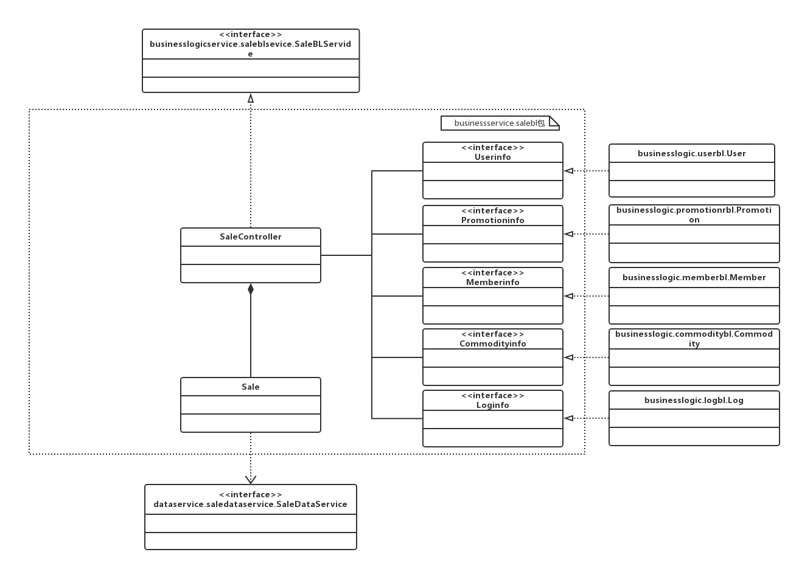
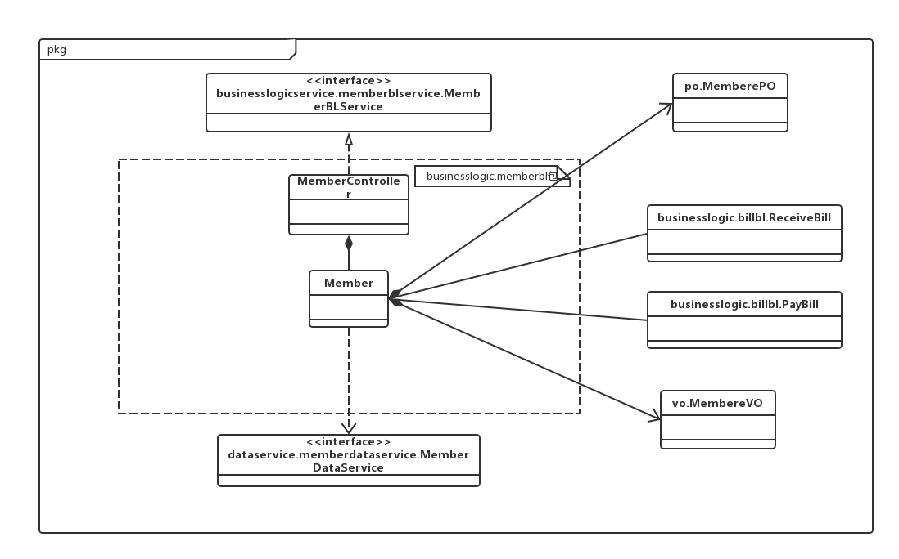
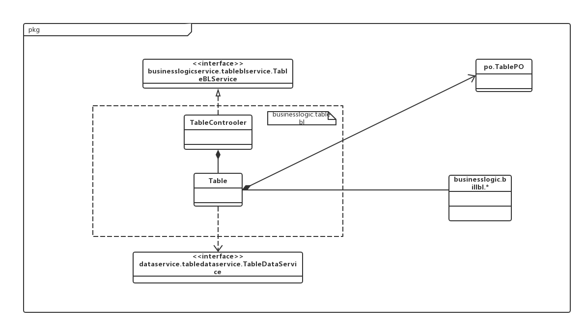
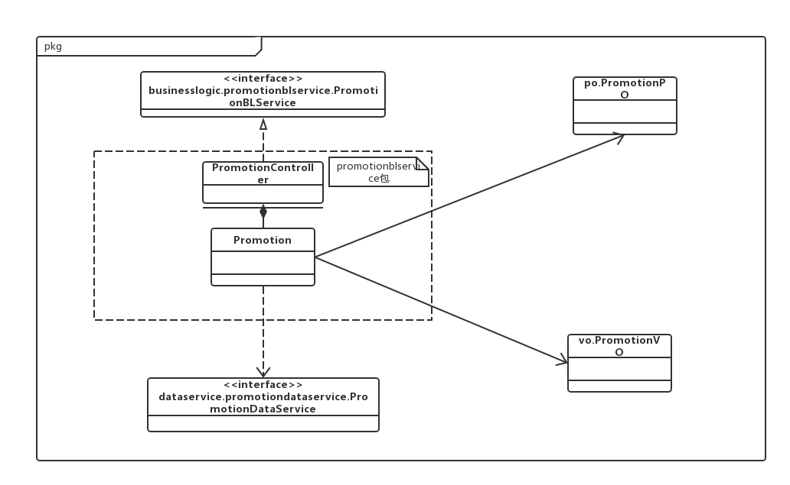

 # 进销存系统软件详细设计描述文档

##1.引言

###1.1编制目的

本报告详细完成对进销存系统的详细设计，达到指导后后续软件构造的目的。同时实现和测试人员及用户的沟通。

本报告面向开发人员、测试人员及最终用户而编写，是了解系统的导航。

###1.2词汇表

| 词汇名称        | 词汇含义             | 备注   |
| ----------- | ---------------- | ---- |
| *ui         | 表示某展示层           |      |
| *bl         | 表示某逻辑层           |      |
| *data       | 表示某数据层           |      |
| RMI         | 表示远程方法调用         |      |
| utilitybl   | 表示初始化和业务逻辑上下文的工作 |      |
| datafactory | 表示调用其它数据库的方法     |      |

###1.3参考资料

1.IEEE std 1471-2000

2.丁二玉，刘钦.计算与软件工程（卷二）[M]机械工业出版2012，134—182

##2.产品概述

参考进销存系统用例文档和进销存系统需求规格说明文档中对产品的概括描述。

##3.体系结构设计概述

参考进销存系统概要设计文档中对体系结构设计的概述。

##4.结构视角

###4.1业务逻辑的分解

业务逻辑层的开发包图参见软件体系结构文档图。

####4.1.1salebl模块

（1）模块概述

salebl模块承担的需求参见需求规格说明文档，功能需求及相关非功能需求参见需求规格说明文档。

Sale模块的职责及接口参见软件系统结构描述文档表

（2）整体结构

根据体系结构的设计，我们将系统分为展示层、业务逻辑层、数据层。每一层之间为了增加灵活性，我们会添加接口，比如展示层和业务逻辑层之间我们添加businesslogicservice.saleblservice.SaleBLService接口.业务逻辑层和数据层之间添加dataservice.saledataservice.SaleDataService接口。为隔离业务逻辑职责和逻辑控制职责，我们增加了SaleController，这样SaleController会将对销售的业务逻辑处理委托给Sale对象。SalePO是作为销售记录的持久化对象被添加到设计模型中去的。

salebl模块的设计如图。

salebl模块各个类的职责如表所示。

| 模块             | 职责                                       |
| -------------- | ---------------------------------------- |
| SaleController | 负责实现销售界面所需要的服务                           |
| Sale           | 销售的领域模型对象，拥有一次销售所持有的会员、购买商品、总价、销售记录等信息，可以帮助完成销售界面所需要的服务 |

（3）模块内部类的接口规范

SaleController的接口规范如表所示。

提供的服务（供接口）

SaleController.import_

| 语法   | public String import_() |
| ---- | ----------------------- |
| 前置条件 | 已选择进货，进货销售人员已登录         |
| 后置条件 | 调用Sale领域对象的import_方法    |

SaleController.importReturn

| 语法   | public String importReturn() |
| ---- | ---------------------------- |
| 前置条件 | 已选择进货退货，进货销售人员已登录            |
| 后置条件 | 调用Sale领域对象的importReturn方法    |

SaleController.sell

| 语法   | public String sell() |
| ---- | -------------------- |
| 前置条件 | 已选择销售，进货销售人员已登录      |
| 后置条件 | 调用Sale领域对象的sell方法    |

SaleController.sellReturn

| 语法   | public String sellReturn() |
| ---- | -------------------------- |
| 前置条件 | 已选择销售退货，进货销售人员已登录          |
| 后置条件 | 调用Sale领域对象的sellReturn方法    |

SaleController.getPromotion

| 语法   | public PromotionVO getPromotion() |
| ---- | --------------------------------- |
| 前置条件 | 存在促销策略，进货销售人员已登录                  |
| 后置条件 | 调用Sale领域对象的getPromotion方法         |

SaleController.getMember

| 语法   | public MemberVO getMember(String name) |
| ---- | -------------------------------------- |
| 前置条件 | 存在该用户信息，进货销售人员已登录                      |
| 后置条件 | 调用Sale领域对象的getMember方法                 |

SaleController.getCommodity

| 语法   | public CommodityVO getCommodity(int id) |
| ---- | --------------------------------------- |
| 前置条件 | 存在该商品信息，进货销售人员已登录                       |
| 后置条件 | 调用Sale领域对象的getCommodity方法               |

需要的服务（需接口）

| 服务名                         | 服务             |
| --------------------------- | -------------- |
| Sale.import_()              | 进行一次进货         |
| Sale.importReturn()         | 进行一次进货退货       |
| Sale.sell()                 | 进行一次销售         |
| Sale.sellReturn()           | 进行一次销售退货       |
| Sale.getPromotion()         | 获取此次销售的促销策略    |
| Sale.getMember(String name) | 获取与此次销售相关的客户信息 |
| Sale.getCommodity(int id)   | 获取与此次销售相关的商品信息 |

Sale的接口规范如表所示。

提供的服务（供接口）

Sale.import_

| 语法   | public String import_() |
| ---- | ----------------------- |
| 前置条件 | 启动一次进货                  |
| 后置条件 | 调用Sale领域对象的import_方法    |

Sale.importReturn

| 语法   | public String importReturn() |
| ---- | ---------------------------- |
| 前置条件 | 启动一次进货退货                     |
| 后置条件 | 调用Sale领域对象的importReturn方法    |

Sale.sell

| 语法   | public String sell() |
| ---- | -------------------- |
| 前置条件 | 启动一次销售               |
| 后置条件 | 调用Sale领域对象的sell方法    |

Sale.sellReturn

| 语法   | public String sellReturn() |
| ---- | -------------------------- |
| 前置条件 | 启动一次销售退货                   |
| 后置条件 | 调用Sale领域对象的sellReturn方法    |

Sale.getPromotion

| 语法   | public PromotionVO getPromotion() |
| ---- | --------------------------------- |
| 前置条件 | 已应用促销策略                           |
| 后置条件 | 调用Sale领域对象的getPromotion方法         |

Sale.getMember

| 语法   | public MemberVO getMember(String name) |
| ---- | -------------------------------------- |
| 前置条件 | 已存在该客户信息                               |
| 后置条件 | 调用Sale领域对象的getMember方法                 |

Sale.getCommodity

| 语法   | public CommodityVO getCommodity(int id) |
| ---- | --------------------------------------- |
| 前置条件 | 已存在该商品信息                                |
| 后置条件 | 调用Sale领域对象的getCommodity方法               |

需要的服务（需接口）

| 服务名                               | 服务              |
| --------------------------------- | --------------- |
| CommodityDataService.find(int id) | 根据ID查找商品        |
| MemeberDataService.find(int id)   | 根据ID查找客户        |
| SaleDataService.insert(SalePO po) | 插入单一持久化对象       |
| DatabaseFactory.getSaleDatabase   | 得到Sale数据库的服务的引用 |

（4）业务逻辑层的动态模型

（5）业务逻辑层的设计原理

利用委托式控制风格，每个界面需要访问的业务逻辑由各自的控制器委托给不同的领域对象。

其他略。

####4.1.2 memberbl模块

（1）模块概述

memberbl模块承担的需求参见需求规格说明文档，功能需求及相关非功能需求参见需求规格说明文档。

Member模块的职责及接口参见软件系统结构描述文档表

（2）整体结构

根据体系结构的设计，我们将系统分为展示层、业务逻辑层、数据层。每一层之间为了增加灵活性，我们会添加接口，比如展示层和业务逻辑层之间我们添加businesslogicservice.memberblservice.MemberBLService接口.业务逻辑层和数据层之间添加dataservice.memberdataservice.MemberDataService接口。为隔离业务逻辑职责和逻辑控制职责，我们增加了MenberController，这样MemberController会将对销售的业务逻辑处理委托给Member对象。MemberPO是作为销售记录的持久化对象被添加到设计模型中去的。

memberbl模块的设计如图。

memberbl模块各个类的职责如表所示。

| 模块               | 职责                                       |
| ---------------- | ---------------------------------------- |
| MemberController | 负责实现客户管理界面做需要的服务                         |
| Member           | 客户管理领域的模型对象，拥有一次客户管理操作所持有的客户姓名，等级信息，可以帮助完成客户管理界面所需要的服务。 |

（3）模块内部类的接口规范

MemberController 的接口规范

提供的服务（供接口）

MemberController.addMember

| 语法   | public String addMember(MemberVO vo) |
| ---- | ------------------------------------ |
| 前置条件 | 已创建一个Member对象，并且输入符合输入规则             |
| 后置条件 | 调用Member对象的addMember方法               |

MemberController.findMember

| 语法   | public MemberVO findMember(String field,int id) |
| ---- | ---------------------------------------- |
| 前置条件 | 已创建一个Member对象，并且输入符合输入规则                 |
| 后置条件 | 调用Member对象的findMember方法                  |

MemberController.deleteMember

| 语法   | public String deleteMmber(MemberVO vo) |
| ---- | -------------------------------------- |
| 前置条件 | 已创建一个Member对象，并且输入符合输入规则               |
| 后置条件 | 调用Member对象的deleteMember方法              |

MemberController.updateMember

| 语法   | public String updateMember(MemberVO vo) |
| ---- | --------------------------------------- |
| 前置条件 | 已创建一个Member对象，并且输入符合输入规则                |
| 后置条件 | 调用Member对象的updateMember方法               |

需要的服务（需接口）

| 服务名                                    | 服务       |
| -------------------------------------- | -------- |
| Member.addMember(MemberVO )            | 加入一个客户对象 |
| Member.findMember(String field,int id) | 查找一个客户对象 |
| Member.deleteMember(MemberVO vo)       | 删除一个客户对象 |
| Member.updateMember(MemberVO vo)       | 维护一个客户对象 |

Member的接口规范

提供的服务（供接口）

Member.addMember

| 语法   | public MemberVO addmember (MemberVO a) |
| ---- | -------------------------------------- |
| 前置条件 | 进货销售人员已登录                              |
| 后置条件 | 增添一个客户信息                               |

Member.deleteMember

| 语法   | public MemberVO deletemember (MemberVO a) |
| ---- | ---------------------------------------- |
| 前置条件 | 进货销售人员已登录                                |
| 后置条件 | 删除一个客户信息                                 |

Member.findMember

| 语法   | public MemberVO findmember (MemberVO a) |
| ---- | --------------------------------------- |
| 前置条件 | 输入的关键词正确，进货销售人员已登录                      |
| 后置条件 | 显示查询客户的信息                               |

Member.updateMember

| 语法   | public MemberVO findmember (MemberVO a) |
| ---- | --------------------------------------- |
| 前置条件 | 此客户存在，进货销售人员已登录                         |
| 后置条件 | 更改客户的信息                                 |

需要的服务（需接口）

| 服务名                                      | 服务                |
| ---------------------------------------- | ----------------- |
| MemberDataService.find(int id)           | 根据客户编号进行查找单一持久化对象 |
| MemberDataService.find(String field,String content) | 根据字段名和值查找多个持久化对象  |
| MemberDataService.insert(MemberPO po)    | 插入单一持久化对象         |
| MemberDataService.delete(MemberPO po)    | 删除单一持久化对象         |
| MemberDataService.update(MemberPO po)    | 更新单一持久化对象         |
| MemberDataService.getSalesDatabase       | 得到Member数据库的服务的引用 |
| MemberDataService.insert(MemberPO po)    | 在数据库中插入MemberPO对象 |

####4.1.3 tablebl模块

（1）模块概述

tablebl模块承担的需求参见需求规格说明文档，功能需求及相关非功能需求参见需求规格说明文档。

Table模块的职责及接口参见软件系统结构描述文档表

（2）整体结构

根据体系结构的设计，我们将系统分为展示层、业务逻辑层、数据层。每一层之间为了增加灵活性，我们会添加接口，比如展示层和业务逻辑层之间我们添加businesslogicservice.tableblservice.TableBLService接口.业务逻辑层和数据层之间添加dataservice.tabledataservice.TableDataService接口。为隔离业务逻辑职责和逻辑控制职责，我们增加了TableController，这样TableController会将对销售的业务逻辑处理委托给Table对象。TablePO是作为销售记录的持久化对象被添加到设计模型中去的。

tablebl模块的设计如图。

tablebl模块各个类的职责如表所示。

| 模块              | 职责                                       |
| --------------- | ---------------------------------------- |
| TableController | 负责实现表格查看界面所需要的服务                         |
| Table           | 表格的领域对象模型，拥有一次表个插卡所持有的各类表单的引用，可以帮助完成表格查看界面所需要的服务 |

（3）模块内部类的接口规范

TableController的接口规范

提供的服务（供接口）

TableController.getSaleDetails

| 语法   | public Table_saleDetailsVO getSaleDetails(String field) |
| ---- | ---------------------------------------- |
| 前置条件 | 已创建一个Table领域对象，并且输入符合输入规范                |
| 后置条件 | 调用Table领域对象的getSaleDetails方法             |

TableController.getOperateCondition

| 语法   | public Table_operateConditionVO get OperateCondirtion(String field) |
| ---- | ---------------------------------------- |
| 前置条件 | 已创建一个Table领域对象，并且输入符合输入规范                |
| 后置条件 | 调用Table领域对象的getOperateCondition方法        |

TableController.getOperateCourse

| 语法   | public ArrayList<BillVO> getOperateCourse(String field) |
| ---- | ---------------------------------------- |
| 前置条件 | 已创建一个Table领域对象，并且输入符合输入规范                |
| 后置条件 | 调用Table领域对象的getOperateCourse方法           |

TableController.Red

| 语法   | public void Red(String id,String Note) |
| ---- | -------------------------------------- |
| 前置条件 | 已创建一个Table领域对象，并且输入符合输入规范              |
| 后置条件 | 调用Table领域对象的Red方法                      |

需要的服务（需接口）

| 服务名                       | 服务          |
| ------------------------- | ----------- |
| Table.getSaleDetails      | 获得销售记录      |
| Table.getOperateCondition | 获得经营情况表     |
| Table.getOperateCour      | 获得所有符合条件的单据 |
| Table.Red                 | 进行单据红冲      |

Table的接口规范

提供的服务（供接口）

Table.SaleDetails

| 语法   | public SaleDetailsTableVO getSaleDetailsTable(String field) |
| ---- | ---------------------------------------- |
| 前置条件 | 筛选条件选择，财务人员/总经理已登录                       |
| 后置条件 | 返回符合筛选条件的信息                              |

Table.MangeCourse

| 语法   | public MangeCourseTableVO getMangeCourseTable(String field) |
| ---- | ---------------------------------------- |
| 前置条件 | 筛选条件选择，财务人员/总经理已登录                       |
| 后置条件 | 返回符合筛选条件的信息                              |

Table.MangeSituation

| 语法   | public MangeSituationTableVO getMangeSituationTable(String field) |
| ---- | ---------------------------------------- |
| 前置条件 | 筛选条件选择，财务人员/总经理已登录                       |
| 后置条件 | 返回符合筛选条件的信息                              |

Table.MangeCourse.Red

| 语法   | public BillVO getMangeSituationTable(BillVO vo) |
| ---- | ---------------------------------------- |
| 前置条件 | 财务人员在查看经营历程表选择具体单据，财务人员已登录               |
| 后置条件 | 返回修改后的单据                                 |

需要的服务（需接口）

| 服务名                                 | 服务               |
| ----------------------------------- | ---------------- |
| tableDataService.find(String field） | 根据字段名查找多个持久化对象   |
| tableDataService.clone(tablePO po)  | 复制单一持久化对象并修改数值   |
| tableDataService.gettableDatabase   | 得到table数据库的服务的引用 |
| tableDataService.insert(tablePO po) | 在数据库中插入tablePO对象 |
| tableDataService.getbillDatabase    | 得到Bill数据库的服务的引用  |

####4.2.4 commoditybl模块
（1）模块概述

commodityebl模块承担的需求参见需求规格说明文档，功能需求及相关非功能需求参见需求规格说明文档。

Commodity模块的职责及接口参见软件系统结构描述文档表

（2）整体结构

根据体系结构的设计，我们将系统分为展示层、业务逻辑层、数据层。每一层之间为了增加灵活性，我们会添加接口，比如展示层和业务逻辑层之间我们添加businesslogicservice.commodityblservice.CommodityBLService接口.业务逻辑层和数据层之间添加dataservice.commoditydataservice.CommodityDataService接口。为隔离业务逻辑职责和逻辑控制职责，我们增加了CommodityController，这样CommodityController会将对销售的业务逻辑处理委托给Commodity对象。CommodityPO是作为销售记录的持久化对象被添加到设计模型中去的。

commoditybl模块的设计如图。

commoditybl模块各个类的职责如表所示。
commoditybl模块各个类的职责
| CommodityController | 负责实现商品界面所需要的服务                           |
| ------------------- | ---------------------------------------- |
| Commodity           | 商品的领域模型对象，拥有分类，商品价格，名称，库存数量等信息，可以帮助实现商品界面所需要的服务 |
| Category            | 商品分类的领域模型对象，拥有分类，子类，名称等信息，可以帮助完成实现商品界面所需要的服务 |
（3）模块内部类的接口规范

commodityController的接口规范

CommodityController.getCommodity

| 语法   | public CommodityVO getCommodity(String field) |
| ---- | ---------------------------------------- |
| 前置条件 | 已创建一个commodity领域对象，并且输入正确                |
| 后置条件 | 调用commodity领域对象的getCommodity方法           |

CommodityController.addCommodity

| 语法   | public ResultMessage addCommodity(CommodityVO c) |
| ---- | ---------------------------------------- |
| 前置条件 | 已创建一个commodity领域对象，并且输入正确                |
| 后置条件 | 调用commodity领域对象的addCommodity方法           |

CommodityController.deleteCommodity
| 语法   | public ResultMessage deleteCommodity(CommodityVO c) |
| ---- | ---------------------------------------- |
| 前置条件 | 已创建一个commodity领域对象，并且输入正确                |
| 后置条件 | 调用commodity领域对象的deleteCommodity方法        |

CommodityController.modifyCommodity

| 语法   | public ResultMessage modifyCommodity(CommodityVO c) |
| ---- | ---------------------------------------- |
| 前置条件 | 已创建一个commodity领域对象，并且输入正确                |
| 后置条件 | 调用commodity领域对象的modifyCommodity方法        |

CommodityController.getCategoryList

| 语法   | public ArrayList<Category> getCategory() |
| ---- | ---------------------------------------- |
| 前置条件 | 选已创建一个commodity领域对象，并且输入正确               |
| 后置条件 | 调用commodity领域对象的getCommodityList方法       |
CommodityController.addCategory

| 语法   | public ResultMessage addCategory(CategoryVO c) |
| ---- | ---------------------------------------- |
| 前置条件 | 已创建一个category领域对象，并且输入正确                 |
| 后置条件 | 调用category领域对象的addcategory方法             |
CommodityController.deleteCategory

| 语法   | public ResultMessage deleteCategory(CategoryVO c) |
| ---- | ---------------------------------------- |
| 前置条件 | 已创建一个category领域对象，并且输入正确                 |
| 后置条件 | 调用category领域对象的deletecategory方法          |
CommodityController.modifyCategory

| 语法   | public ResultMessage  modifyCategory(CategoryVO c) |
| ---- | ---------------------------------------- |
| 前置条件 | 已创建一个category领域对象，并且输入正确                 |
| 后置条件 | 调用category领域对象的modifycategory方法          |
Commodity的接口规范

CommodityController.getCommodity

| 语法   | public CommodityVO getCommodity(String field) |
| ---- | ---------------------------------------- |
| 前置条件 | 已创建一个category领域对象，并且输入正确                 |
| 后置条件 | 返回商品信息                                   |

Commodity.addCommodity

| 语法   | public ResultMessage addCommodity(CommodityVO c) |
| ---- | ---------------------------------------- |
| 前置条件 | 选择新增商品且商品信息填写完整且符合要求，库存管理人员已登录           |
| 后置条件 | 新增商品并将其作为持久化对象插入数据库，返回维护结果               |

Commodity.deleteCommodity
| 语法   | public ResultMessage deleteCommodity(CommodityVO c) |
| ---- | ---------------------------------------- |
| 前置条件 | 选择删除商品，库存管理人员已登录                         |
| 后置条件 | 删除商品并从数据库中删除单一持久化对象，返回维护结果               |

Commodity.modifyCommodity

| 语法   | public ResultMessage modifyCommodity(CommodityVO c) |
| ---- | ---------------------------------------- |
| 前置条件 | 选择修改商品，库存管理人员已登录                         |
| 后置条件 | 更新商品并从数据库中更新单一持久化对象，返回维护结果               |

Category的接口规范
Category.getCategoryList

| 语法   | public ArrayList<Category> getCategory() |
| ---- | ---------------------------------------- |
| 前置条件 | 选择进入商品分类管理界面，库存管理人员已登录                   |
| 后置条件 | 返回分类列表信息                                 |
Category.addCategory

| 语法   | public ResultMessage addCategory(CategoryVO c) |
| ---- | ---------------------------------------- |
| 前置条件 | 选择新增分类，分类信息填写完整，库存管理人员已登录                |
| 后置条件 | 新增分类并将其作为持久化对象插入数据库，返回维护结果               |
Category.deleteCategory

| 语法   | public ResultMessage deleteCategory(CategoryVO c) |
| ---- | ---------------------------------------- |
| 前置条件 | 选择删除分类，库存管理人员已登录                         |
| 后置条件 | 删除分类并从数据库中删除单一持久化对象，返回维护结果               |
Category.modifyCategory

| 语法   | public ResultMessage  modifyCategory(CategoryVO c) |
| ---- | ---------------------------------------- |
| 前置条件 | 选择修改分类，库存管理人员已登录                         |
| 后置条件 | 更新分类并从数据库中更新单一持久化对象，返回维护结果               |
需要的接口（需接口）

| 服务名                                      | 服务                   |
| ---------------------------------------- | -------------------- |
| CommodityDataService.find(int id)        | 根据ID查找单一持久化对象        |
| CommodityDataService.finds(String field,int value) | 根据字段名称和值查找多个持久化对象    |
| CommodityDataService.insert(CommodityPO po) | 插入单一持久化对象            |
| CommodityDataService.delete(CommodityPO p) | 删除单一持久化对象            |
| CommodityDataService.update(CommodityPO p) | 更新单一持久化对象            |
| DatabaseFactory.getCommodityDatabase     | 得到Commodity数据库的服务的引用 |
####4.2.5 accountbl模块
（1）模块概述

accountbl模块承担的需求参见需求规格说明文档，功能需求及相关非功能需求参见需求规格说明文档。

Account模块的职责及接口参见软件系统结构描述文档表

（2）整体结构

根据体系结构的设计，我们将系统分为展示层、业务逻辑层、数据层。每一层之间为了增加灵活性，我们会添加接口，比如展示层和业务逻辑层之间我们添加businesslogicservice.accountblservice.AccountBLService接口.业务逻辑层和数据层之间添加dataservice.accountdataservice.AccountDataService接口。为隔离业务逻辑职责和逻辑控制职责，我们增加了AccountController，这样AccountController会将对销售的业务逻辑处理委托给Account对象。AccountPO是作为销售记录的持久化对象被添加到设计模型中去的。

accountbl模块的设计如图。

accountbl模块各个类的职责如表所示。
| 模块                | 职责                       |
| ----------------- | ------------------------ |
| AccountController | 负责实现账户管理所需要的服务           |
| Account           | 银行账户的领域模型对象，拥有账户数据的名称和金额 |

（3）模块内部类的接口规范

AccountController

提供的服务（供接口）

AccountController.addAccount

| 语法   | public String addAccount(AccountVO account) |
| ---- | ---------------------------------------- |
| 前置条件 | 已创建一个Account对象，并且输入符合输入规则                |
| 后置条件 | 调用Account领域对象的addAccount方法               |

AccountController.getAccount

| 语法   | public AccountVO getAccount(long id) |
| ---- | ------------------------------------ |
| 前置条件 | 已创建一个Account对象，并且输入符合输入规则            |
| 后置条件 | 调用Account领域对象的getAccount方法           |

AccountController.deleteAccount

| 语法   | public String deleteAccount(AccountVO account) |
| ---- | ---------------------------------------- |
| 前置条件 | 已创建一个Account对象，并且输入符合输入规则                |
| 后置条件 | 调用Account领域对象的deleteAccount方法            |

AccountController.modifyAccount

| 语法   | public String modifyAccount(long id) |
| ---- | ------------------------------------ |
| 前置条件 | 已创建一个Account对象，并且输入符合输入规则            |
| 后置条件 | 调用Account领域对象的modifyAccount方法        |

AccountController.getAccountList

| 语法   | public ArrayList<AccountVO> getAccountList(String field,long id) |
| ---- | ---------------------------------------- |
| 前置条件 | 已创建一个Account对象，并且输入符合输入规则                |
| 后置条件 | 调用Account领域对象的getAccountList方法           |

需要的服务（需接口）

| 服务名                                      | 服务                |
| ---------------------------------------- | ----------------- |
| Account.addAccount(AccountVO account)    | 加入一个银行账户对象        |
| Account.getAccount(long id)              | 查看一个的银行账户对象的具体信息  |
| Account.deleteAccount(AccountVO account) | 删除一个银行账户对象        |
| Account.modifyAccount(long id)           | 修改一个已存在的银行账户对象的信息 |
| Account.etAccountList(String field,long id) | 列出所有符合条件的银行账户信息   |

Account的接口规范

Account.getAccount

| 语法   | public AccountPO getAccount(long id) |
| ---- | ------------------------------------ |
| 前置条件 | 选择查看某具体银行账户信息，财务人员已登录                |
| 后置条件 | 返回账户信息                               |

Account.addAccount

| 语法   | public ResultMessage addAccount(AccountVO account) |
| ---- | ---------------------------------------- |
| 前置条件 | 选择增加银行账户信息，财务人员已登录                       |
| 后置条件 | 增加账户信息，向数据库插入单一持久化对象，返回维护结果              |

Account.deleteAccount

| 语法   | public ResultMessage deleteAccount(AccountVO account) |
| ---- | ---------------------------------------- |
| 前置条件 | 选择删除银行账户信息，财务人员已登录                       |
| 后置条件 | 删除账户信息，从数据库删除单一持久化对象，返回维护结果              |

Account.modifyAccount

| 语法   | public ResultMessage modifyAccount(long id) |
| ---- | ---------------------------------------- |
| 前置条件 | 选择更新银行账户信息，财务人员已登录                       |
| 后置条件 | 更新账户信息，从数据库更新单一持久化对象，返回维护结果              |

Account.getAccountList

| 语法   | public AccountListPO getAccountList(long id,String field) |
| ---- | ---------------------------------------- |
| 前置条件 | 选择查看账户列表，财务人员已登录                         |
| 后置条件 | 返回账户列表信息                                 |

需要的接口（需接口）

| 服务名                                      | 服务                |
| ---------------------------------------- | ----------------- |
| AccountDataService.find(int id)          | 根据ID查找单一持久化对象     |
| AccountDataService.finds(String field,int value) | 根据字段名称和值查找多个持久化对象 |
| AccountDataService.insert(CommodityPO po) | 插入单一持久化对象         |
| AccountDataService.delete(CommodityPO p) | 删除单一持久化对象         |
| AccountDataService.update(CommodityPO p) | 更新单一持久化对象         |
| DatabaseFactory.getCommodit              |                   |

####4.2.6 logbl模块

（1）模块概述

logbl模块承担的需求参见需求规格说明文档，功能需求及相关非功能需求参见需求规格说明文档。

Log模块的职责及接口参见软件系统结构描述文档表

（2）整体结构

根据体系结构的设计，我们将系统分为展示层、业务逻辑层、数据层。每一层之间为了增加灵活性，我们会添加接口，比如展示层和业务逻辑层之间我们添加businesslogicservice.logblservice.LogBLService接口.业务逻辑层和数据层之间添加dataservice.logdataservice.LogDataService接口。为隔离业务逻辑职责和逻辑控制职责，我们增加了LogController，这样LogController会将对销售的业务逻辑处理委托给Log对象。LogPO是作为销售记录的持久化对象被添加到设计模型中去的。

logbl模块的设计如图。

logbl模块各个类的职责如表所示。

| 模块            | 职责                         |
| ------------- | -------------------------- |
| LogController | 负责实现查看日志所需要的服务             |
| Log           | 日志的领域模型对象，拥有日志数据的时间，操作员，操作 |

（3）模块内部类的接口规范

LogController

提供的服务（供接口）

LogController.addRecord

| 语法   | public String addRecord(LogVO vo) |
| ---- | --------------------------------- |
| 前置条件 | 已创建一个Log对象，并且输入符合输入规则             |
| 后置条件 | 调用Log领域对象的addRecord方法             |

LogController.checkRecord

| 语法   | public String checkRecord() |
| ---- | --------------------------- |
| 前置条件 | 已创建一个Log对象                  |
| 后置条件 | 调用Log领域对象的checkRecord方法     |

需要的的服务（需接口）

| 服务名                     | 服务             |
| ----------------------- | -------------- |
| Log.addRecord(LogVO vo) | 添加一个日志对象       |
| Log.checkRecord()       | 显示最近的一定数量的日志对象 |

Log的接口规范

log.addRecord

| 语法   | public void addRecord(LogPO po) |
| ---- | ------------------------------- |
| 前置条件 | 用户进行了某项操作                       |
| 后置条件 | 记录操作的持久化数据对象到数据库                |

log.checkRecord

| 语法   | public void checkRecord() |
| ---- | ------------------------- |
| 前置条件 | 用户进行了某项操作                 |
| 后置条件 | 显示一定数量的持久化数据对象            |

需要的服务（需接口）

| 服务名                              | 服务            |
| -------------------------------- | ------------- |
| LogDataService.find(int id)      | 根据ID查找单一持久化对象 |
| LogDataService.insert(UserPO po) | 插入单一持久化对象     |
| LogDataService.delete(UserPO po) | 删除单一持久化对象     |
| LogDataService.update(UserPO po) | 更新单一持久化对象     |
| LogDataService.getLogDatabase    | 得到数据库的服务的引用   |

#### 4.2.7 userbl模块

（1）模块概述

userbl模块承担的需求参见需求规格说明文档，功能需求及相关非功能需求参见需求规格说明文档。

User模块的职责及接口参见软件系统结构描述文档表

（2）整体结构

根据体系结构的设计，我们将系统分为展示层、业务逻辑层、数据层。每一层之间为了增加灵活性，我们会添加接口，比如展示层和业务逻辑层之间我们添加businesslogicservice.userblservice.UserBLService接口.业务逻辑层和数据层之间添加dataservice.userdataservice.UserDataService接口。为隔离业务逻辑职责和逻辑控制职责，我们增加了UserController，这样UserController会将对销售的业务逻辑处理委托给User对象。UserPO是作为销售记录的持久化对象被添加到设计模型中去的。

userbl模块的设计如图。

userbl模块各个类的职责如表所示。

| UserController | 负责实现用户界面所需要的服务                           |
| -------------- | ---------------------------------------- |
| User           | 用户的领域模型对象，拥有姓名，工号，职位，权限等信息，可以帮助实现用户界面所需要的服务 |

模块内部类的接口规范

（3）模块内部类的接口规范

usercontroller的接口规范

UserController.findUser

| 语法   | public UserVO findUser (UserVO a) |
| ---- | --------------------------------- |
| 前置条件 | 已创建一个user领域对象，并且输入正确              |
| 后置条件 | 调用user领域对象的findUser方法             |

 UserController.add User

| 语法   | public ResultMessage add User( UserVO a) |
| ---- | ---------------------------------------- |
| 前置条件 | 已创建一个user领域对象，并且输入正确                     |
| 后置条件 | 调用user领域对象的addUser方法                     |

 UserController.deleteUser
| 语法   | public ResultMessage deleteUser( UserVO a) |
| ---- | ---------------------------------------- |
| 前置条件 | 已创建一个user领域对象，并且输入正确                     |
| 后置条件 | 调用user领域对象的deleteUser方法                  |

UserController.updateUser

| 语法   | public ResultMessage updateUser(UserVO c) |
| ---- | ---------------------------------------- |
| 前置条件 | 已创建一个user领域对象，并且输入正确                     |
| 后置条件 | 调用user领域对象的updateUser方法                  |

User的接口规范

User.addUser

| 语法   | public ResultMessage addUser (UserVO a) |
| ---- | --------------------------------------- |
| 前置条件 | 管理员已登录                                  |
| 后置条件 | 增添一个用户信息                                |

User.deleteUser

| 语法   | public ResultMessage deleteUser (UserVO a) |
| ---- | ---------------------------------------- |
| 前置条件 | 管理员已登录                                   |
| 后置条件 | 删除一个用户信息                                 |

User.findUser

| 语法   | public UserVO findUser (UserVO a) |
| ---- | --------------------------------- |
| 前置条件 | 输入的关键词正确，管理员已登录                   |
| 后置条件 | 显示查询用户的信息                         |

User.updateUser

| 语法   | public ResultMessage updateUser (UserVO a) |
| ---- | ---------------------------------------- |
| 前置条件 | 此用户存在，管理员已登录                             |
| 后置条件 | 更改用户的信息                                  |

需要的服务（需接口）

| 服务名                                      | 服务                |
| ---------------------------------------- | ----------------- |
| UserDataService.find(int id)             | 根据客户编号进行查找单一持久化对象 |
| UserDataService.find(String field,String content) | 根据字段名和值查找多个持久化对象  |
| UserDataService.insert(UserPO po)        | 插入单一持久化对象         |
| UserDataService.delete(UserPO po)        | 删除单一持久化对象         |
| UserDataService.update(UserPO po)        | 更新单一持久化对象         |
| UserDataService.getUserDatabase          | 得到User数据库的服务的引用   |
| UserDataService.insert(UserPO po)        | 在数据库中插入UserPO对象   |

#### 4.2.8 promotionbl模块

（1）模块概述

promotionbl模块承担的需求参见需求规格说明文档，功能需求及相关非功能需求参见需求规格说明文档。

Promotion模块的职责及接口参见软件系统结构描述文档表

（2）整体结构

根据体系结构的设计，我们将系统分为展示层、业务逻辑层、数据层。每一层之间为了增加灵活性，我们会添加接口，比如展示层和业务逻辑层之间我们添加businesslogicservice.promotionblservice.PromotionBLService接口.业务逻辑层和数据层之间添加dataservice.promotiondataservice.PromotionDataService接口。为隔离业务逻辑职责和逻辑控制职责，我们增加了PromotionController，这样PromotionController会将对销售的业务逻辑处理委托给Promotion对象。PromotionPO是作为销售记录的持久化对象被添加到设计模型中去的。

promotionbl模块的设计如图。

promotionbl模块各个类的职责如表所示。

| 模块                  | 职责                                       |
| ------------------- | ---------------------------------------- |
| PromotionController | 负责实现表格查看界面所需要的服务                         |
| Promotion           | 表格的领域对象模型，拥有一次表个插卡所持有的各类表单的引用，可以帮助完成表格查看界面所需要的服务 |

（3）模块内部类的接口规范

PromotionController的接口规范

提供的服务（供接口）

PromotionController.addPromotion

| 语法   | public  String  addPromotion(PromotionVO vo) |
| ---- | ---------------------------------------- |
| 前置条件 | 已创建一个Promotion领域对象，并且输入符合输入规则            |
| 后置条件 | 调用Promotion领域对象的addPromotion方法           |

PromotionController.deletePromotion

| 语法   | public  String  deletePromotion（long id） |
| ---- | ---------------------------------------- |
| 前置条件 | 已创建一个Promotion领域对象，并且输入符合输入规则            |
| 后置条件 | 调用Promotion领域对象的deletePromotion方法        |

PromotionController.getPromotionList

| 语法   | public  String  getPromotionList(String field，long id) |
| ---- | ---------------------------------------- |
| 前置条件 | 已创建一个Promotion领域对象，并且输入符合输入规则            |
| 后置条件 | 调用Promotion领域对象的getPromotionList方法       |

PromotionController.getPromotion

| 语法   | public  String  getPromotion(long id) |
| ---- | ------------------------------------- |
| 前置条件 | 已创建一个Promotion领域对象，并且输入符合输入规则         |
| 后置条件 | 调用Promotion领域对象的getPromotion方法        |

需要的服务（需接口）

| 服务名              | 服务          |
| ---------------- | ----------- |
| addPromotion     | 增加一个促销策略    |
| deletePromotion  | 删除一个促销策略    |
| getPromotionList | 获得促销策略列表    |
| getPromotion     | 获得一个促销策略的对象 |

Promotion的接口规范

提供的服务（供接口）

Promotion.addPromotion

| 语法   | public ResultMessage addPromotion() |
| ---- | ----------------------------------- |
| 前置条件 | 选择新增促销策略，总经理已登录                     |
| 后置条件 | 增加策略信息，向数据库插入单一持久化对象，返回维护结果         |

Promotion.deletePromotion

| 语法   | public ResultMessage deletePromotion() |
| ---- | -------------------------------------- |
| 前置条件 | 选择停用促销策略，总经理已登录                        |
| 后置条件 | 删除账户信息，向数据库删除单一持久化对象，返回维护结果            |

Promotion.getPromotion

| 语法   | public PromotionVO getPromotion() |
| ---- | --------------------------------- |
| 前置条件 | 选择查看促销策略，总经理已登录                   |
| 后置条件 | 返回策略信息                            |

Promotion.getPromotinoList
| 语法   | public Promotion getPromotionList() |
| ---- | ----------------------------------- |
| 前置条件 | 选择查看全部促销策略，总经理已登录                   |
| 后置条件 | 返回全部促销策略                            |

需要的接口（需接口）

| 服务名                                      | 服务            |
| ---------------------------------------- | ------------- |
| CommodityDataService.find(int id)        | 根据ID查找单一持久化对象 |
| PromotionDataService.insert(CommodityPO po) | 插入单一持久化对象     |
| PromotionDataService.delete(CommodityPO p) | 删除单一持久化对象     |

#### 4.2.9 billbl模块
（1）模块概述

billbl模块承担的需求参见需求规格说明文档，功能需求及相关非功能需求参见需求规格说明文档。

Bill模块的职责及接口参见软件系统结构描述文档表

（2）整体结构

根据体系结构的设计，我们将系统分为展示层、业务逻辑层、数据层。每一层之间为了增加灵活性，我们会添加接口，比如展示层和业务逻辑层之间我们添加businesslogicservice.billblservice.BillBLService接口.业务逻辑层和数据层之间添加dataservice.billdataservice.BillDataService接口。为隔离业务逻辑职责和逻辑控制职责，我们增加了BillController，这样BillController会将对销售的业务逻辑处理委托给Bill对象。BillPO是作为销售记录的持久化对象被添加到设计模型中去的。

billbl模块的设计如图。

billbl模块各个类的职责如表所示。
| BillController   | 负责实现对应于生成单据需要的服务                        |
| ---------------- | --------------------------------------- |
| Bill             | 单据的领域模型对象，是所有单据类型的父类                    |
| CashBill         | 现金费用单的领域模型对象， 拥有业务员，账户，金额等信息            |
| LossBill         | 库存报损单的领域模型对象，拥有商品，库存量等信息                |
| GiftBill         | 库存赠送单的领域模型对象，拥有商品，赠送量等信息                |
| ImportBill       | 进货单的领域模型对象，拥有业务员，客户，商品，金额等信息，解决进货问题     |
| ImportReturnBill | 进货退货单的领域模型对象，拥有业务员，客户，商品，金额等信息，解决进货退货问题 |
| OverBill         | 库存报溢单的领域模型对象，拥有商品，库存量等信息                |
| PayBill          | 付款单的领域模型对象，拥有业务员，账户，金额等信息，解决付款问题        |
| ReceiveBill      | 收款单的领域模型对象，拥有业务员，账户，金额等信息，解决收款问题        |
| SaleBill         | 销售单的领域模型对象，拥有业务员，客户，商品，金额等信息，解决销售问题     |
| SaleReturnBill   | 销售退货单的领域模型对象，拥有业务员，客户，商品，金额等信息，解决销售退货问题 |
| WarningBill      | 库存报警单的领域模型对象，拥有商品，库存量等信息                |

（3）模块内部类的接口规范

BillController模块的接口规范

BillController.makeImportbill

| 语法   | public ImportbillPO makeImportbill（ImportbillVO vo) |
| ---- | ---------------------------------------- |
| 前置条件 | 已创建一个ImportBill领域对象                      |
| 后置条件 | 调用ImportBill领域对象的makeImportbill方法        |

BillController.makeImport_Returnbill

| 语法   | public ExportbillPO makeImport_Returnbill（ExportbillVO vo) |
| ---- | ---------------------------------------- |
| 前置条件 | 已创建一个ImportReturnBill领域对象                |
| 后置条件 | 调用ImportReturnBill领域对象的makeImportReturnbill方法 |

BillController.makeSalebill

| 语法   | public SalebillPO makeSalebill（SalebillVO vo) |
| ---- | ---------------------------------------- |
| 前置条件 | 已创建一个SaleBill领域对象                        |
| 后置条件 | 调用SaleBill领域对象的makeSalebill方法            |

BillController.makeSale_Returnbill

| 语法   | public SaleReturnbillPO makeSale_Returnbill（SaleReturnbillVO vo) |
| ---- | ---------------------------------------- |
| 前置条件 | 已创建一个SaleReturnBill领域对象                  |
| 后置条件 | 调用SaleBill领域对象的makeSaleReturnbill方法      |

BillController.makePaybill

| 语法   | public PaybillPO makePaybill（PaybillVO vo) |
| ---- | ---------------------------------------- |
| 前置条件 | 已创建一个PayBill领域对象                         |
| 后置条件 | 调用PayBill领域对象的makePaybill方法              |

BillController.makeReceivebill

| 语法   | public ReceivebillPO makeReceivebill（GetbillVO vo) |
| ---- | ---------------------------------------- |
| 前置条件 | 已创建一个ReceiveBill领域对象                     |
| 后置条件 | 调用ReceiveBill领域对象的makeReceivebill方法      |

BillController.makeGiftbill

| 语法   | public GiftbillPO makeGiftbill（GiftbillVO vo) |
| ---- | ---------------------------------------- |
| 前置条件 | 已创建一个GiftBill领域对象                        |
| 后置条件 | 调用GiftBill领域对象的makeGiftbill方法            |

BillController.makeOverbill

| 语法   | public OverbillPO makeOverbill(OverbillVO vo) |
| ---- | ---------------------------------------- |
| 前置条件 | 已创建一个OverBill领域对象                        |
| 后置条件 | 调用OverBill领域对象的makeOverbill方法            |

BillController.makeWarningbill

| 语法   | public WarningbillPO makeWarningbill(WarningbillVO vo) |
| ---- | ---------------------------------------- |
| 前置条件 | 已创建一个WarningBill领域对象                     |
| 后置条件 | 调用WarningBill领域对象的makeWarningbill方法      |

BillController.makeCashbill

| 语法   | public CashbillPO makeCashbill(CashbillVO vo) |
| ---- | ---------------------------------------- |
| 前置条件 | 已创建一个CashBill领域对象                        |
| 后置条件 | 调用CashBill领域对象的makeCashbill方法            |

BillController.makeLossbill

| 语法   | public LossbillPO makeLossbill(LossbillVO vo) |
| ---- | ---------------------------------------- |
| 前置条件 | 已创建一个DamageBill领域对象                      |
| 后置条件 | 调用DamageBill领域对象的makeDamagebill方法        |

BillController.conveyBill

| 语法   | public ResultMessage conveyBill(BillVO vo) |
| ---- | ---------------------------------------- |
| 前置条件 | 已创建一个Bill领域对象                            |
| 后置条件 | 调用Bill领域对象的conveybill方法                  |

BillController.checkBill

| 语法   | public ResultMessage checkBill(BillVO vo) |
| ---- | ---------------------------------------- |
| 前置条件 | 已创建一个Bill领域对象                            |
| 后置条件 | 调用Bill领域对象的checkbill方法                   |

billbl模块的接口规范

Bill.conveyBill

| 语法   | public ResultMessage conveyBill(BillVO vo) |
| ---- | ---------------------------------------- |
| 前置条件 | 完成单据制定或审批                                |
| 后置条件 | 将单据推送给目标人员                               |

Bill.checkBill

| 语法   | public ResultMessage checkMessage(BillVO vo) |
| ---- | ---------------------------------------- |
| 前置条件 | 总经理已登录                                   |
| 后置条件 | 修改单据状态                                   |
ImportBill模块的接口规范

ImportBill.makeImportbill

| 语法   | public ImportbillPO makeImportbill（ImportbillVO vo) |
| ---- | ---------------------------------------- |
| 前置条件 | 进货销售人员已登录                                |
| 后置条件 | 生成进货单                                    |
ImportReturnBill模块的接口规范
ImportReturnBill.makeImport_Returnbill

| 语法   | public ExportbillPO makeImport_Returnbill（ExportbillVO vo) |
| ---- | ---------------------------------------- |
| 前置条件 | 进货销售人员已登录                                |
| 后置条件 | 生成进货退货单                                  |
SaleBill模块的接口规范
SaleBill.makeSalebill

| 语法   | public SalebillPO makeSalebill（SalebillVO vo) |
| ---- | ---------------------------------------- |
| 前置条件 | 进货销售人员已登录                                |
| 后置条件 | 生成销售单                                    |
SaleReturnBil模块的接口规范
SaleReturnBill.makeSale_Returnbill

| 语法   | public SaleReturnbillPO makeSale_Returnbill（SaleReturnbillVO vo) |
| ---- | ---------------------------------------- |
| 前置条件 | 进货销售人员已登录                                |
| 后置条件 | 生成销售退货单                                  |
Paybill模块的接口规范
Paybill.makePaybill

| 语法   | public PaybillPO makePaybill（PaybillVO vo) |
| ---- | ---------------------------------------- |
| 前置条件 | 财务人员已登录                                  |
| 后置条件 | 生成付款单                                    |
ReceiveBill模块的接口规范
ReceiveBill.makeReceiveGetbill

| 语法   | public GetbillPO makeGetbill（GetbillVO vo) |
| ---- | ---------------------------------------- |
| 前置条件 | 财务人员已登录                                  |
| 后置条件 | 生成收款单                                    |
GiftBill模块的接口规范
GiftBill.makeGiftbill

| 语法   | public GiftbillPO makeGiftbill（GiftbillVO vo) |
| ---- | ---------------------------------------- |
| 前置条件 | 库存管理人员选择商品进行赠送，库存管理人员已登录                 |
| 后置条件 | 生成库存赠送单                                  |
OverBill模块的接口规范
OverBill.makeOverbill

| 语法   | public OverbillPO makeOverbill(OverbillVO vo) |
| ---- | ---------------------------------------- |
| 前置条件 | 实际库存比系统中的多，库存管理人员已登录                     |
| 后置条件 | 生成库存报溢单                                  |
WarningBill模块的接口规范
WarningBill.makeWarningbill

| 语法   | public WarningbillPO makeWarningbill(WarningbillVO vo) |
| ---- | ---------------------------------------- |
| 前置条件 | 库存数量低于警戒线，库存管理人员已登录                      |
| 后置条件 | 生成库存报警单                                  |
CashBill模块的接口规范
CashBill.makeCashbill

| 语法   | public CashbillPO makeCashbill(CashbillVO vo) |
| ---- | ---------------------------------------- |
| 前置条件 | 财务人员已登录                                  |
| 后置条件 | 生成现金费用单                                  |
Lossbill模块的接口规范
Lossbill.makeLossbill

| 语法   | public LossbillPO makeLossbill(LossbillVO vo) |
| ---- | ---------------------------------------- |
| 前置条件 | 实际库存比系统中的少，库存管理人员已登录                     |
| 后置条件 | 生成库存报溢单                                  |

需要的服务（需接口）

| 服务名                                 | 服务                  |
| ----------------------------------- | ------------------- |
| BillDataService.insert(UserPO po)   | 插入单一持久化对象           |
| BillDataService.delete(UserPO po)   | 删除单一持久化对象           |
| BillDataService.update(UserPO po)   | 更新单一持久化对象           |
| BillDataService.getCommdityDatabase | 得到Commdity数据库的服务的引用 |
| BillDataService.getUserDatabase     | 得到User数据库的服务的引用     |
| BillDataService.getBillDatabase     | 得到Bill数据库的服务的引用     |
| BillDataService.getMemberDatabase   | 得到Member数据库的服务的引用   |

5.依赖视角客户端和服务器各自的包之间的依赖关系。

