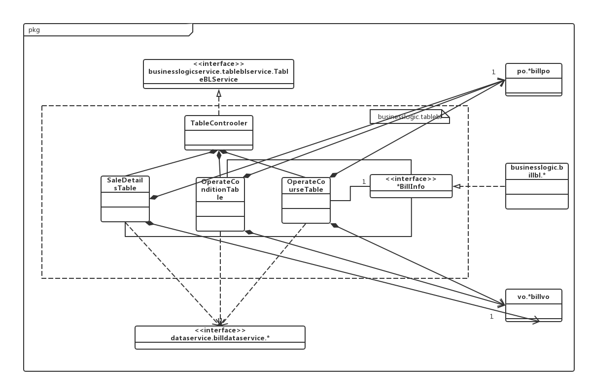
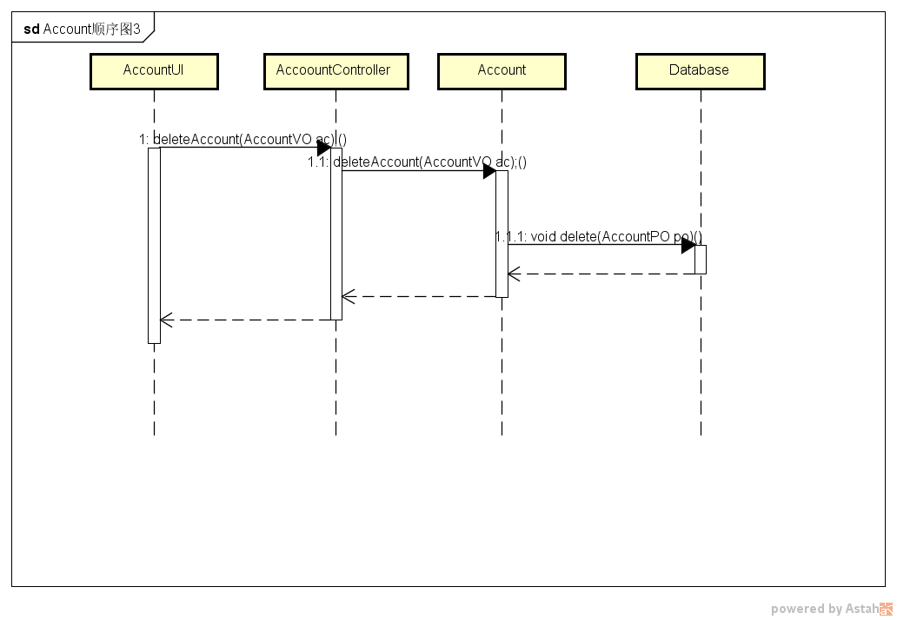

# 进销存系统软件详细设计描述文档

#### V1.1正式版

# 更新历史

------

| **修改人员** | **日期**    | **变更原因**     | **版本号**   |
| -------- | --------- | ------------ | --------- |
| 全体人员     | 2017-11-3 | 最初草稿         | V1.0  草稿  |
| 石胜杰      | 2017-11-7 | 细化了bill模块的接口 | V1.0  正式版 |
| 刘苏豫      | 2018-1-4  | 细化接口         | V1.1正式版   |

------

##1.引言

###1.1编制目的

本报告详细完成对进销存系统的详细设计，达到指导后后续软件构造的目的。同时实现和测试人员及用户的沟通。

本报告面向开发人员、测试人员及最终用户而编写，是了解系统的导航。

###1.2词汇表

| 词汇名称        | 词汇含义             | 备注   |
| ----------- | ---------------- | ---- |
| *ui         | 表示某展示层           |      |
| *bl         | 表示某逻辑层           |      |
| *data       | 表示某数据层           |      |
| RMI         | 表示远程方法调用         |      |
| utilitybl   | 表示初始化和业务逻辑上下文的工作 |      |
| datafactory | 表示调用其它数据库的方法     |      |

###1.3参考资料

1.IEEE std 1471-2000

2.丁二玉，刘钦.计算与软件工程（卷二）[M]机械工业出版2012，134—182

##2.产品概述

参考进销存系统用例文档和进销存系统需求规格说明文档中对产品的概括描述。

##3.体系结构设计概述

参考进销存系统概要设计文档中对体系结构设计的概述。

##4.结构视角

###4.1业务逻辑的分解

业务逻辑层的开发包图参见软件体系结构文档图。

####4.1.1 memberbl模块

#####4.1.1.1模块概述

memberbl模块承担的需求参见需求规格说明文档，功能需求及相关非功能需求参见需求规格说明文档。

Member模块的职责及接口参见软件系统结构描述文档表

#####4.1.1.2整体结构

根据体系结构的设计，我们将系统分为展示层、业务逻辑层、数据层。每一层之间为了增加灵活性，我们会添加接口，比如展示层和业务逻辑层之间我们添加businesslogicservice.memberblservice.MemberBLService接口.业务逻辑层和数据层之间添加dataservice.memberdataservice.MemberDataService接口。为隔离业务逻辑职责和逻辑控制职责，我们增加了MenberController，这样MemberController会将对销售的业务逻辑处理委托给Member对象。MemberPO是作为销售记录的持久化对象被添加到设计模型中去的。

memberbl模块的设计如图。

memberbl模块各个类的职责如表所示。

| 模块               | 职责                                       |
| ---------------- | ---------------------------------------- |
| MemberController | 负责实现客户管理界面做需要的服务                         |
| Member           | 客户管理领域的模型对象，拥有一次客户管理操作所持有的客户姓名，等级信息，可以帮助完成客户管理界面所需要的服务。 |

#####4.1.1.3模块内部类的接口规范

#####MemberController 的接口规范

提供的服务（供接口）

MemberController.addMember

| 语法   | public boolean addMember(MemberVO vo) |
| ---- | ------------------------------------- |
| 前置条件 | 已创建一个Member对象，并且输入符合输入规则              |
| 后置条件 | 调用Member对象的addMember方法                |

MemberController.findMember

| 语法   | public MemberVO findMemberByName(String name) |
| ---- | ---------------------------------------- |
| 前置条件 | 已创建一个Member对象，并且输入符合输入规则                 |
| 后置条件 | 调用Member对象的findMember方法                  |

MemberController.deleteMember

| 语法   | public boolean deleteMember(MemberVO a); |
| ---- | ---------------------------------------- |
| 前置条件 | 已创建一个Member对象，并且输入符合输入规则                 |
| 后置条件 | 调用Member对象的deleteMember方法                |

MemberController.updateMember

| 语法   | public boolean updateMember(MemberVO a) |
| ---- | --------------------------------------- |
| 前置条件 | 已创建一个Member对象，并且输入符合输入规则                |
| 后置条件 | 调用Member对象的updateMember方法               |

MemberController.findMembersByField

| 语法   | public ArrayList<MemberVO> findMembersByField(String field) |
| ---- | ---------------------------------------- |
| 前置条件 | 已创建一群Member对象                            |
| 后置条件 | 调用Member对象的findMembersByField方法          |

MemberController.toMemberVO

| 语法   | public MemberVO toMemberVO(MemberPO memberPO) |
| ---- | ---------------------------------------- |
| 前置条件 | 已创建一个Member对象                            |
| 后置条件 | 调用Member对象的toMemberVO方法                  |

MemberController.findMembers

| 语法   | public ArrayList<MemberVO> findMembers() |
| ---- | ---------------------------------------- |
| 前置条件 | 已创建Member对象                              |
| 后置条件 | 调用Member对象的findMembers方法                 |

MemberController.findMemberByID

| 语法   | public MemberVO findMemberByID(long id) |
| ---- | --------------------------------------- |
| 前置条件 | 已创建一个Member对象，且输入符合输入规则                 |
| 后置条件 | 调用Member对象的findMemberByID方法             |

需要的服务（需接口） 

| 服务名                                     | 服务                   |
| --------------------------------------- | -------------------- |
| Member.addMember(MemberVO )             | 加入一个客户对象             |
| Member.findMember(String field,int id)  | 查找一个客户对象             |
| Member.deleteMember(MemberVO vo)        | 删除一个客户对象             |
| Member.updateMember(MemberVO vo)        | 维护一个客户对象             |
| Member.findMembersByField(String field) | 根据范围查找对象             |
| Member.toMemberVO(MemberPO memberPO)    | 把MemberPO转化为MemberVO |
| Member.findMembers()                    | 查找用户群                |
| Member.findMemberByID(long id)          | 根据ID查找用户             |

#####Member的接口规范

提供的服务（供接口）

Member.addMember

| 语法   | public MemberVO addmember (MemberVO a) |
| ---- | -------------------------------------- |
| 前置条件 | 进货销售人员已登录                              |
| 后置条件 | 增添一个客户信息                               |

Member.deleteMember

| 语法   | public MemberVO deletemember (MemberVO a) |
| ---- | ---------------------------------------- |
| 前置条件 | 进货销售人员已登录                                |
| 后置条件 | 删除一个客户信息                                 |

Member.findMemberByName

| 语法   | public MemberVO findMemberByName(MemberVO a) |
| ---- | ---------------------------------------- |
| 前置条件 | 输入的关键词正确，进货销售人员已登录                       |
| 后置条件 | 显示查询客户的信息                                |

Member.updateMember

| 语法   | public MemberVO updateMember(MemberVO a) |
| ---- | ---------------------------------------- |
| 前置条件 | 此客户存在，进货销售人员已登录                          |
| 后置条件 | 更改客户的信息                                  |

Member.findMembersByField

| 语法   | public ArrayList<MemberVO> findMembersByField(String field) |
| ---- | ---------------------------------------- |
| 前置条件 | 此客户存在，进货销售人员已登录                          |
| 后置条件 | 根据范围查找对象                                 |

Member.toMemberVO

| 语法   | public MemberVO toMemberVO(MemberPO memberPO) |
| ---- | ---------------------------------------- |
| 前置条件 | MemberVO存在                               |
| 后置条件 | 把MemberPO转化为MemberVO                     |

Member.findMembers

| 语法   | public ArrayList<MemberVO> findMembers() |
| ---- | ---------------------------------------- |
| 前置条件 | 此客户群存在，进货销售人员已登录                         |
| 后置条件 | 查找用户群                                    |

Member.findMemberByID

| 语法   | public MemberVO findMemberByID(long id) |
| ---- | --------------------------------------- |
| 前置条件 | 此客户ID存在，用户已登录                           |
| 后置条件 | 根据ID查找用户                                |

需要的服务（需接口）

| 服务名                                      | 服务                |
| ---------------------------------------- | ----------------- |
| MemberDataService.findMemberbyName(String name) | 根据客户姓名进行查找单一持久化对象 |
| MemberDataService.findMembers()          | 根据字段名和值查找多个持久化对象  |
| MemberDataService.findMemberbyID(long id) | 根据客户ID进行查找单一持久化对象 |
| MemberDataService.findMembersbyField(String field) | 根据字段名查找多个持久化对象    |
| MemberDataService.update(MemberPO po)    | 更新单一持久化对象         |
| MemberDataService.delete(MemberPO po)    | 得到Member数据库的服务的引用 |
| MemberDataService.insert(MemberPO po)    | 在数据库中插入MemberPO对象 |

(4) 业务逻辑层的动态模型

如图是增加客户的顺序图

删除客户信息的顺序图

查找并获得客户信息的顺序图

维护客户的顺序图参照添加客户

获取客户列表的顺序图参照获取客户信息

（5）业务逻辑层的设计原理

​	利用了委托式的控制风格，每个界面需要访问的业务逻辑由各自的控制器委托给不同的领域对象。

####4.1.2 tablebl模块

#####4.1.2.1模块概述

tablebl模块承担的需求参见需求规格说明文档，功能需求及相关非功能需求参见需求规格说明文档。

Table模块的职责及接口参见软件系统结构描述文档表

#####4.1.2.2整体结构

根据体系结构的设计，我们将系统分为展示层、业务逻辑层、数据层。每一层之间为了增加灵活性，我们会添加接口，比如展示层和业务逻辑层之间我们添加businesslogicservice.tableblservice.TableBLService接口.业务逻辑层和数据层之间添加dataservice.tabledataservice.TableDataService接口。为隔离业务逻辑职责和逻辑控制职责，我们增加了TableController，这样TableController会将对销售的业务逻辑处理委托给Table对象。TablePO是作为销售记录的持久化对象被添加到设计模型中去的。

tablebl模块的设计如图。

tablebl模块各个类的职责如表所示。

| 模块              | 职责                                       |
| --------------- | ---------------------------------------- |
| TableController | 负责实现表格查看界面所需要的服务                         |
| Table           | 表格的领域对象模型，拥有一次表个插卡所持有的各类表单的引用，可以帮助完成表格查看界面所需要的服务 |

#####4.1.2.3模块内部类的接口规范

#####TableController的接口规范

提供的服务（供接口）

TableController.getSaleDetails

| 语法   | public SaleDetailsTableVO getSaleDetails(String field) |
| ---- | ---------------------------------------- |
| 前置条件 | 已创建一个Table领域对象，并且输入符合输入规范                |
| 后置条件 | 调用Table领域对象的getSaleDetails方法             |

TableController.getOperateCondition

| 语法   | public OperateConditionTableVO getOperateCondition(String field) |
| ---- | ---------------------------------------- |
| 前置条件 | 已创建一个Table领域对象，并且输入符合输入规范                |
| 后置条件 | 调用Table领域对象的getOperateCondition方法        |

TableController.getOperateCourse

| 语法   | public ArrayList<BillVO> getOperateCourse(String field) |
| ---- | ---------------------------------------- |
| 前置条件 | 已创建一个Table领域对象，并且输入符合输入规范                |
| 后置条件 | 调用Table领域对象的getOperateCourse方法           |

TableController.Red

| 语法   | public void Red(String id,String Note) |
| ---- | -------------------------------------- |
| 前置条件 | 已创建一个Table领域对象，并且输入符合输入规范              |
| 后置条件 | 调用Table领域对象的Red方法                      |

需要的服务（需接口）

| 服务名                       | 服务          |
| ------------------------- | ----------- |
| Table.getSaleDetails      | 获得销售记录      |
| Table.getOperateCondition | 获得经营情况表     |
| Table.getOperateCour      | 获得所有符合条件的单据 |
| Table.Red                 | 进行单据红冲      |

（4）业务逻辑层的动态设计模型

如图是查看销售明细表的顺序图

红冲顺序图

查看经营情况表和经营明细表的顺序图参照销售明细表。

####4.2.3commoditybl模块

#####4.2.3.1模块概述

commodityebl模块承担的需求参见需求规格说明文档，功能需求及相关非功能需求参见需求规格说明文档。

Commodity模块的职责及接口参见软件系统结构描述文档表

#####4.2.3.2整体结构

根据体系结构的设计，我们将系统分为展示层、业务逻辑层、数据层。每一层之间为了增加灵活性，我们会添加接口，比如展示层和业务逻辑层之间我们添加businesslogicservice.commodityblservice.CommodityBLService接口.业务逻辑层和数据层之间添加dataservice.commoditydataservice.CommodityDataService接口。为隔离业务逻辑职责和逻辑控制职责，我们增加了CommodityController，这样CommodityController会将对销售的业务逻辑处理委托给Commodity对象。CommodityPO是作为销售记录的持久化对象被添加到设计模型中去的。

commoditybl模块的设计如图。

commoditybl模块各个类的职责如表所示。
commoditybl模块各个类的职责
| CommodityController | 负责实现商品界面所需要的服务                           |
| ------------------- | ---------------------------------------- |
| Commodity           | 商品的领域模型对象，拥有分类，商品价格，名称，库存数量等信息，可以帮助实现商品界面所需要的服务 |
| Category            | 商品分类的领域模型对象，拥有分类，子类，名称等信息，可以帮助完成实现商品界面所需要的服务 |
#####4.2.3.3模块内部类的接口规范

#####CommodityController的接口规范

CommodityController.findCommodityByField

| 语法   | public ArrayList<CommodityVO> findCommodityByField(String field) |
| ---- | ---------------------------------------- |
| 前置条件 | 已创建一个commodity领域对象，并且输入正确                |
| 后置条件 | 调用commodity领域对象的findCommodityByField方法   |

CommodityController.findCommodityByName

| 语法   | public CommodityVO findCommodityByName(String name) |
| ---- | ---------------------------------------- |
| 前置条件 | 已创建一个commodity领域对象，并且输入正确                |
| 后置条件 | 调用commodity领域对象的findCommodityByName方法    |

CommodityController.findCommodityByID

| 语法   | public CommodityVO findCommodityByID(long id) |
| ---- | ---------------------------------------- |
| 前置条件 | 已创建一个commodity领域对象，并且输入正确                |
| 后置条件 | 调用commodity领域对象的findCommodityByID方法      |

CommodityController.findCommodities

| 语法   | public ArrayList<CommodityVO> findCommodities() |
| ---- | ---------------------------------------- |
| 前置条件 | 已创建一个commodity领域对象，并且输入正确                |
| 后置条件 | 调用commodity领域对象的findCommodities方法        |

CommodityController.toCommodityVO

| 语法   | public CommodityVO toCommodityVO(CommodityPO commodityPO) |
| ---- | ---------------------------------------- |
| 前置条件 | 已创建一个commodity领域对象，并且输入正确                |
| 后置条件 | 调用commodity领域对象的toCommodityVO方法          |

CommodityController.findDownCommodity

| 语法   | public ArrayList<CommodityVO> findDownCommodity(CategoryVO vo) |
| ---- | ---------------------------------------- |
| 前置条件 | 已创建commodity领域对象，并且输入正确                  |
| 后置条件 | 调用commodity领域对象的findDownCommodity方法      |

CommodityController.addCommodity

| 语法   | public boolean addCommodity(CommodityVO commodityVO) |
| ---- | ---------------------------------------- |
| 前置条件 | 已创建一个commodity领域对象，并且输入正确                |
| 后置条件 | 调用commodity领域对象的addCommodity方法           |

CommodityController.deleteCommodity
| 语法   | public boolean deleteCommodity(CommodityVO commodityVO) |
| ---- | ---------------------------------------- |
| 前置条件 | 已创建一个commodity领域对象，并且输入正确                |
| 后置条件 | 调用commodity领域对象的deleteCommodity方法        |

CommodityController.updateCommodity

| 语法   | public boolean updateCommodity(CommodityVO commodityVO) |
| ---- | ---------------------------------------- |
| 前置条件 | 已创建一个commodity领域对象，并且输入正确                |
| 后置条件 | 调用commodity领域对象的updateCommodity方法        |

CommodityController.findCategoryByName

| 语法   | public CategoryVO findCategoryByName(String name); |
| ---- | ---------------------------------------- |
| 前置条件 | 根据类别名查找已创建一个commodity领域对象，并且输入正确         |
| 后置条件 | 调用commodity领域对象的findCategoryByName方法     |
CommodityController.findCategoryByID

| 语法   | public CategoryVO findCategoryByID(long id); |
| ---- | ---------------------------------------- |
| 前置条件 | 根据ID查找已创建一个commodity领域对象，并且输入正确          |
| 后置条件 | 调用commodity领域对象的findCategoryByID方法       |

CommodityController.addCategory

| 语法   | public boolean addCategory(CategoryVO categoryVO) |
| ---- | ---------------------------------------- |
| 前置条件 | 已创建一个category领域对象，并且输入正确                 |
| 后置条件 | 调用category领域对象的addcategory方法             |
CommodityController.deleteCategory

| 语法   | public boolean deleteCategory(CategoryVO categoryVO) |
| ---- | ---------------------------------------- |
| 前置条件 | 已创建一个category领域对象，并且输入正确                 |
| 后置条件 | 调用category领域对象的deletecategory方法          |
CommodityController.updateCategory

| 语法   | public boolean updateCategory(CategoryVO categoryVO) |
| ---- | ---------------------------------------- |
| 前置条件 | 已创建一个category领域对象，并且输入正确                 |
| 后置条件 | 调用category领域对象的updateCategory方法          |
CommodityController.toCategoryVO

| 语法   | public CategoryVO toCategoryVO(CategoryPO categoryPO) |
| ---- | ---------------------------------------- |
| 前置条件 | 已创建一个category领域对象，并且输入正确                 |
| 后置条件 | 调用category领域对象的toCategoryVO方法            |

CommodityController.findUpCategory

| 语法   | public ArrayList<CategoryVO> findUpCategory(CategoryVO vo) |
| ---- | ---------------------------------------- |
| 前置条件 | 已创建一个category领域对象，并且输入正确                 |
| 后置条件 | 调用category领域对象的findUpCategory方法          |

CommodityController.findDownCategory

| 语法   | public ArrayList<CategoryVO> findDownCategory(CategoryVO vo) |
| ---- | ---------------------------------------- |
| 前置条件 | 已创建一个category领域对象，并且输入正确                 |
| 后置条件 | 调用category领域对象的findDownCategory方法        |

CommodityController.getStockInfo

| 语法   | public ArrayList<StockCheckInfoVO> getStockInfo(Date start,Date end) |
| ---- | ---------------------------------------- |
| 前置条件 | 已创建库存信息，并且输入正确                           |
| 后置条件 | 调用category领域对象的getStockInfo方法            |

CommodityController.getInventoryInfo

| 语法   | public ArrayList<StockInventoryInfoVO> getInventoryInfo() |
| ---- | ---------------------------------------- |
| 前置条件 | 已创建库存信息，并且输入正确                           |
| 后置条件 | 调用category领域对象的getInventoryInfo方法        |

CommodityController.findLargestIDofCommodity

| 语法   | public long findLargestIDofCommodity()   |
| ---- | ---------------------------------------- |
| 前置条件 | 已创建一个category领域对象，并且输入正确                 |
| 后置条件 | 调用category领域对象的findLargestIDofCommodity方法 |

CommodityController.findLargestIDofCategory

| 语法   | public long findLargestIDofCategory()    |
| ---- | ---------------------------------------- |
| 前置条件 | 已创建一个category领域对象，并且输入正确                 |
| 后置条件 | 调用category领域对象的findLargestIDofCategory方法 |

#####Commodity的接口规范

Commodity.findCommodityByField

| 语法   | public ArrayList<CommodityVO> findCommodityByField(String field) |
| ---- | ---------------------------------------- |
| 前置条件 | 查询关键字正确，库存管理人员已登录                        |
| 后置条件 | 返回商品列表信息                                 |

Commodity.addCommodity

| 语法   | public boolean addCommodity(CommodityVO commodityVO) |
| ---- | ---------------------------------------- |
| 前置条件 | 选择新增商品且商品信息填写完整且符合要求，库存管理人员已登录           |
| 后置条件 | 新增商品并将其作为持久化对象插入数据库，返回维护结果               |

Commodity.addCategory

| 语法   | public boolean addCategory(CategoryVO categoryVO) |
| ---- | ---------------------------------------- |
| 前置条件 | 选择新增分类，分类信息填写完整，库存管理人员已登录                |
| 后置条件 | 新增分类并将其作为持久化对象插入数据库，返回维护结果               |

Commodity.deleteCommodity

| 语法   | public boolean deleteCommodity(CommodityVO commodityVO) |
| ---- | ---------------------------------------- |
| 前置条件 | 选择删除商品，库存管理人员已登录                         |
| 后置条件 | 删除商品并从数据库中删除单一持久化对象，返回维护结果               |

Commodity.deleteCategory

| 语法   | public boolean deleteCategory(CategoryVO categoryVO) |
| ---- | ---------------------------------------- |
| 前置条件 | 选择删除分类，库存管理人员已登录                         |
| 后置条件 | 删除分类并从数据库中删除单一持久化对象，返回维护结果               |

Commodity.updateCommodity

| 语法   | public boolean updateCommodity(CommodityVO commodityVO) |
| ---- | ---------------------------------------- |
| 前置条件 | 选择修改商品，库存管理人员已登录                         |
| 后置条件 | 更新商品并从数据库中更新单一持久化对象，返回维护结果               |

Commodity.updateCategory

| 语法   | public boolean updateCategory(CategoryVO categoryVO) |
| ---- | ---------------------------------------- |
| 前置条件 | 选择修改分类，库存管理人员已登录                         |
| 后置条件 | 更新分类并从数据库中更新单一持久化对象，返回维护结果               |

Commodity.findCommodityByName

| 语法   | public CommodityVO findCommodityByName(String name) |
| ---- | ---------------------------------------- |
| 前置条件 | 输入类型正确，库存管理人员已登录                         |
| 后置条件 | 返回符合条件的商品信息                              |

Commodity.findCommodityByID

| 语法   | public CommodityVO findCommodityByID(long id) |
| ---- | ---------------------------------------- |
| 前置条件 | 输入类型正确，库存管理人员已登录                         |
| 后置条件 | 返回符合条件的商品信息                              |

Commodity.findCategoryByName

| 语法   | public CategoryVO findCategoryByName(String name) |
| ---- | ---------------------------------------- |
| 前置条件 | 输入类型正确，库存管理人员已登录                         |
| 后置条件 | 返回符合条件的分类信息                              |

Commodity.findCategoryByID

| 语法   | public CategoryVO findCategoryByID(long id) |
| ---- | ---------------------------------------- |
| 前置条件 | 输入类型正确，库存管理人员已登录                         |
| 后置条件 | 返回符合条件的分类信息                              |

Commodity.toCommodityVO

| 语法   | public CommodityVO toCommodityVO(CommodityPO commodityPO) |
| ---- | ---------------------------------------- |
| 前置条件 | 库存管理人员已登录，已选择持久化对象                       |
| 后置条件 | 返回商品信息                                   |

Commodity.toCategoryVO

| 语法   | public CategoryVO toCategoryVO(CategoryPO categoryPO) |
| ---- | ---------------------------------------- |
| 前置条件 | 库存管理人员已登录，已选择持久化对象                       |
| 后置条件 | 返回分类信息                                   |

Commodity.findUpCategory

| 语法   | public ArrayList<CategoryVO> findUpCategory(CategoryVO vo) |
| ---- | ---------------------------------------- |
| 前置条件 | 库存管理人员已登录，分类存在父节点                        |
| 后置条件 | 返回父类分类信息                                 |

Commodity.findDownCategory

| 语法   | public ArrayList<CategoryVO> findDownCategory(CategoryVO vo) |
| ---- | ---------------------------------------- |
| 前置条件 | 库存管理人员已登录，分类存在子节点                        |
| 后置条件 | 返回子类分类信息                                 |

Commodity.findDownCommodity

| 语法   | public ArrayList<CommodityVO> findDownCommodity(CategoryVO vo); |
| ---- | ---------------------------------------- |
| 前置条件 | 库存管理人员已登录，分类存在所属于他的商品                    |
| 后置条件 | 返回商品列表信息                                 |

Commodity.getStockInfo

| 语法   | public ArrayList<StockCheckInfoVO> getStockInfo(Date start,Date end) |
| ---- | ---------------------------------------- |
| 前置条件 | 库存管理人员已登录，时间符合现实条件                       |
| 后置条件 | 返回商品列表信息                                 |

Commodity.getInventoryInfo

| 语法   | public ArrayList<StockInventoryInfoVO> getInventoryInfo(); |
| ---- | ---------------------------------------- |
| 前置条件 | 库存管理人员已登录，当天销售已结束                        |
| 后置条件 | 返回商品列表信息                                 |

Commodity.findCommodities

| 语法   | public ArrayList<CommodityVO> findCommodities(); |
| ---- | ---------------------------------------- |
| 前置条件 | 库存管理人员已登录                                |
| 后置条件 | 返回所有商品列表信息                               |

Commodity.findLargestIDofCommodity

| 语法   | public long findLargestIDofCommodity(); |
| ---- | --------------------------------------- |
| 前置条件 | 库存管理人员已登录                               |
| 后置条件 | 返回最新商品的编号                               |

Commodity.findLargestIDofCategory

| 语法   | public long findLargestIDofCategory() |
| ---- | ------------------------------------- |
| 前置条件 | 库存管理人员已登录                             |
| 后置条件 | 返回最新商分类的编号                            |

需要的接口（需接口）

| 服务名                                      | 服务                  |
| ---------------------------------------- | ------------------- |
| CommodityDataService.findCommoditybyID(long id) | 根据ID查找单一持久化对象       |
| CommodityDataService.findCommoditiesbyField(String field) | 根据字段名称和值查找多个持久化对象   |
| CommodityDataService.insert(CommodityPO po) | 插入单一持久化对象           |
| CommodityDataService.delete(CommodityPO po) | 删除单一持久化对象           |
| CommodityDataService.update(CommodityPO p) | 更新单一持久化对象           |
| CommodityDataService.findCommodities()   | 得到Commodity所有的持久化对象 |
| CommodityDataService.findCommoditybyName(String name) | 根据名称查找单一持久化对象       |
| CommodityDataService.findCommoditiesbyParent(long parentid) | 根据所属分类查找多个持久化对象     |
| CommodityDataService.getLargestIDofCommodity() | 得到最新的单一持久化对象的编号     |
| CategoryDataService.findCategorybyID(long id) | 根据ID查找单一持久化对象       |
| CategoryDataService.findCategorybyName(String Name) | 根据名称得到单一化持久对象       |
| CategoryDataService.insert(CategoryPO po) | 插入单一持久化对象           |
| CategoryDataService.delete(CategoryPO po) | 删除单一持久化对象           |
| CategoryDataService.update(CategoryPO po) | 更新单一持久化对象           |
| CategoryDataService.findCategories()     | 得到Category所有的持久化对象  |
| CategoryDataService.findCategorybyParent(long parentid) | 根据父类查找多个持久化对象       |
| CategoryDataService.getLargestIDofCategory() | 得到最新的单一持久化对象的编号     |

##### （4）业务逻辑层动态设计模型

如图是商品管理增加商品的顺序图

商品管理删除商品顺序图

获取商品分类列表顺序图

获取商品信息顺序图

更新商品信息顺序图

####4.2.4 accountbl模块

#####4.2.4.1模块概述

accountbl模块承担的需求参见需求规格说明文档，功能需求及相关非功能需求参见需求规格说明文档。

Account模块的职责及接口参见软件系统结构描述文档表

#####4.2.4.2整体结构

根据体系结构的设计，我们将系统分为展示层、业务逻辑层、数据层。每一层之间为了增加灵活性，我们会添加接口，比如展示层和业务逻辑层之间我们添加businesslogicservice.accountblservice.AccountBLService接口.业务逻辑层和数据层之间添加dataservice.accountdataservice.AccountDataService接口。为隔离业务逻辑职责和逻辑控制职责，我们增加了AccountController，这样AccountController会将对销售的业务逻辑处理委托给Account对象。AccountPO是作为销售记录的持久化对象被添加到设计模型中去的。

accountbl模块的设计如图。

accountbl模块各个类的职责如表所示。
| 模块                | 职责                       |
| ----------------- | ------------------------ |
| AccountController | 负责实现账户管理所需要的服务           |
| Account           | 银行账户的领域模型对象，拥有账户数据的名称和金额 |

#####4.2.4.3模块内部类的接口规范

#####AccountController接口规范

提供的服务（供接口）

AccountController.addAccount

| 语法   | public boolean addAccount(AccountVO accountVO) |
| ---- | ---------------------------------------- |
| 前置条件 | 已创建一个Account对象，并且输入符合输入规则                |
| 后置条件 | 调用Account领域对象的addAccount方法               |

AccountController.getAccount

| 语法   | public AccountVO findAccountByID(long id) |
| ---- | ---------------------------------------- |
| 前置条件 | 已创建一个Account对象，并且输入符合输入规则                |
| 后置条件 | 调用Account领域对象的getAccount方法               |

AccountController.deleteAccount

| 语法   | public boolean deleteAccount(AccountVO accountVO) |
| ---- | ---------------------------------------- |
| 前置条件 | 已创建一个Account对象，并且输入符合输入规则                |
| 后置条件 | 调用Account领域对象的deleteAccount方法            |

AccountController.modifyAccount

| 语法   | public boolean updateAccount(AccountVO accountVO) |
| ---- | ---------------------------------------- |
| 前置条件 | 已创建一个Account对象，并且输入符合输入规则                |
| 后置条件 | 调用Account领域对象的modifyAccount方法            |

AccountController.findAccountByField

| 语法   | public ArrayList<AccountVO> findAccountByField(String field) |
| ---- | ---------------------------------------- |
| 前置条件 | 已创建Account对象，并且输入符合输入规则                  |
| 后置条件 | 调用Account领域对象的findAccountByField方法       |

AccountController.toAccountVO

| 语法   | public AccountVO toAccountVO(AccountPO accountPO) |
| ---- | ---------------------------------------- |
| 前置条件 | 已创建一个Account对象，并且输入符合输入规则                |
| 后置条件 | 调用Account领域对象的toAccountVO方法              |

AccountController.findAccounts

| 语法   | public ArrayList<AccountVO> findAccounts() |
| ---- | ---------------------------------------- |
| 前置条件 | 已创建一个Account对象，并且输入符合输入规则                |
| 后置条件 | 调用Account领域对象的findAccounts方法             |

AccountController.backUpDataBase

| 语法   | public boolean backUpDataBase(Date time) |
| ---- | ---------------------------------------- |
| 前置条件 | 已创建一个Account对象，并且输入符合输入规则                |
| 后置条件 | 调用Account领域对象的backUpDataBase方法           |

AccountController.retore

| 语法   | public ArrayList<AccountBookData> retore() |
| ---- | ---------------------------------------- |
| 前置条件 | 已创建一个AccountBookData对象，并且输入符合输入规则        |
| 后置条件 | 调用Account领域对象的retore方法                   |

需要的服务（供接口）

| 服务名                                      | 服务                     |
| ---------------------------------------- | ---------------------- |
| Account.addAccount(AccountVO accountVO)  | 加入一个银行账户对象             |
| Account.findAccountByID(long id)         | 根据ID查看一个的银行账户对象的具体信息   |
| Account.deleteAccount(AccountVO accountVO) | 删除一个银行账户对象             |
| Account.updateAccount(AccountVO accountVO) | 修改一个已存在的银行账户对象的信息      |
| Account.findAccountByField(String field) | 列出所有符合条件的银行账户信息        |
| Account.toAccountVO(AccountPO accountPO) | 将AccountPO转化为AccountVO |
| Account.findAccounts()                   | 列出所有银行账户信息             |
| Account.backUpDataBase(Date time)        | 把当时所有的账户信息存储起来         |
| Account.retore()                         | 查看期初建账的账本信息            |

#####Account的接口规范

Account.findAccountByID

| 语法   | public AccountVO findAccountByID(long id) |
| ---- | ---------------------------------------- |
| 前置条件 | 选择查看某具体银行账户信息，财务人员已登录                    |
| 后置条件 | 返回账户信息                                   |

Account.addAccount

| 语法   | public boolean addAccount(AccountVO accountVO) |
| ---- | ---------------------------------------- |
| 前置条件 | 选择增加银行账户信息，财务人员已登录                       |
| 后置条件 | 增加账户信息，向数据库插入单一持久化对象，返回维护结果              |

Account.deleteAccount

| 语法   | public boolean deleteAccount(AccountVO accountVO) |
| ---- | ---------------------------------------- |
| 前置条件 | 选择删除银行账户信息，财务人员已登录                       |
| 后置条件 | 删除账户信息，从数据库删除单一持久化对象，返回维护结果              |

Account.updateAccount

| 语法   | public boolean updateAccount(AccountVO accountVO); |
| ---- | ---------------------------------------- |
| 前置条件 | 选择更新银行账户信息，财务人员已登录                       |
| 后置条件 | 更新账户信息，从数据库更新单一持久化对象，返回维护结果              |

Account.findAccounts()

| 语法   | public ArrayList<AccountVO> findAccounts() |
| ---- | ---------------------------------------- |
| 前置条件 | 选择查看账户列表，财务人员已登录                         |
| 后置条件 | 返回账户列表信息                                 |

Account.findAccountByField

| 语法   | public ArrayList<AccountVO> findAccountByField(String field) |
| ---- | ---------------------------------------- |
| 前置条件 | 关键词类型正确，财务人员已登录                          |
| 后置条件 | 返回账户列表信息                                 |

Account.toAccountVO

| 语法   | public AccountVO toAccountVO(AccountPO accountPO) |
| ---- | ---------------------------------------- |
| 前置条件 | 财务人员已登录，存在此持久化对象                         |
| 后置条件 | 返回账户信息                                   |

Account.backUpDataBase

| 语法   | public boolean backUpDataBase(Date time) |
| ---- | ---------------------------------------- |
| 前置条件 | 财务人员已登录                                  |
| 后置条件 | 返回维护结果                                   |

Account.retore

| 语法   | public ArrayList<AccountBookData> retore() |
| ---- | ---------------------------------------- |
| 前置条件 | 财务人员已登录                                  |
| 后置条件 | 显示此时刻的账户信息                               |

需要的接口（需接口）

| 服务名                                      | 服务                   |
| ---------------------------------------- | -------------------- |
| AccountDataService.findAccountbyID(long id) | 根据ID查找单一持久化对象        |
| AccountDataService.findAcountbyField(String field) | 根据字段名称和值查找多个持久化对象    |
| AccountDataService.insert(AccountPO po)  | 插入单一持久化对象            |
| AccountDataService.delete(AccountPO p)   | 删除单一持久化对象            |
| AccountDataService.update(AccountPOp)    | 更新单一持久化对象            |
| AccountDataService.findAccounts()        | 得到Commodity数据库的服务的引用 |
| AccountDataService.backUpDataBase(Date time) | 保存为单一持久化对象           |
| AccountDataService.restore()             | 得到单一持久化对象            |

（4）业务逻辑层动态设计模型

如图是增加账户顺序图

删除账户顺序图

修改账户信息顺序图

获取账户顺序图

####4.2.5 logbl模块

#####4.2.5.1模块概述

logbl模块承担的需求参见需求规格说明文档，功能需求及相关非功能需求参见需求规格说明文档。

Log模块的职责及接口参见软件系统结构描述文档表

#####4.2.5.2整体结构

根据体系结构的设计，我们将系统分为展示层、业务逻辑层、数据层。每一层之间为了增加灵活性，我们会添加接口，比如展示层和业务逻辑层之间我们添加businesslogicservice.logblservice.LogBLService接口.业务逻辑层和数据层之间添加dataservice.logdataservice.LogDataService接口。为隔离业务逻辑职责和逻辑控制职责，我们增加了LogController，这样LogController会将对销售的业务逻辑处理委托给Log对象。LogPO是作为销售记录的持久化对象被添加到设计模型中去的。

logbl模块的设计如图。

logbl模块各个类的职责如表所示。

| 模块            | 职责                         |
| ------------- | -------------------------- |
| LogController | 负责实现查看日志所需要的服务             |
| Log           | 日志的领域模型对象，拥有日志数据的时间，操作员，操作 |

#####4.5.2.3模块内部类的接口规范

#####LogController接口规范

提供的服务（供接口）

LogController.addLog

| 语法   | public boolean addLog(LogVO logVO) |
| ---- | ---------------------------------- |
| 前置条件 | 已创建一个Log对象，并且输入符合输入规则              |
| 后置条件 | 调用Log领域对象的addLog方法                 |

LogController.findLogs

| 语法   | public ArrayList<LogVO> findLogs() |
| ---- | ---------------------------------- |
| 前置条件 | 已创建一个Log对象                         |
| 后置条件 | 调用Log领域对象的findLogs方法               |

LogController.findLogByUserID

| 语法   | public ArrayList<LogVO> findLogByUserID(long userid) |
| ---- | ---------------------------------------- |
| 前置条件 | 已创建一个Log对象，userid存在                      |
| 后置条件 | 调用Log领域对象的findLogByUserID方法              |

LogController.findLogByField

| 语法   | public ArrayList<LogVO> findLogByField(String field) |
| ---- | ---------------------------------------- |
| 前置条件 | 已创建一个Log对象，输入符合规则                        |
| 后置条件 | 调用Log领域对象的findLogByField方法               |

LogController.toLogVO

| 语法   | public LogVO toLogVO(LogPO logPO) |
| ---- | --------------------------------- |
| 前置条件 | 已创建一个LogPO对象                      |
| 后置条件 | 调用Log领域对象的toLogVO方法               |

LogController.findLargestID

| 语法   | public long findLargestID() |
| ---- | --------------------------- |
| 前置条件 | 已创建一个Log对象                  |
| 后置条件 | 调用Log领域对象的findLargestID方法   |

需要的的服务（需接口）

| 服务名                              | 服务             |
| -------------------------------- | -------------- |
| Log.addLog(LogVO logVO)          | 添加一个日志对象       |
| Log.findLogs()                   | 显示最近的一定数量的日志对象 |
| Log.findLogByUserID(long userid) | 根据ID查找日志       |
| Log.findLogByField(String field) | 根据字段名和值查找日志    |
| Log.toLogVO(LogPO logPO)         | 将LogPO转化为LogVO |
| Log.findLargestID()              | 查找最新的日志        |

#####Log的接口规范

log.addLog

| 语法   | public boolean addLog(LogVO logVO) |
| ---- | ---------------------------------- |
| 前置条件 | 用户进行了某项操作                          |
| 后置条件 | 记录操作的持久化数据对象到数据库                   |

log. findLogs

| 语法   | public ArrayList<LogVO> findLogs() |
| ---- | ---------------------------------- |
| 前置条件 | 财务人员或总经理已登录                        |
| 后置条件 | 显示记录中的历史日志                         |

log. findLogByUserID

| 语法   | public ArrayList<LogVO> findLogByUserID(long userid) |
| ---- | ---------------------------------------- |
| 前置条件 | 财务人员或总经理已登录，ID存在                         |
| 后置条件 | 显示相关历史日志                                 |

log.findLogByField

| 语法   | public ArrayList<LogVO> findLogByField(String field) |
| ---- | ---------------------------------------- |
| 前置条件 | 财务人员或总经理已登录，关键词类型相符                      |
| 后置条件 | 显示相关的历史日志                                |

log.findLargestID

| 语法   | public long findLargestID() |
| ---- | --------------------------- |
| 前置条件 | 财务人员或总经理已登录                 |
| 后置条件 | 得到最新的日志的编号                  |

log.toLogVO

| 语法   | public LogVO toLogVO(LogPO logPO) |
| ---- | --------------------------------- |
| 前置条件 | 财务人员或总经理已登录，持久化对象存在               |
| 后置条件 | 显示日志的信息                           |

需要的服务（需接口）

| 服务名                                      | 服务            |
| ---------------------------------------- | ------------- |
| LogDataService.findLogs()                | 得到所有持久化对象     |
| LogDataService.insert(LogPO po)          | 插入单一持久化对象     |
| LogDataService.findLogbyOperator(long operatorID) | 根据ID查找多个持久化对象 |
| LogDataService.findLogbyType(String type) | 根据类型查找多个持久化对象 |
| LogDataService.getLogNum()               | 得到对象个数        |
| LogDataService.delete(LogPO po)          | 删除单一持久化对象     |
| LogDataService.update(LogPO po)          | 更新单一持久化对象     |
| LogDataService.getLargestIDofLog()       | 得到最新持久化对象的编号  |

### 

（4）业务逻辑层动态设计模型

如图是增加操作记录顺序图

查看操作记录顺序图

#### 4.2.6 userbl模块

#####4.2.6.1模块概述

userbl模块承担的需求参见需求规格说明文档，功能需求及相关非功能需求参见需求规格说明文档。

User模块的职责及接口参见软件系统结构描述文档表

#####4.2.6.2整体结构

根据体系结构的设计，我们将系统分为展示层、业务逻辑层、数据层。每一层之间为了增加灵活性，我们会添加接口，比如展示层和业务逻辑层之间我们添加businesslogicservice.userblservice.UserBLService接口.业务逻辑层和数据层之间添加dataservice.userdataservice.UserDataService接口。为隔离业务逻辑职责和逻辑控制职责，我们增加了UserController，这样UserController会将对销售的业务逻辑处理委托给User对象。UserPO是作为销售记录的持久化对象被添加到设计模型中去的。

userbl模块的设计如图。

userbl模块各个类的职责如表所示。

| UserController | 负责实现用户界面所需要的服务                           |
| -------------- | ---------------------------------------- |
| User           | 用户的领域模型对象，拥有姓名，工号，职位，权限等信息，可以帮助实现用户界面所需要的服务 |

模块内部类的接口规范

#####4.2.6.3模块内部类的接口规范

#####Usercontroller的接口规范

UserController.findUsers

| 语法   | public ArrayList<UserVO> findUsers() |
| ---- | ------------------------------------ |
| 前置条件 | 已创建一个user领域对象，并且输入正确                 |
| 后置条件 | 调用user领域对象的findUsers方法               |

UserController.findUserbyName 

| 语法   | public UserVO findUserbyName (String name) |
| ---- | ---------------------------------------- |
| 前置条件 | 已创建一个user领域对象，并且输入正确                     |
| 后置条件 | 调用user领域对象的findUserbyName方法              |

UserController.findUserByID

| 语法   | public UserVO findUserByID(long id) |
| ---- | ----------------------------------- |
| 前置条件 | 已创建一个user领域对象，并且输入正确                |
| 后置条件 | 调用user领域对象的findUserByID方法           |

UserController.findUsersbyField

| 语法   | public ArrayList<UserVO> findUsersbyField(String field) |
| ---- | ---------------------------------------- |
| 前置条件 | 已创建一个user领域对象，并且输入正确                     |
| 后置条件 | 调用user领域对象的findUsersbyField方法            |

 UserController.addUser

| 语法   | public boolean addUser( UserVO a) |
| ---- | --------------------------------- |
| 前置条件 | 已创建一个user领域对象，并且输入正确              |
| 后置条件 | 调用user领域对象的addUser方法              |

 UserController.deleteUser
| 语法   | public boolean deleteUser( UserVO a) |
| ---- | ------------------------------------ |
| 前置条件 | 已创建一个user领域对象，并且输入正确                 |
| 后置条件 | 调用user领域对象的deleteUser方法              |

UserController.updateUser

| 语法   | public boolean updateUser(UserVO c) |
| ---- | ----------------------------------- |
| 前置条件 | 已创建一个user领域对象，并且输入正确                |
| 后置条件 | 调用user领域对象的updateUser方法             |

UserController.toUserVO

| 语法   | public UserVO toUserVO(UserPO userPO) |
| ---- | ------------------------------------- |
| 前置条件 | 已创建一个user领域对象，并且输入正确                  |
| 后置条件 | 调用user领域对象的toUserVO方法                 |

##### User的接口规范

User.addUser

| 语法   | public boolean addUser(UserVO a) |
| ---- | -------------------------------- |
| 前置条件 | 管理员已登录，                          |
| 后置条件 | 增添一个用户信息                         |

User.deleteUser

| 语法   | public boolean deleteUser(UserVO a) |
| ---- | ----------------------------------- |
| 前置条件 | 管理员已登录                              |
| 后置条件 | 删除一个用户信息                            |

User.findUserbyName

| 语法   | public UserVO findUserbyName (String name) |
| ---- | ---------------------------------------- |
| 前置条件 | 输入的名称正确，管理员已登录                           |
| 后置条件 | 显示查询用户的信息                                |

User.findUserByID

| 语法   | public UserVO findUserByID(long id) |
| ---- | ----------------------------------- |
| 前置条件 | 输入的ID正确，管理员已登录                      |
| 后置条件 | 显示查询用户的信息                           |

User.findUsersbyField

| 语法   | public ArrayList<UserVO> findUsersbyField(String field) |
| ---- | ---------------------------------------- |
| 前置条件 | 输入关键词类型正确，管理员已登录                         |
| 后置条件 | 显示查询用户的信息列表                              |

User.updateUser

| 语法   | public boolean updateUser (UserVO a) |
| ---- | ------------------------------------ |
| 前置条件 | 此用户存在，管理员已登录                         |
| 后置条件 | 更改用户的信息                              |

User. findUsers

| 语法   | public ArrayList<UserVO> findUsers() |
| ---- | ------------------------------------ |
| 前置条件 | 管理员已登录                               |
| 后置条件 | 显示所有用户的信息                            |

User.toUserVO

| 语法   | public UserVO toUserVO(UserPO userPO); |
| ---- | -------------------------------------- |
| 前置条件 | 存在此持久化对象，管理员已登录                        |
| 后置条件 | 显示用户信息                                 |

需要的服务（需接口）

| 服务名                                      | 服务                |
| ---------------------------------------- | ----------------- |
| UserDataService.findUserbyID(long id)    | 根据客户编号进行查找单一持久化对象 |
| UserDataService.findUserbyField(String field) | 根据关键词查找多个持久化对象    |
| UserDataService.insert(UserPO po)        | 插入单一持久化对象         |
| UserDataService.delete(UserPO po)        | 删除单一持久化对象         |
| UserDataService.update(UserPO po)        | 更新单一持久化对象         |
| UserDataService.findUsers()              | 得到所有的持久化对象        |
| UserDataService.findUserbyName(String name) | 根据名称查找单一持久化对象     |

##### （4）业务逻辑层动态设计模型

如图是增加用户顺序图

删除用户顺序图

获取用户信息顺序图

更新用户信息顺序图

#### 4.2.7 promotionbl模块

#####4.2.7.1模块概述

promotionbl模块承担的需求参见需求规格说明文档，功能需求及相关非功能需求参见需求规格说明文档。

Promotion模块的职责及接口参见软件系统结构描述文档表

#####4.2.7.2整体结构

根据体系结构的设计，我们将系统分为展示层、业务逻辑层、数据层。每一层之间为了增加灵活性，我们会添加接口，比如展示层和业务逻辑层之间我们添加businesslogicservice.promotionblservice.PromotionBLService接口.业务逻辑层和数据层之间添加dataservice.promotiondataservice.PromotionDataService接口。为隔离业务逻辑职责和逻辑控制职责，我们增加了PromotionController，这样PromotionController会将对销售的业务逻辑处理委托给Promotion对象。PromotionPO是作为销售记录的持久化对象被添加到设计模型中去的。

promotionbl模块的设计如图。

promotionbl模块各个类的职责如表所示。

| 模块                  | 职责                                       |
| ------------------- | ---------------------------------------- |
| PromotionController | 负责实现表格查看界面所需要的服务                         |
| Promotion           | 表格的领域对象模型，拥有一次表个插卡所持有的各类表单的引用，可以帮助完成表格查看界面所需要的服务 |

##### 4.2.7.3模块内部类的接口规范

#####PromotionController的接口规范

提供的服务（供接口）

PromotionController.addMemberPromotion

| 语法   | public boolean addMemberPromotion(MemberPromotionVO memberPromotionVO) |
| ---- | ---------------------------------------- |
| 前置条件 | 已创建一个Promotion领域对象，并且输入正确                |
| 后置条件 | 调用Promotion领域对象的addMemberPromotion方法     |

PromotionController.addPackagePromotion

| 语法   | public boolean addPackagePromotion(PackagePromotionVO packagePromotionVO) |
| ---- | ---------------------------------------- |
| 前置条件 | 已创建一个Promotion领域对象，并且输入正确                |
| 后置条件 | 调用Promotion领域对象的addPackagePromotion方法    |

PromotionController.addPricePromotion

| 语法   | public boolean addPricePromotion(PricePromotionVO pricePromoionVO) |
| ---- | ---------------------------------------- |
| 前置条件 | 已创建一个Promotion领域对象，并且输入正确                |
| 后置条件 | 调用Promotion领域对象的addPricePromotion方法      |

Promotion.deleteMemberPromotion

| 语法   | public boolean deleteMemberPromotion(MemberPromotionVO memberPromotionVO) |
| ---- | ---------------------------------------- |
| 前置条件 | 已创建一个Promotion领域对象，并且输入正确                |
| 后置条件 | 调用Promotion领域对象的deleteMemberPromotion方法  |

PromotionController.deletePackagePromotion

| 语法   | public boolean deletePackagePromotion(PackagePromotionVO packagePromotionVO) |
| ---- | ---------------------------------------- |
| 前置条件 | 已创建一个Promotion领域对象，并且输入正确                |
| 后置条件 | 调用Promotion领域对象的deletePackagePromotion方法 |

PromotionController.deletePricePromotion

| 语法   | public boolean deletePricePromotion(PricePromotionVO pricePromoionVO) |
| ---- | ---------------------------------------- |
| 前置条件 | 已创建一个Promotion领域对象，并且输入正确                |
| 后置条件 | 调用Promotion领域对象的deletePricePromotion方法   |

PromotionController.findMemberPromotions

| 语法   | public ArrayList<MemberPromotionVO> findMemberPromotions() |
| ---- | ---------------------------------------- |
| 前置条件 | 已创建一个Promotion领域对象，并且输入正确                |
| 后置条件 | 调用Promotion领域对象的findMemberPromotions方法   |

PromotionController.findPackagePromotions

| 语法   | public ArrayList<PackagePromotionVO> findPackagePromotions() |
| ---- | ---------------------------------------- |
| 前置条件 | 已创建一个Promotion领域对象，并且输入正确                |
| 后置条件 | 调用Promotion领域对象的findPackagePromotions方法  |

PromotionController.findPricePromotions

| 语法   | ArrayList<PricePromotionVO> findPricePromotions() |
| ---- | ---------------------------------------- |
| 前置条件 | 已创建一个Promotion领域对象，并且输入正确                |
| 后置条件 | 调用Promotion领域对象的findPricePromotions方法    |

PromotionController.toPackagePromotion

| 语法   | public PackagePromotionVO toPackagePromotion(PackagePromotionPO packagePromotionPO) |
| ---- | ---------------------------------------- |
| 前置条件 | 已创建一个Promotion领域对象，并且输入正确                |
| 后置条件 | 调用Promotion领域对象的toPackagePromotion方法     |

PromotionController.toPricePromotion

| 语法   | public PricePromotionVO toPricePromotion(PricePromotionPO pricePromotionPO); |
| ---- | ---------------------------------------- |
| 前置条件 | 已创建一个Promotion领域对象，并且输入正确                |
| 后置条件 | 调用Promotion领域对象的toPricePromotion方法       |

PromotionController.toMemberPromotion

| 语法   | public MemberPromotionVO toMemberPromotion(MemberPromotionPO memberPromotionPO) |
| ---- | ---------------------------------------- |
| 前置条件 | 已创建一个Promotion领域对象，并且输入正确                |
| 后置条件 | 调用Promotion领域对象的toMemberPromotion方法      |

PromotionController.findMemberPromotionByRank

| 语法   | public ArrayList<MemberPromotionVO> findMemberPromotionByRank(int rank); |
| ---- | ---------------------------------------- |
| 前置条件 | 已创建一个Promotion领域对象，并且输入正确                |
| 后置条件 | 调用Promotion领域对象的findMemberPromotionByRank方法 |

需要的服务（需接口）

| 服务名                                      | 服务            |
| ---------------------------------------- | ------------- |
| Promotion.addMemberPromotion(MemberPromotionVO memberPromotionVO) | 增加一个会员促销策略    |
| Promotion.addPackagePromotion(PackagePromotionVO packagePromotionVO) | 增加一个特价包促销策略   |
| Promotion.addPricePromotion(PricePromotionVO pricePromoionVO) | 增加一个总价特价包促销策略 |
| Promotion.deleteMemberPromotion(MemberPromotionVO memberPromotionVO) | 删除一个会员促销策略    |
| Promotion.deletePackagePromotion(PackagePromotionVO packagePromotionVO) | 删除一个特价包促销策略   |
| Promotion.deletePricePromotion(PricePromotionVO pricePromoionVO) | 删除一个总价促销策略    |
| Promotion.findMemberPromotions()         | 查看会员促销策略      |
| Promotion.findPackagePromotions()        | 查看特价包促销策略     |
| Promotion.findPricePromotions()          | 查看总价促销策略      |

| Promotion.toMemberPromotion(MemberPromotionPO memberPromotionPO) | 将MemberPromotionPO转化为MemberPromotionVO   |
| ---------------------------------------- | ---------------------------------------- |
| Promotion.toPackagePromotion(PackagePromotionPO packagePromotionPO) | 将PackagePromotionPO转化为PackagePromotionVO |
| Promotion.toPricePromotion(PricePromotionPO pricePromotionPO) | 将PricePromotionPO转化为PricePromotionVO     |
| Promotion.findMemberPromotionByRank(int rank) | 根据会员级别查看会员促销策略                           |

#####Promotion的接口规范

提供的服务（供接口）

Promotion.addMemberPromotion

| 语法   | public boolean addMemberPromotion(MemberPromotionVO memberPromotionVO) |
| ---- | ---------------------------------------- |
| 前置条件 | 选择新增客户促销策略，总经理已登录                        |
| 后置条件 | 增加策略信息，向数据库插入单一持久化对象，返回维护结果              |

Promotion.addPackagePromotion

| 语法   | public boolean addPackagePromotion(PackagePromotionVO packagePromotionVO) |
| ---- | ---------------------------------------- |
| 前置条件 | 选择新增促销包促销策略，总经理已登录                       |
| 后置条件 | 增加策略信息，向数据库插入单一持久化对象，返回维护结果              |

Promotion.addPricePromotion

| 语法   | public boolean addPricePromotion(PricePromotionVO pricePromoionVO) |
| ---- | ---------------------------------------- |
| 前置条件 | 选择新增总价促销策略，总经理已登录                        |
| 后置条件 | 增加策略信息，向数据库插入单一持久化对象，返回维护结果              |

Promotion.deleteMemberPromotion

| 语法   | public boolean deleteMemberPromotion(MemberPromotionVO memberPromotionVO) |
| ---- | ---------------------------------------- |
| 前置条件 | 选择停用促销策略，总经理已登录                          |
| 后置条件 | 删除账户信息，向数据库删除单一持久化对象，返回维护结果              |

Promotion.PackagePromotion

| 语法   | public boolean deletePackagePromotion(PackagePromotionVO packagePromotionVO) |
| ---- | ---------------------------------------- |
| 前置条件 | 选择停用促销策略，总经理已登录                          |
| 后置条件 | 删除账户信息，向数据库删除单一持久化对象，返回维护结果              |

Promotion.deletePricePromotion

| 语法   | public boolean deletePricePromotion(PricePromotionVO pricePromoionVO) |
| ---- | ---------------------------------------- |
| 前置条件 | 选择停用促销策略，总经理已登录                          |
| 后置条件 | 删除账户信息，向数据库删除单一持久化对象，返回维护结果              |

Promotion.findMemberPromotions

| 语法   | public ArrayList<MemberPromotionVO> findMemberPromotions() |
| ---- | ---------------------------------------- |
| 前置条件 | 选择查看客户促销策略，总经理已登录                        |
| 后置条件 | 返回客户策略信息列表                               |

Promotion.findPackagePromotions

| 语法   | public ArrayList<PackagePromotionVO> findPackagePromotions() |
| ---- | ---------------------------------------- |
| 前置条件 | 选择查看促销包促销策略，总经理已登录                       |
| 后置条件 | 返回促销包促销策略列表                              |

Promotion.findPricePromotions

| 语法   | ArrayList<PricePromotionVO> findPricePromotions() |
| ---- | ---------------------------------------- |
| 前置条件 | 选择查看总价促销策略，总经理已登录                        |
| 后置条件 | 返回总价促销策略列表                               |

Promotion.toPackagePromotion

| 语法   | public PackagePromotionVO toPackagePromotion(PackagePromotionPO packagePromotionPO) |
| ---- | ---------------------------------------- |
| 前置条件 | 选择查看促销包促销策略，存在持久化对象，总经理已登录               |
| 后置条件 | 返回促销包促销策略                                |

Promotion.toPricePromotion

| 语法   | public PricePromotionVO toPricePromotion(PricePromotionPO pricePromotionPO); |
| ---- | ---------------------------------------- |
| 前置条件 | 选择查看总价促销策略，存在持久化对象，总经理已登录                |
| 后置条件 | 返回客户促销策略                                 |

Promotion.toMemberPromotion

| 语法   | public MemberPromotionVO toMemberPromotion(MemberPromotionPO memberPromotionPO) |
| ---- | ---------------------------------------- |
| 前置条件 | 选择查看客户促销策略，存在持久化对象，总经理已登录                |
| 后置条件 | 返回客户促销策略                                 |

Promotion.findMemberPromotionByRank

| 语法   | public ArrayList<MemberPromotionVO> findMemberPromotionByRank(int rank); |
| ---- | ---------------------------------------- |
| 前置条件 | 总经理已登录，等级符合要求                            |
| 后置条件 | 返回相应的客户促销策略                              |

需要的接口（需接口）

| 服务名                                      | 服务                 |
| ---------------------------------------- | ------------------ |
| PromotionDataService.update(MemberPromotionPO po) | 更新单一持久化对象          |
| PromotionDataService.insert(MemberPromotionPO po) | 插入单一持久化对象          |
| PromotionDataService.delete(MemberPromotionPO po) | 删除单一持久化对象          |
| PromotionDataService.update(PackagePromotionPO po) | 更新单一持久化对象          |
| PromotionDataService.insert(PackagePromotionPO po) | 插入单一持久化对象          |
| PromotionDataService.delete(PackagePromotionPO po) | 删除单一持久化对象          |
| PromotionDataService.update(PricePromotionPO po) | 更新单一持久化对象          |
| PromotionDataService.insert(PricePromotionPO po) | 插入单一持久化对象          |
| PromotionDataService.delete(PricePromotionPO po) | 删除单一持久化对象          |
| PromotionDataService.findMemberPromotions() | 得到所有的持久化对象         |
| PromotionDataService.findPackagePromotions() | 得到所有的持久化对象         |
| PromotionDataService.findPricePromotions() | 得到所有的持久化对象         |
| PromotionDataService.findMemberPromotionsbyRank(int rank) | 根据等级得到符合条件的多个持久化对象 |

##### （4）业务逻辑层的动态模型

如图是获取促销方案的顺序图

增加促销方案的顺序图

删除促销方案的顺序图

获取促销策略列表的顺序图参照获取促销策略。

#### 4.2.8 billbl模块

#####4.2.8.1模块概述

billbl模块承担的需求参见需求规格说明文档，功能需求及相关非功能需求参见需求规格说明文档。

Bill模块的职责及接口参见软件系统结构描述文档表

##### 4.2.8.2整体结构

根据体系结构的设计，我们将系统分为展示层、业务逻辑层、数据层。每一层之间为了增加灵活性，我们会添加接口，比如展示层和业务逻辑层之间我们添加businesslogicservice.billblservice.BillBLService接口.业务逻辑层和数据层之间添加dataservice.billdataservice.BillDataService接口。为隔离业务逻辑职责和逻辑控制职责，我们增加了BillController，这样BillController会将对销售的业务逻辑处理委托给Bill对象。BillPO是作为销售记录的持久化对象被添加到设计模型中去的。

billbl模块的设计如图。

billbl模块各个类的职责如表所示。
| BillController   | 负责实现对应于生成单据需要的服务                        |
| ---------------- | --------------------------------------- |
| Bill             | 单据的领域模型对象，是所有单据类型的父类                    |
| CashBill         | 现金费用单的领域模型对象， 拥有业务员，账户，金额等信息            |
| LossBill         | 库存报损单的领域模型对象，拥有商品，库存量等信息                |
| GiftBill         | 库存赠送单的领域模型对象，拥有商品，赠送量等信息                |
| ImportBill       | 进货单的领域模型对象，拥有业务员，客户，商品，金额等信息，解决进货问题     |
| ImportReturnBill | 进货退货单的领域模型对象，拥有业务员，客户，商品，金额等信息，解决进货退货问题 |
| OverBill         | 库存报溢单的领域模型对象，拥有商品，库存量等信息                |
| PayBill          | 付款单的领域模型对象，拥有业务员，账户，金额等信息，解决付款问题        |
| ReceiveBill      | 收款单的领域模型对象，拥有业务员，账户，金额等信息，解决收款问题        |
| SaleBill         | 销售单的领域模型对象，拥有业务员，客户，商品，金额等信息，解决销售问题     |
| SaleReturnBill   | 销售退货单的领域模型对象，拥有业务员，客户，商品，金额等信息，解决销售退货问题 |
| WarningBill      | 库存报警单的领域模型对象，拥有商品，库存量等信息                |

##### 4.2.8.3模块内部类的接口规范

#####BillController模块的接口规范

CashBillController.submitCashBill

| 语法   | public boolean submitCashBill(CashBillVO cashbill) |
| ---- | ---------------------------------------- |
| 前置条件 | 已创建一个CashBill领域对象，并且输入正确                 |
| 后置条件 | 调用CashBill对象的submitCashBill方法            |

CashBillController.checkCashBill

| 语法   | public boolean checkCashBill(boolean pass,String id) |
| ---- | ---------------------------------------- |
| 前置条件 | 已创建一个CashBill领域对象，并且输入正确                 |
| 后置条件 | 调用CashBill对象的checkCashBill方法             |

CashBillController.toCashBillVO

| 语法   | public CashBillVO toCashBillVO (CashBillPO po) |
| ---- | ---------------------------------------- |
| 前置条件 | 已创建一个CashBill领域对象，并且输入正确                 |
| 后置条件 | 调用CashBill对象的toCashBillVO方法              |

CashBillController.deleteCashBill

| 语法   | public boolean deleteCashBill(CashBillVO cashbill) |
| ---- | ---------------------------------------- |
| 前置条件 | 已创建一个CashBill领域对象，并且输入正确                 |
| 后置条件 | 调用CashBill对象的deleteCashBill方法            |

CashBillController.findCashBillByID

| 语法   | public CashBillVO findCashBillByID(String id) |
| ---- | ---------------------------------------- |
| 前置条件 | 已创建一个CashBill领域对象，并且输入正确                 |
| 后置条件 | 调用CashBill对象的findCashBillByID方法          |

CashBillController. findCashBillByTime

| 语法   | public ArrayList<CashBillVO> findCashBillByTime(Date time) |
| ---- | ---------------------------------------- |
| 前置条件 | 已创建一个CashBill领域对象，并且输入正确                 |
| 后置条件 | 调用CashBill对象的findCashBillByTime方法        |

CashBillController.findCashBills

| 语法   | public ArrayList<CashBillVO> findCashBills() |
| ---- | ---------------------------------------- |
| 前置条件 | 已创建一个CashBill领域对象，并且输入正确                 |
| 后置条件 | 调用CashBill对象的findCashBills方法             |

CashBillController.findCashBillsByInterval

| 语法   | public ArrayList<CashBillVO> findCashBillsByInterval(Date begin,Date end) |
| ---- | ---------------------------------------- |
| 前置条件 | 已创建一个CashBill领域对象，并且输入正确                 |
| 后置条件 | 调用CashBill对象的findCashBillsByInterval方法   |

CashBillController.findCashBillsByField

| 语法   | public ArrayList<CashBillVO> findCashBillsByField(Date begin,Date end,String userName) |
| ---- | ---------------------------------------- |
| 前置条件 | 已创建一个CashBill领域对象，并且输入正确                 |
| 后置条件 | 调用CashBill对象的findCashBillsByField方法      |

CashBillController.findCashBillsByState

| 语法   | public ArrayList<CashBillVO> findCashBillsByState(int state) |
| ---- | ---------------------------------------- |
| 前置条件 | 已创建一个CashBill领域对象，并且输入正确                 |
| 后置条件 | 调用CashBill对象的findCashBillsByState方法      |

CashBillController.findCashBillsByUser

| 语法   | public ArrayList<CashBillVO> findCashBillsByUser(long userid) |
| ---- | ---------------------------------------- |
| 前置条件 | 已创建一个CashBill领域对象，并且输入正确                 |
| 后置条件 | 调用CashBill对象的findCashBillsByUser方法       |

CashBillController.fakeDelete

| 语法   | public boolean fakeDelete(String id) |
| ---- | ------------------------------------ |
| 前置条件 | 已创建一个CashBill领域对象，并且输入正确             |
| 后置条件 | 调用CashBill对象的fakeDelete方法            |

GiftBillController.submitGiftBill

| 语法   | public boolean submitGiftBill(GiftBillVO Giftbill) |
| ---- | ---------------------------------------- |
| 前置条件 | 已创建一个GiftBill领域对象，并且输入正确                 |
| 后置条件 | 调用GiftBill对象的submitGiftBill方法            |

GiftBillController.checkGiftBill

| 语法   | public boolean checkGiftBill(boolean pass,long id) |
| ---- | ---------------------------------------- |
| 前置条件 | 已创建一个GiftBill领域对象，并且输入正确                 |
| 后置条件 | 调用GiftBill对象的checkGiftBill方法             |

GiftBillController.toGiftBillVO

| 语法   | public GiftBillVO toGiftBillVO (GiftBillPO po) |
| ---- | ---------------------------------------- |
| 前置条件 | 已创建一个GiftBill领域对象，并且输入正确                 |
| 后置条件 | 调用GiftBill对象的toGiftBillVO方法              |

GiftBillController.deleteGiftBill

| 语法   | public boolean deleteGiftBill(GiftBillVO Giftbill) |
| ---- | ---------------------------------------- |
| 前置条件 | 已创建一个GiftBill领域对象，并且输入正确                 |
| 后置条件 | 调用GiftBill对象的deleteGiftBill方法            |

GiftBillController.findGiftBillByID

| 语法   | public GiftBillVO findGiftBillByID(long id) |
| ---- | ---------------------------------------- |
| 前置条件 | 已创建一个GiftBill领域对象，并且输入正确                 |
| 后置条件 | 调用GiftBill对象的findGiftBillByID方法          |

GiftBillController. findGiftBillByTime

| 语法   | public ArrayList<GiftBillVO> findGiftBillByTime(Date time) |
| ---- | ---------------------------------------- |
| 前置条件 | 已创建一个GiftBill领域对象，并且输入正确                 |
| 后置条件 | 调用GiftBill对象的findGiftBillByTime方法        |

GiftBillController.findGiftBills

| 语法   | public ArrayList<GiftBillVO> findGiftBills() |
| ---- | ---------------------------------------- |
| 前置条件 | 已创建一个GiftBill领域对象，并且输入正确                 |
| 后置条件 | 调用GiftBill对象的findGiftBills方法             |

GiftBillController.findGiftBillsByInterval

| 语法   | public ArrayList<GiftBillVO> findGiftBillsByInterval(Date begin,Date end) |
| ---- | ---------------------------------------- |
| 前置条件 | 已创建一个GiftBill领域对象，并且输入正确                 |
| 后置条件 | 调用GiftBill对象的findGiftBillsByInterval方法   |

GiftBillController.findGiftBillsByField

| 语法   | public ArrayList<GiftBillVO> findGiftBillsByField(Date begin,Date end,String userName) |
| ---- | ---------------------------------------- |
| 前置条件 | 已创建一个GiftBill领域对象，并且输入正确                 |
| 后置条件 | 调用GiftBill对象的findGiftBillsByField方法      |

GiftBillController.findGiftBillsByState

| 语法   | public ArrayList<GiftBillVO> findGiftBillsByState(int state) |
| ---- | ---------------------------------------- |
| 前置条件 | 已创建一个GiftBill领域对象，并且输入正确                 |
| 后置条件 | 调用GiftBill对象的findGiftBillsByState方法      |

GiftBillController.findGiftBillsByUser

| 语法   | public ArrayList<GiftBillVO> findGiftBillsByUser(long userid) |
| ---- | ---------------------------------------- |
| 前置条件 | 已创建一个GiftBill领域对象，并且输入正确                 |
| 后置条件 | 调用GiftBill对象的findGiftBillsByUser方法       |

GiftBillController.fakeDelete

| 语法   | public boolean fakeDelete(String id) |
| ---- | ------------------------------------ |
| 前置条件 | 已创建一个GiftBill领域对象，并且输入正确             |
| 后置条件 | 调用GiftBill对象的fakeDelete方法            |

ImportBillController.submitImportBill

| 语法   | public boolean submitImportBill(ImportBillVO Importbill) |
| ---- | ---------------------------------------- |
| 前置条件 | 已创建一个ImportBill领域对象，并且输入正确               |
| 后置条件 | 调用ImportBill对象的submitImportBill方法        |

ImportBillController.checkImportBill

| 语法   | public boolean checkImportBill(boolean pass,String id) |
| ---- | ---------------------------------------- |
| 前置条件 | 已创建一个ImportBill领域对象，并且输入正确               |
| 后置条件 | 调用ImportBill对象的checkImportBill方法         |

ImportBillController.toImportBillVO

| 语法   | public ImportBillVO toImportBillVO (ImportBillPO po) |
| ---- | ---------------------------------------- |
| 前置条件 | 已创建一个ImportBill领域对象，并且输入正确               |
| 后置条件 | 调用ImportBill对象的toImportBillVO方法          |

ImportBillController.deleteImportBill

| 语法   | public boolean deleteImportBill(ImportBillVO Importbill) |
| ---- | ---------------------------------------- |
| 前置条件 | 已创建一个ImportBill领域对象，并且输入正确               |
| 后置条件 | 调用ImportBill对象的deleteImportBill方法        |

ImportBillController.findImportBillByID

| 语法   | public ImportBillVO findImportBillByID(String id) |
| ---- | ---------------------------------------- |
| 前置条件 | 已创建一个ImportBill领域对象，并且输入正确               |
| 后置条件 | 调用ImportBill对象的findImportBillByID方法      |

ImportBillController.findImportBillByTime

| 语法   | public ArrayList<ImportBillVO> findImportBillByTime(Date time) |
| ---- | ---------------------------------------- |
| 前置条件 | 已创建一个ImportBill领域对象，并且输入正确               |
| 后置条件 | 调用ImportBill对象的findImportBillByTime方法    |

ImportBillController.findImportBills

| 语法   | public ArrayList<ImportBillVO> findImportBills() |
| ---- | ---------------------------------------- |
| 前置条件 | 已创建一个ImportBill领域对象，并且输入正确               |
| 后置条件 | 调用ImportBill对象的findImportBills方法         |

ImportBillController.findImportBillsByInterval

| 语法   | public ArrayList<ImportBillVO> findImportBillsByInterval(Date begin,Date end) |
| ---- | ---------------------------------------- |
| 前置条件 | 已创建一个ImportBill领域对象，并且输入正确               |
| 后置条件 | 调用ImportBill对象的findImportBillsByInterval方法 |

ImportBillController.findImportBillsByField

| 语法   | public ArrayList<ImportBillVO> findImportBillsByField(Date begin,Date end,String userName) |
| ---- | ---------------------------------------- |
| 前置条件 | 已创建一个ImportBill领域对象，并且输入正确               |
| 后置条件 | 调用ImportBill对象的findImportBillsByField方法  |

ImportBillController.findImportBillsByState

| 语法   | public ArrayList<ImportBillVO> findImportBillsByState(int state) |
| ---- | ---------------------------------------- |
| 前置条件 | 已创建一个ImportBill领域对象，并且输入正确               |
| 后置条件 | 调用ImportBill对象的findImportBillsByState方法  |

ImportBillController.findImportBillsByUser

| 语法   | public ArrayList<ImportBillVO> findImportBillsByUser(long userid) |
| ---- | ---------------------------------------- |
| 前置条件 | 已创建一个ImportBill领域对象，并且输入正确               |
| 后置条件 | 调用ImportBill对象的findImportBillsByUser方法   |

ImportBillController.fakeDelete

| 语法   | public boolean fakeDelete(String id) |
| ---- | ------------------------------------ |
| 前置条件 | 已创建一个ImportBill领域对象，并且输入正确           |
| 后置条件 | 调用ImportBill对象的fakeDelete方法          |

ImportReturnBillController.submitImportReturnBill

| 语法   | public boolean submitImportReturnBill(ImportReturnBillVO ImportReturnbill) |
| ---- | ---------------------------------------- |
| 前置条件 | 已创建一个ImportReturnBill领域对象，并且输入正确         |
| 后置条件 | 调用ImportReturnBill对象的submitImportReturnBill方法 |

ImportReturnBillController.checkImportReturnBill

| 语法   | public boolean checkImportReturnBill(boolean pass,String id) |
| ---- | ---------------------------------------- |
| 前置条件 | 已创建一个ImportReturnBill领域对象，并且输入正确         |
| 后置条件 | 调用ImportReturnBill对象的checkImportReturnBill方法 |

ImportReturnBillController.toImportReturnBillVO

| 语法   | public ImportReturnBillVO toImportReturnBillVO (ImportReturnBillPO po) |
| ---- | ---------------------------------------- |
| 前置条件 | 已创建一个ImportReturnBill领域对象，并且输入正确         |
| 后置条件 | 调用ImportReturnBill对象的toImportReturnBillVO方法 |

ImportReturnBillController.deleteImportReturnBill

| 语法   | public boolean deleteImportReturnBill(ImportReturnBillVO ImportReturnbill) |
| ---- | ---------------------------------------- |
| 前置条件 | 已创建一个ImportReturnBill领域对象，并且输入正确         |
| 后置条件 | 调用ImportReturnBill对象的deleteImportReturnBill方法 |

ImportReturnBillController.findImportReturnBillByID

| 语法   | public ImportReturnBillVO findImportReturnBillByID(String id) |
| ---- | ---------------------------------------- |
| 前置条件 | 已创建一个ImportReturnBill领域对象，并且输入正确         |
| 后置条件 | 调用ImportReturnBill对象的findImportReturnBillByID方法 |

ImportReturnBillController. findImportReturnBillByTime

| 语法   | public ArrayList<ImportReturnBillVO> findImportReturnBillByTime(Date time) |
| ---- | ---------------------------------------- |
| 前置条件 | 已创建一个ImportReturnBill领域对象，并且输入正确         |
| 后置条件 | 调用ImportReturnBill对象的findImportReturnBillByTime方法 |

ImportReturnBillController.findImportReturnBills

| 语法   | public ArrayList<ImportReturnBillVO> findImportReturnBills() |
| ---- | ---------------------------------------- |
| 前置条件 | 已创建一个ImportReturnBill领域对象，并且输入正确         |
| 后置条件 | 调用ImportReturnBill对象的findImportReturnBills方法 |

ImportReturnBillController.findImportReturnBillsByInterval

| 语法   | public ArrayList<ImportReturnBillVO> findImportReturnBillsByInterval(Date begin,Date end) |
| ---- | ---------------------------------------- |
| 前置条件 | 已创建一个ImportReturnBill领域对象，并且输入正确         |
| 后置条件 | 调用ImportReturnBill对象的findImportReturnBillsByInterval方法 |

ImportReturnBillController.findImportReturnBillsByField

| 语法   | public ArrayList<ImportReturnBillVO> findImportReturnBillsByField(Date begin,Date end,String userName) |
| ---- | ---------------------------------------- |
| 前置条件 | 已创建一个ImportReturnBill领域对象，并且输入正确         |
| 后置条件 | 调用ImportReturnBill对象的findImportReturnBillsByField方法 |

ImportReturnBillController.findImportReturnBillsByState

| 语法   | public ArrayList<ImportReturnBillVO> findImportReturnBillsByState(int state) |
| ---- | ---------------------------------------- |
| 前置条件 | 已创建一个ImportReturnBill领域对象，并且输入正确         |
| 后置条件 | 调用ImportReturnBill对象的findImportReturnBillsByState方法 |

ImportReturnBillController.findImportReturnBillsByUser

| 语法   | public ArrayList<ImportReturnBillVO> findImportReturnBillsByUser(long userid) |
| ---- | ---------------------------------------- |
| 前置条件 | 已创建一个ImportReturnBill领域对象，并且输入正确         |
| 后置条件 | 调用ImportReturnBill对象的findImportReturnBillsByUser方法 |

ImportReturnBillController.fakeDelete

| 语法   | public boolean fakeDelete(String id) |
| ---- | ------------------------------------ |
| 前置条件 | 已创建一个ImportReturnBill领域对象，并且输入正确     |
| 后置条件 | 调用ImportReturnBill对象的fakeDelete方法    |

SaleBillController.submitSaleBill

| 语法   | public boolean submitSaleBill(SaleBillVO Salebill) |
| ---- | ---------------------------------------- |
| 前置条件 | 已创建一个SaleBill领域对象，并且输入正确                 |
| 后置条件 | 调用SaleBill对象的submitSaleBill方法            |

SaleBillController.checkSaleBill

| 语法   | public boolean checkSaleBill(boolean pass,String id) |
| ---- | ---------------------------------------- |
| 前置条件 | 已创建一个SaleBill领域对象，并且输入正确                 |
| 后置条件 | 调用SaleBill对象的checkSaleBill方法             |

SaleBillController.toSaleBillVO

| 语法   | public SaleBillVO toSaleBillVO (SaleBillPO po) |
| ---- | ---------------------------------------- |
| 前置条件 | 已创建一个SaleBill领域对象，并且输入正确                 |
| 后置条件 | 调用SaleBill对象的toSaleBillVO方法              |

SaleBillController.deleteSaleBill

| 语法   | public boolean deleteSaleBill(SaleBillVO Salebill) |
| ---- | ---------------------------------------- |
| 前置条件 | 已创建一个SaleBill领域对象，并且输入正确                 |
| 后置条件 | 调用SaleBill对象的deleteSaleBill方法            |

SaleBillController.findSaleBillByID

| 语法   | public SaleBillVO findSaleBillByID(String id) |
| ---- | ---------------------------------------- |
| 前置条件 | 已创建一个SaleBill领域对象，并且输入正确                 |
| 后置条件 | 调用SaleBill对象的findSaleBillByID方法          |

SaleBillController. findSaleBillByTime

| 语法   | public ArrayList<SaleBillVO> findSaleBillByTime(Date time) |
| ---- | ---------------------------------------- |
| 前置条件 | 已创建一个SaleBill领域对象，并且输入正确                 |
| 后置条件 | 调用SaleBill对象的findSaleBillByTime方法        |

SaleBillController.findSaleBills

| 语法   | public ArrayList<SaleBillVO> findSaleBills() |
| ---- | ---------------------------------------- |
| 前置条件 | 已创建一个SaleBill领域对象，并且输入正确                 |
| 后置条件 | 调用SaleBill对象的findSaleBills方法             |

SaleBillController.findSaleBillsByInterval

| 语法   | public ArrayList<SaleBillVO> findSaleBillsByInterval(Date begin,Date end) |
| ---- | ---------------------------------------- |
| 前置条件 | 已创建一个SaleBill领域对象，并且输入正确                 |
| 后置条件 | 调用SaleBill对象的findSaleBillsByInterval方法   |

SaleBillController.findSaleBillsByField

| 语法   | public ArrayList<SaleBillVO> findSaleBillsByField(Date begin,Date end,String userName) |
| ---- | ---------------------------------------- |
| 前置条件 | 已创建一个SaleBill领域对象，并且输入正确                 |
| 后置条件 | 调用SaleBill对象的findSaleBillsByField方法      |

SaleBillController.findSaleBillsByState

| 语法   | public ArrayList<SaleBillVO> findSaleBillsByState(int state) |
| ---- | ---------------------------------------- |
| 前置条件 | 已创建一个SaleBill领域对象，并且输入正确                 |
| 后置条件 | 调用SaleBill对象的findSaleBillsByState方法      |

SaleBillController.findSaleBillsByUser

| 语法   | public ArrayList<SaleBillVO> findSaleBillsByUser(long userid) |
| ---- | ---------------------------------------- |
| 前置条件 | 已创建一个SaleBill领域对象，并且输入正确                 |
| 后置条件 | 调用SaleBill对象的findSaleBillsByUser方法       |

SaleBillController.fakeDelete

| 语法   | public boolean fakeDelete(String id) |
| ---- | ------------------------------------ |
| 前置条件 | 已创建一个SaleBill领域对象，并且输入正确             |
| 后置条件 | 调用SaleBill对象的fakeDelete方法            |

SaleReturnBillController.submitSaleReturnBill

| 语法   | public boolean submitSaleReturnBill(SaleBillVO Salebill) |
| ---- | ---------------------------------------- |
| 前置条件 | 已创建一个SaleReturnBill领域对象，并且输入正确           |
| 后置条件 | 调用SaleReturnBill对象的submitSaleReturnBill方法 |

SaleReturnBillController.checkSaleReturnBill

| 语法   | public boolean checkSaleReturnBill(boolean pass,String id) |
| ---- | ---------------------------------------- |
| 前置条件 | 已创建一个SaleReturnBill领域对象，并且输入正确           |
| 后置条件 | 调用SaleReturnBill对象的checkSaleReturnBill方法 |

SaleReturnBillController.toSaleReturnBillVO

| 语法   | public SaleBillVO toSaleReturnBillVO (SaleReturnBillPO po) |
| ---- | ---------------------------------------- |
| 前置条件 | 已创建一个SaleReturnBill领域对象，并且输入正确           |
| 后置条件 | 调用SaleReturnBill对象的toSaleReturnBillVO方法  |

SaleReturnBillController.deleteSaleReturnBill

| 语法   | public boolean deleteSaleReturnBill(SaleReturnBillVO SaleReturnbill) |
| ---- | ---------------------------------------- |
| 前置条件 | 已创建一个SaleReturnBill领域对象，并且输入正确           |
| 后置条件 | 调用SaleReturnBill对象的deleteSaleReturnBill方法 |

SaleReturnBillController.findSaleReturnBillByID

| 语法   | public SaleReturnBillVO findSaleReturnBillByID(String id) |
| ---- | ---------------------------------------- |
| 前置条件 | 已创建一个SaleReturnBill领域对象，并且输入正确           |
| 后置条件 | 调用SaleReturnBill对象的findSaleReturnBillByID方法 |

SaleReturnBillController. findSaleReturnBillByTime

| 语法   | public ArrayList<SaleReturnBillVO> findSaleReturnBillByTime(Date time) |
| ---- | ---------------------------------------- |
| 前置条件 | 已创建一个SaleReturnBill领域对象，并且输入正确           |
| 后置条件 | 调用SaleReturnBill对象的findSaleReturnBillByTime方法 |

SaleBillController.findSaleReturnBills

| 语法   | public ArrayList<SaleReturnBillVO> findSaleReturnBills() |
| ---- | ---------------------------------------- |
| 前置条件 | 已创建一个SaleReturnBill领域对象，并且输入正确           |
| 后置条件 | 调用SaleReturnBill对象的findSaleReturnBills方法 |

SaleReturnBillController.findSaleReturnBillsByInterval

| 语法   | public ArrayList<SaleReturnBillVO> findSaleReturnBillsByInterval(Date begin,Date end) |
| ---- | ---------------------------------------- |
| 前置条件 | 已创建一个SaleReturnBill领域对象，并且输入正确           |
| 后置条件 | 调用SaleReturnBill对象的findSaleReturnBillsByInterval方法 |

SaleReturnBillController.findSaleBillsByField

| 语法   | public ArrayList<SaleBillVO> findSaleBillsByField(Date begin,Date end,String userName) |
| ---- | ---------------------------------------- |
| 前置条件 | 已创建一个SaleReturnBill领域对象，并且输入正确           |
| 后置条件 | 调用SaleReturnBill对象的findSaleBillsByField方法 |

SaleReturnBillController.findSaleReturnBillsByState

| 语法   | public ArrayList<SaleReturnBillVO> findSaleReturnBillsByState(int state) |
| ---- | ---------------------------------------- |
| 前置条件 | 已创建一个SaleReturnBill领域对象，并且输入正确           |
| 后置条件 | 调用SaleReturnBill对象的findSaleReturnBillsByState方法 |

SaleReturnBillController.findSaleReturnBillsByUser

| 语法   | public ArrayList<SaleReturnBillVO> findSaleReturnBillsByUser(long userid) |
| ---- | ---------------------------------------- |
| 前置条件 | 已创建一个SaleReturnBill领域对象，并且输入正确           |
| 后置条件 | 调用SaleReturnBill对象的findSaleReturnBillsByUser方法 |

SaleReturnBillController.fakeDelete

| 语法   | public boolean fakeDelete(String id) |
| ---- | ------------------------------------ |
| 前置条件 | 已创建一个SaleReturnBill领域对象，并且输入正确       |
| 后置条件 | 调用SaleReturnBill对象的fakeDelete方法      |

LossBillController.submitLossBill

| 语法   | public boolean submitLossBill(LossBillVO Lossbill) |
| ---- | ---------------------------------------- |
| 前置条件 | 已创建一个LossBill领域对象，并且输入正确                 |
| 后置条件 | 调用LossBill对象的submitLossBill方法            |

LossBillController.checkILossBill

| 语法   | public boolean checkLossBill(boolean pass,long id) |
| ---- | ---------------------------------------- |
| 前置条件 | 已创建一个LossBill领域对象，并且输入正确                 |
| 后置条件 | 调用LossBill对象的checkLossBill方法             |

LossBillController.toLossBillVO

| 语法   | public LossBillVO toLossBillVO (LossBillPO po) |
| ---- | ---------------------------------------- |
| 前置条件 | 已创建一个LossBill领域对象，并且输入正确                 |
| 后置条件 | 调用LossBill对象的toLossBillVO方法              |

LossBillController.deleteLossBill

| 语法   | public boolean deleteLossBill(LossBillVO Lossbill) |
| ---- | ---------------------------------------- |
| 前置条件 | 已创建一个LossBill领域对象，并且输入正确                 |
| 后置条件 | 调用LossBill对象的deleteLossBill方法            |

LossBillController.findLossBillByID

| 语法   | public LossBillVO findLossBillByID(long id) |
| ---- | ---------------------------------------- |
| 前置条件 | 已创建一个LossBill领域对象，并且输入正确                 |
| 后置条件 | 调用LossBill对象的findLossBillByID方法          |

LossBillController.findLossBillByTime

| 语法   | public ArrayList<LossBillVO> findLossBillByTime(Date time) |
| ---- | ---------------------------------------- |
| 前置条件 | 已创建一个LossBill领域对象，并且输入正确                 |
| 后置条件 | 调用LossBill对象的findLossBillByTime方法        |

LossBillController.findLossBills

| 语法   | public ArrayList<LossBillVO> findLossBills() |
| ---- | ---------------------------------------- |
| 前置条件 | 已创建一个LossBill领域对象，并且输入正确                 |
| 后置条件 | 调用LossBill对象的findLossBills方法             |

LossBillController.findLossBillsByInterval

| 语法   | public ArrayList<LossBillVO> LossBillsByInterval(Date begin,Date end) |
| ---- | ---------------------------------------- |
| 前置条件 | 已创建一个LossBill领域对象，并且输入正确                 |
| 后置条件 | 调用LossBill对象的LossBillsByInterval方法       |

LossBillController.findLossBillsByField

| 语法   | public ArrayList<LossBillVO> findLossBillsByField(Date begin,Date end,String userName) |
| ---- | ---------------------------------------- |
| 前置条件 | 已创建一个LossBill领域对象，并且输入正确                 |
| 后置条件 | 调用LossBill对象的findLossBillsByField方法      |

LossBillController.findLossBillsByState

| 语法   | public ArrayList<LossBillVO> findLossBillsByState(int state) |
| ---- | ---------------------------------------- |
| 前置条件 | 已创建一个LossBill领域对象，并且输入正确                 |
| 后置条件 | 调用LossBill对象的findLossBillsByState方法      |

LossBillController.findLossBillsByUser

| 语法   | public ArrayList<LossBillVO> findLossBillsByUser(long userid) |
| ---- | ---------------------------------------- |
| 前置条件 | 已创建一个LossBill领域对象，并且输入正确                 |
| 后置条件 | 调用LossBill对象的findLossBillsByUser方法       |

LossBillController.fakeDelete

| 语法   | public boolean fakeDelete(String id) |
| ---- | ------------------------------------ |
| 前置条件 | 已创建一个LossBill领域对象，并且输入正确             |
| 后置条件 | 调用LossBill对象的fakeDelete方法            |

OverBillController.submitOverBill

| 语法   | public boolean submitOverBill(OverBillVO Overbill) |
| ---- | ---------------------------------------- |
| 前置条件 | 已创建一个OverBill领域对象，并且输入正确                 |
| 后置条件 | 调用OverBill对象的submitOverBill方法            |

OverBillController.checkOverBill

| 语法   | public boolean checkOverBill(boolean pass,long id) |
| ---- | ---------------------------------------- |
| 前置条件 | 已创建一个OverBill领域对象，并且输入正确                 |
| 后置条件 | 调用OverBill对象的checkOverBill方法             |

OverBillController.toOverBillVO

| 语法   | public OverBillVO toOverBillVO (OverBillPO po) |
| ---- | ---------------------------------------- |
| 前置条件 | 已创建一个OverBill领域对象，并且输入正确                 |
| 后置条件 | 调用OverBill对象的toOverBillVO方法              |

OverBillController.deleteOverBill

| 语法   | public boolean deleteOverBill(OverBillVO Overbill) |
| ---- | ---------------------------------------- |
| 前置条件 | 已创建一个OverBill领域对象，并且输入正确                 |
| 后置条件 | 调用OverBill对象的deleteOverBill方法            |

OverBillController.findOverBillByID

| 语法   | public OverBillVO findOverBillByID(long id) |
| ---- | ---------------------------------------- |
| 前置条件 | 已创建一个OverBill领域对象，并且输入正确                 |
| 后置条件 | 调用OverBill对象的findOverBillByID方法          |

OverBillController. findOverBillByTime

| 语法   | public ArrayList<OverBillVO> findOverBillByTime(Date time) |
| ---- | ---------------------------------------- |
| 前置条件 | 已创建一个OverBill领域对象，并且输入正确                 |
| 后置条件 | 调用OverBill对象的findOverBillByTime方法        |

OverBillController.findOverBills

| 语法   | public ArrayList<OverBillVO> findOverBills() |
| ---- | ---------------------------------------- |
| 前置条件 | 已创建一个OverBill领域对象，并且输入正确                 |
| 后置条件 | 调用OverBill对象的findOverBills方法             |

OverBillController.findOverBillsByInterval

| 语法   | public ArrayList<OverBillVO> OverBillsByInterval(Date begin,Date end) |
| ---- | ---------------------------------------- |
| 前置条件 | 已创建一个OverBill领域对象，并且输入正确                 |
| 后置条件 | 调用OverBill对象的OverBillsByInterval方法       |

OverBillController.findOverBillsByField

| 语法   | public ArrayList<OverBillVO> findOverBillsByField(Date begin,Date end,String userName) |
| ---- | ---------------------------------------- |
| 前置条件 | 已创建一个OverBill领域对象，并且输入正确                 |
| 后置条件 | 调用OverBill对象的findOverBillsByField方法      |

OverBillController.findOverBillsByState

| 语法   | public ArrayList<OverBillVO> findOverBillsByState(int state) |
| ---- | ---------------------------------------- |
| 前置条件 | 已创建一个OverBill领域对象，并且输入正确                 |
| 后置条件 | 调用OverBill对象的findOverBillsByState方法      |

OverBillController.findOverBillsByUser

| 语法   | public ArrayList<OverBillVO> findOverBillsByUser(long userid) |
| ---- | ---------------------------------------- |
| 前置条件 | 已创建一个OverBill领域对象，并且输入正确                 |
| 后置条件 | 调用OverBill对象的findOverBillsByUser方法       |

OverBillController.fakeDelete

| 语法   | public boolean fakeDelete(String id) |
| ---- | ------------------------------------ |
| 前置条件 | 已创建一个OverBill领域对象，并且输入正确             |
| 后置条件 | 调用OverBill对象的fakeDelete方法            |

WarningBillController.submitWarningBill

| 语法   | public boolean submitWarningBill(WarningBillVO Warningbill) |
| ---- | ---------------------------------------- |
| 前置条件 | 已创建一个WarningBill领域对象，并且输入正确              |
| 后置条件 | 调用WarningBill对象的submitWarningBill方法      |

WarningBillController.checkWarningBill

| 语法   | public boolean checkWarningBill(boolean pass,long id) |
| ---- | ---------------------------------------- |
| 前置条件 | 已创建一个WarningBill领域对象，并且输入正确              |
| 后置条件 | 调用WarningBill对象的checkWarningBill方法       |

WarningBillController.toWarningBillVO

| 语法   | public WarningBillVO toWarningBillVO (WarningBillPO po) |
| ---- | ---------------------------------------- |
| 前置条件 | 已创建一个WarningBill领域对象，并且输入正确              |
| 后置条件 | 调用WarningBill对象的toWarningBillVO方法        |

WarningBillController.deleteWarningBill

| 语法   | public boolean deleteWarningBill(WarningBillVO Warningbill) |
| ---- | ---------------------------------------- |
| 前置条件 | 已创建一个WarningBill领域对象，并且输入正确              |
| 后置条件 | 调用WarningBill对象的deleteWarningBill方法      |

WarningBillController.findWarningBillByID

| 语法   | public WarningBillVO findWarningBillByID(long id) |
| ---- | ---------------------------------------- |
| 前置条件 | 已创建一个WarningBill领域对象，并且输入正确              |
| 后置条件 | 调用WarningBill对象的findWarningBillByID方法    |

WarningBillController. findWarningBillByTime

| 语法   | public ArrayList<WarningBillVO> findWarningBillByTime(Date time) |
| ---- | ---------------------------------------- |
| 前置条件 | 已创建一个WarningBill领域对象，并且输入正确              |
| 后置条件 | 调用WarningBill对象的findWarningBillByTime方法  |

WarningBillController.findWarningBills

| 语法   | public ArrayList<WarningBillVO> findWarningBills() |
| ---- | ---------------------------------------- |
| 前置条件 | 已创建一个WarningBill领域对象，并且输入正确              |
| 后置条件 | 调用WarningBill对象的findWarningBills方法       |

WarningBillController.findWarningBillsByInterval

| 语法   | public ArrayList<WarningBillVO> WarningBillsByInterval(Date begin,Date end) |
| ---- | ---------------------------------------- |
| 前置条件 | 已创建一个WarningBill领域对象，并且输入正确              |
| 后置条件 | 调用WarningBill对象的findWarningBillsByInterval方法 |

WarningBillController.findWarningBillsByField

| 语法   | public ArrayList<WarningBillVO> findWarningBillsByField(Date begin,Date end,String userName) |
| ---- | ---------------------------------------- |
| 前置条件 | 已创建一个WarningBill领域对象，并且输入正确              |
| 后置条件 | 调用WarningBill对象的findWarningBillsByField方法 |

WarningBillController.findWarningBillsByState

| 语法   | public ArrayList<WarningBillVO> findWarningBillsByState(int state) |
| ---- | ---------------------------------------- |
| 前置条件 | 已创建一个WarningBill领域对象，并且输入正确              |
| 后置条件 | 调用WarningBill对象的findWarningBillsByState方法 |

WarningBillController.findWarningBillsByUser

| 语法   | public ArrayList<WarningBillVO> findWarningBillsByUser(long userid) |
| ---- | ---------------------------------------- |
| 前置条件 | 已创建一个WarningBill领域对象，并且输入正确              |
| 后置条件 | 调用WarningBill对象的findWarningBillsByUser方法 |

WarningBillController.fakeDelete

| 语法   | public boolean fakeDelete(String id) |
| ---- | ------------------------------------ |
| 前置条件 | 已创建一个WarningBill领域对象，并且输入正确          |
| 后置条件 | 调用WarningBill对象的fakeDelete方法         |

PayBillController.submitPayBill

| 语法   | public boolean submitPayBill(PayBillVO Paybill) |
| ---- | ---------------------------------------- |
| 前置条件 | 已创建一个PayBill领域对象，并且输入正确                  |
| 后置条件 | 调用PayBill对象的submitPayBill方法              |

PayBillController.checkPayBill

| 语法   | public boolean checkPayBill(boolean pass,String id) |
| ---- | ---------------------------------------- |
| 前置条件 | 已创建一个PayBill领域对象，并且输入正确                  |
| 后置条件 | 调用PayBill对象的checkPayBill方法               |

PayBillController.toPayBillVO

| 语法   | public PayBillVO toPayBillVO (PayBillPO po) |
| ---- | ---------------------------------------- |
| 前置条件 | 已创建一个PayBill领域对象，并且输入正确                  |
| 后置条件 | 调用PayBill对象的toPayBillVO方法                |

PayBillController.deletePayBill

| 语法   | public boolean deletePayBill(PayBillVO Paybill) |
| ---- | ---------------------------------------- |
| 前置条件 | 已创建一个PayBill领域对象，并且输入正确                  |
| 后置条件 | 调用PayBill对象的deletePayBill方法              |

PayBillController.findPayBillByID

| 语法   | public PayBillVO findPayBillByID(String id) |
| ---- | ---------------------------------------- |
| 前置条件 | 已创建一个PayBill领域对象，并且输入正确                  |
| 后置条件 | 调用PayBill对象的findPayBillByID方法            |

PayBillController. findPayBillByTime

| 语法   | public ArrayList<PayBillVO> findPayBillByTime(Date time) |
| ---- | ---------------------------------------- |
| 前置条件 | 已创建一个PayBill领域对象，并且输入正确                  |
| 后置条件 | 调用PayBill对象的findPayBillByTime方法          |

PayBillController.findPayBills

| 语法   | public ArrayList<PayBillVO> findPayBills() |
| ---- | ---------------------------------------- |
| 前置条件 | 已创建一个PayBill领域对象，并且输入正确                  |
| 后置条件 | 调用PayBill对象的findPayBills方法               |

PayBillController.findPayBillsByInterval

| 语法   | public ArrayList<PayBillVO> findPayBillsByInterval(Date begin,Date end) |
| ---- | ---------------------------------------- |
| 前置条件 | 已创建一个PayBill领域对象，并且输入正确                  |
| 后置条件 | 调用PayBill对象的findPayBillsByInterval方法     |

PayBillController.findPayBillsByField

| 语法   | public ArrayList<PayBillVO> findPayBillsByField(Date begin,Date end,String userName) |
| ---- | ---------------------------------------- |
| 前置条件 | 已创建一个PayBill领域对象，并且输入正确                  |
| 后置条件 | 调用PayBill对象的findPayBillsByField方法        |

PayBillController.findPayBillsByState

| 语法   | public ArrayList<PayBillVO> findPayBillsByState(int state) |
| ---- | ---------------------------------------- |
| 前置条件 | 已创建一个PayBill领域对象，并且输入正确                  |
| 后置条件 | 调用PayBill对象的findPayBillsByState方法        |

PayBillController.findPayBillsByUser

| 语法   | public ArrayList<PayBillVO> findPayBillsByUser(long userid) |
| ---- | ---------------------------------------- |
| 前置条件 | 已创建一个PayBill领域对象，并且输入正确                  |
| 后置条件 | 调用PayBill对象的findPayBillsByUser方法         |

PayBillController.fakeDelete

| 语法   | public boolean fakeDelete(String id) |
| ---- | ------------------------------------ |
| 前置条件 | 已创建一个PayBill领域对象，并且输入正确              |
| 后置条件 | 调用PayBill对象的fakeDelete方法             |

ReceiveBillController.submitReceiveBill

| 语法   | public boolean submitReceiveBill(ReceiveBillVO Receivebill) |
| ---- | ---------------------------------------- |
| 前置条件 | 已创建一个ReceiveBill领域对象，并且输入正确              |
| 后置条件 | 调用ReceiveBill对象的submitReceiveBill方法      |

ReceiveBillController.checkReceiveBill

| 语法   | public boolean checkReceiveBill(boolean pass,String id) |
| ---- | ---------------------------------------- |
| 前置条件 | 已创建一个ReceiveBill领域对象，并且输入正确              |
| 后置条件 | 调用ReceiveBill对象的checkReceiveBill方法       |

ReceiveBillController.toReceiveBillVO

| 语法   | public ReceiveBillVO toReceiveBillVO (ReceiveBillPO po) |
| ---- | ---------------------------------------- |
| 前置条件 | 已创建一个ReceiveBill领域对象，并且输入正确              |
| 后置条件 | 调用ReceiveBill对象的toReceiveBillVO方法        |

ReceiveBillController.deleteReceiveBill

| 语法   | public boolean deleteReceiveBill(ReceiveBillVO Receivebill) |
| ---- | ---------------------------------------- |
| 前置条件 | 已创建一个ReceiveBill领域对象，并且输入正确              |
| 后置条件 | 调用ReceiveBill对象的deleteReceiveBill方法      |

ReceiveBillController.findReceiveBillByID

| 语法   | public ReceiveBillVO findReceiveBillByID(String id) |
| ---- | ---------------------------------------- |
| 前置条件 | 已创建一个ReceiveBill领域对象，并且输入正确              |
| 后置条件 | 调用ReceiveBill对象的findReceiveBillByID方法    |

ReceiveBillController. findReceiveBillByTime

| 语法   | public ArrayList<ReceiveBillVO> findReceiveBillByTime(Date time) |
| ---- | ---------------------------------------- |
| 前置条件 | 已创建一个ReceiveBill领域对象，并且输入正确              |
| 后置条件 | 调用ReceiveBill对象的findReceiveBillByTime方法  |

ReceiveBillController.findReceiveBills

| 语法   | public ArrayList<ReceiveBillVO> findReceiveBills() |
| ---- | ---------------------------------------- |
| 前置条件 | 已创建一个ReceiveBill领域对象，并且输入正确              |
| 后置条件 | 调用ReceiveBill对象的findReceiveBills方法       |

ReceiveBillController.findReceiveBillsByInterval

| 语法   | public ArrayList<ReceiveBillVO> findReceiveBillsByInterval(Date begin,Date end) |
| ---- | ---------------------------------------- |
| 前置条件 | 已创建一个ReceiveBill领域对象，并且输入正确              |
| 后置条件 | 调用ReceiveBill对象的findReceiveBillsByInterval方法 |

ReceiveBillController.findReceiveBillsByField

| 语法   | public ArrayList<ReceiveBillVO> findReceiveBillsByField(Date begin,Date end,String userName) |
| ---- | ---------------------------------------- |
| 前置条件 | 已创建一个ReceiveBill领域对象，并且输入正确              |
| 后置条件 | 调用ReceiveBill对象的findReceiveBillsByField方法 |

ReceiveBillController.findReceiveBillsByState

| 语法   | public ArrayList<ReceiveBillVO> findReceiveBillsByState(int state) |
| ---- | ---------------------------------------- |
| 前置条件 | 已创建一个ReceiveBill领域对象，并且输入正确              |
| 后置条件 | 调用ReceiveBill对象的findReceiveBillsByState方法 |

ReceiveBillController.findReceiveBillsByUser

| 语法   | public ArrayList<ReceiveBillVO> findReceiveBillsByUser(long userid) |
| ---- | ---------------------------------------- |
| 前置条件 | 已创建一个ReceiveBill领域对象，并且输入正确              |
| 后置条件 | 调用ReceiveBill对象的findReceiveBillsByUser方法 |

ReceiveBillController.fakeDelete

| 语法   | public boolean fakeDelete(String id) |
| ---- | ------------------------------------ |
| 前置条件 | 已创建一个ReceiveBill领域对象，并且输入正确          |
| 后置条件 | 调用ReceiveBill对象的fakeDelete方法         |

#####*Bill模块的接口规范

CashBill.submitCashBill

| 语法   | public boolean submitCashBill(CashBillVO cashbill) |
| ---- | ---------------------------------------- |
| 前置条件 | 财务人员人员已登录，信息填写完整                         |
| 后置条件 | 生成单据                                     |

CashBill.checkCashBill

| 语法   | public boolean checkCashBill(boolean pass,String id) |
| ---- | ---------------------------------------- |
| 前置条件 | 总经理已登录                                   |
| 后置条件 | 更改单据状态                                   |

CashBill.toCashBillVO

| 语法   | public CashBillVO toCashBillVO (CashBillPO po) |
| ---- | ---------------------------------------- |
| 前置条件 | 总经理/财务人员已登录，存在持久化对象                      |
| 后置条件 | 显示单据信息                                   |

CashBill.deleteCashBill

| 语法   | public boolean deleteCashBill(CashBillVO cashbill) |
| ---- | ---------------------------------------- |
| 前置条件 | 总经理/财务人员已登录                              |
| 后置条件 | 删除单据                                     |

CashBill.findCashBillByID

| 语法   | public CashBillVO findCashBillByID(String id) |
| ---- | ---------------------------------------- |
| 前置条件 | 总经理/财务人员已登录，id存在                         |
| 后置条件 | 显示相应单据列表                                 |

CashBill. findCashBillByTime

| 语法   | public ArrayList<CashBillVO> findCashBillByTime(Date time) |
| ---- | ---------------------------------------- |
| 前置条件 | 总经理/财务人员已登录，时间符合条件                       |
| 后置条件 | 显示相应单据列表                                 |

CashBill.findCashBills

| 语法   | public ArrayList<CashBillVO> findCashBills() |
| ---- | ---------------------------------------- |
| 前置条件 | 总经理/财务人员已登录                              |
| 后置条件 | 显示此类型所有单据                                |

CashBill.findCashBillsByInterval

| 语法   | public ArrayList<CashBillVO> findCashBillsByInterval(Date begin,Date end) |
| ---- | ---------------------------------------- |
| 前置条件 | 总经理/财务人员已登录，时间区间存在                       |
| 后置条件 | 显示相关单据                                   |

CashBill.findCashBillsByField

| 语法   | public ArrayList<CashBillVO> findCashBillsByField(Date begin,Date end,String userName) |
| ---- | ---------------------------------------- |
| 前置条件 | 总经理/财务人员已登录，时间区间存在，名称存在                  |
| 后置条件 | 显示相关单据                                   |

CashBill.findCashBillsByState

| 语法   | public ArrayList<CashBillVO> findCashBillsByState(int state) |
| ---- | ---------------------------------------- |
| 前置条件 | 总经理/财务人员已登录                              |
| 后置条件 | 显示相关单据                                   |

CashBill.findCashBillsByUser

| 语法   | public ArrayList<CashBillVO> findCashBillsByUser(long userid) |
| ---- | ---------------------------------------- |
| 前置条件 | 总经理/财务人员已登录，id存在                         |
| 后置条件 | 显示相关单据                                   |

CashBill.fakeDelete

| 语法   | public boolean fakeDelete(String id) |
| ---- | ------------------------------------ |
| 前置条件 | 财务人员已登录，id存在                         |
| 后置条件 | 单据状态改变                               |

GiftBill.submitGiftBill

| 语法   | public boolean submitGiftBill(GiftBillVO Giftbill) |
| ---- | ---------------------------------------- |
| 前置条件 | 进货销售人员已登录，信息填写完整                         |
| 后置条件 | 生成单据                                     |

GiftBill.checkGiftBill

| 语法   | public boolean checkGiftBill(boolean pass,long id) |
| ---- | ---------------------------------------- |
| 前置条件 | 总经理已登录                                   |
| 后置条件 | 更改单据状态                                   |

GiftBill.toGiftBillVO

| 语法   | public GiftBillVO toGiftBillVO (GiftBillPO po) |
| ---- | ---------------------------------------- |
| 前置条件 | 总经理/财务人员/进货销售人员已登录，存在持久化对象               |
| 后置条件 | 显示单据信息                                   |

GiftBill.deleteGiftBill

| 语法   | public boolean deleteGiftBill(GiftBillVO Giftbill) |
| ---- | ---------------------------------------- |
| 前置条件 | 总经理/进货销售人员已登录                            |
| 后置条件 | 删除单据                                     |

GiftBill.findGiftBillByID

| 语法   | public GiftBillVO findGiftBillByID(long id) |
| ---- | ---------------------------------------- |
| 前置条件 | 总经理/财务人员已登录，id存在                         |
| 后置条件 | 显示相应单据列表                                 |

GiftBill. findGiftBillByTime

| 语法   | public ArrayList<GiftBillVO> findGiftBillByTime(Date time) |
| ---- | ---------------------------------------- |
| 前置条件 | 总经理/财务人员已登录，时间符合条件                       |
| 后置条件 | 显示相应单据列表                                 |

GiftBill.findGiftBills

| 语法   | public ArrayList<GiftBillVO> findGiftBills() |
| ---- | ---------------------------------------- |
| 前置条件 | 总经理//财务人员已登录                             |
| 后置条件 | 显示此类型所有单据                                |

GiftBill.findGiftBillsByInterval

| 语法   | public ArrayList<GiftBillVO> findGiftBillsByInterval(Date begin,Date end) |
| ---- | ---------------------------------------- |
| 前置条件 | 总经理/财务人员已登录，时间区间存在                       |
| 后置条件 | 显示相关单据                                   |

GiftBill.findGiftBillsByField

| 语法   | public ArrayList<GiftBillVO> findGiftBillsByField(Date begin,Date end,String userName) |
| ---- | ---------------------------------------- |
| 前置条件 | 总经理/财务人员已登录，时间区间存在，名称存在                  |
| 后置条件 | 显示相关单据                                   |

GiftBill.findGiftBillsByState

| 语法   | public ArrayList<GiftBillVO> findGiftBillsByState(int state) |
| ---- | ---------------------------------------- |
| 前置条件 | 总经理/财务人员已登录                              |
| 后置条件 | 显示相关单据                                   |

GiftBill.findGiftBillsByUser

| 语法   | public ArrayList<GiftBillVO> findGiftBillsByUser(long userid) |
| ---- | ---------------------------------------- |
| 前置条件 | 总经理/财务人员已登录，id存在                         |
| 后置条件 | 显示相关单据                                   |

GiftBill.fakeDelete

| 语法   | public boolean fakeDelete(String id) |
| ---- | ------------------------------------ |
| 前置条件 | 库存管理人员已登录，id存在                       |
| 后置条件 | 单据状态改变                               |

ImportBill.submitImportBill

| 语法   | public boolean submitImportBill(ImportBillVO Importbill) |
| ---- | ---------------------------------------- |
| 前置条件 | 进货销售人员已登录，信息填写完整                         |
| 后置条件 | 生成单据                                     |

ImportBill.checkImportBill

| 语法   | public boolean checkImportBill(boolean pass,String id) |
| ---- | ---------------------------------------- |
| 前置条件 | 总经理已登录                                   |
| 后置条件 | 更改单据状态                                   |

ImportBill.toImportBillVO

| 语法   | public ImportBillVO toImportBillVO (ImportBillPO po) |
| ---- | ---------------------------------------- |
| 前置条件 | 总经理/财务人员/进货销售人员已登录，存在持久化对象               |
| 后置条件 | 显示单据信息                                   |

ImportBill.deleteImportBill

| 语法   | public boolean deleteImportBill(ImportBillVO Importbill) |
| ---- | ---------------------------------------- |
| 前置条件 | 总经理/进货销售人员已登录                            |
| 后置条件 | 删除单据                                     |

ImportBill.findImportBillByID

| 语法   | public ImportBillVO findImportBillByID(String id) |
| ---- | ---------------------------------------- |
| 前置条件 | 总经理/财务人员已登录，id存在                         |
| 后置条件 | 显示相应单据列表                                 |

ImportBill. findImportBillByTime

| 语法   | public ArrayList<ImportBillVO> findImportBillByTime(Date time) |
| ---- | ---------------------------------------- |
| 前置条件 | 总经理/财务人员已登录，时间符合条件                       |
| 后置条件 | 显示相应单据列表                                 |

ImportBill.findImportBills

| 语法   | public ArrayList<ImportBillVO> findImportBills() |
| ---- | ---------------------------------------- |
| 前置条件 | 总经理//财务人员已登录                             |
| 后置条件 | 显示此类型所有单据                                |

ImportBill.findImportBillsByInterval

| 语法   | public ArrayList<ImportBillVO> findImportBillsByInterval(Date begin,Date end) |
| ---- | ---------------------------------------- |
| 前置条件 | 总经理/财务人员已登录，时间区间存在                       |
| 后置条件 | 显示相关单据                                   |

ImportBill.findImportBillsByField

| 语法   | public ArrayList<ImportBillVO> findImportBillsByField(Date begin,Date end,String userName) |
| ---- | ---------------------------------------- |
| 前置条件 | 总经理/财务人员已登录，时间区间存在，名称存在                  |
| 后置条件 | 显示相关单据                                   |

ImportBill.findImportBillsByState

| 语法   | public ArrayList<ImportBillVO> findImportBillsByState(int state) |
| ---- | ---------------------------------------- |
| 前置条件 | 总经理/财务人员已登录                              |
| 后置条件 | 显示相关单据                                   |

ImportBill.findImportBillsByUser

| 语法   | public ArrayList<ImportBillVO> findImportBillsByUser(long userid) |
| ---- | ---------------------------------------- |
| 前置条件 | 总经理/财务人员已登录，id存在                         |
| 后置条件 | 显示相关单据                                   |

ImportBill.fakeDelete

| 语法   | public boolean fakeDelete(String id) |
| ---- | ------------------------------------ |
| 前置条件 | 进货销售人员已登录，id存在                       |
| 后置条件 | 单据状态改变                               |

ImportReturnBill.submitImportReturnBill

| 语法   | public boolean submitImportReturnBill(ImportReturnBillVO ImportReturnbill) |
| ---- | ---------------------------------------- |
| 前置条件 | 进货销售人员已登录，信息填写完整                         |
| 后置条件 | 生成单据                                     |

ImportReturnBill.checkImportReturnBill

| 语法   | public boolean checkImportReturnBill(boolean pass,String id) |
| ---- | ---------------------------------------- |
| 前置条件 | 总经理已登录                                   |
| 后置条件 | 更改单据状态                                   |

ImportReturnBill.toImportReturnBillVO

| 语法   | public ImportReturnBillVO toImportReturnBillVO (ImportReturnBillPO po) |
| ---- | ---------------------------------------- |
| 前置条件 | 总经理/财务人员/进货销售人员已登录，存在持久化对象               |
| 后置条件 | 显示单据信息                                   |

ImportReturnBill.deleteImportReturnBill

| 语法   | public boolean deleteImportReturnBill(ImportReturnBillVO ImportReturnbill) |
| ---- | ---------------------------------------- |
| 前置条件 | 总经理/进货销售人员已登录                            |
| 后置条件 | 删除单据                                     |

ImportReturnBill.findImportReturnBillByID

| 语法   | public ImportReturnBillVO findImportReturnBillByID(String id) |
| ---- | ---------------------------------------- |
| 前置条件 | 总经理/财务人员已登录，id存在                         |
| 后置条件 | 显示相应单据列表                                 |

ImportReturnBill. findImportReturnBillByTime

| 语法   | public ArrayList<ImportReturnBillVO> findImportReturnBillByTime(Date time) |
| ---- | ---------------------------------------- |
| 前置条件 | 总经理/财务人员已登录，时间符合条件                       |
| 后置条件 | 显示相应单据列表                                 |

ImportReturnBill.findImportReturnBills

| 语法   | public ArrayList<ImportReturnBillVO> findImportReturnBills() |
| ---- | ---------------------------------------- |
| 前置条件 | 总经理//财务人员已登录                             |
| 后置条件 | 显示此类型所有单据                                |

ImportReturnBill.findImportReturnBillsByInterval

| 语法   | public ArrayList<ImportReturnBillVO> findImportReturnBillsByInterval(Date begin,Date end) |
| ---- | ---------------------------------------- |
| 前置条件 | 总经理/财务人员已登录，时间区间存在                       |
| 后置条件 | 显示相关单据                                   |

ImportReturnBill.findImportReturnBillsByField

| 语法   | public ArrayList<ImportReturnBillVO> findImportReturnBillsByField(Date begin,Date end,String userName) |
| ---- | ---------------------------------------- |
| 前置条件 | 总经理/财务人员已登录，时间区间存在，名称存在                  |
| 后置条件 | 显示相关单据                                   |

ImportReturnBill.findImportReturnBillsByState

| 语法   | public ArrayList<ImportReturnBillVO> findImportReturnBillsByState(int state) |
| ---- | ---------------------------------------- |
| 前置条件 | 总经理/财务人员已登录                              |
| 后置条件 | 显示相关单据                                   |

ImportReturnBill.findImportReturnBillsByUser

| 语法   | public ArrayList<ImportReturnBillVO> findImportReturnBillsByUser(long userid) |
| ---- | ---------------------------------------- |
| 前置条件 | 总经理/财务人员已登录，id存在                         |
| 后置条件 | 显示相关单据                                   |

ImportReturnBill.fakeDelete

| 语法   | public boolean fakeDelete(String id) |
| ---- | ------------------------------------ |
| 前置条件 | 进货销售人员已登录，id存在                       |
| 后置条件 | 单据状态改变                               |

SaleBill.submitSaleBill

| 语法   | public boolean submitSaleBill(SaleBillVO Salebill) |
| ---- | ---------------------------------------- |
| 前置条件 | 进货销售人员已登录，信息填写完整                         |
| 后置条件 | 生成单据                                     |

SaleBill.checkSaleBill

| 语法   | public boolean checkSaleBill(boolean pass,String id) |
| ---- | ---------------------------------------- |
| 前置条件 | 总经理已登录                                   |
| 后置条件 | 更改单据状态                                   |

SaleBill.toSaleBillVO

| 语法   | public SaleBillVO toSaleBillVO (SaleBillPO po) |
| ---- | ---------------------------------------- |
| 前置条件 | 总经理/财务人员/进货销售人员已登录，存在持久化对象               |
| 后置条件 | 显示单据信息                                   |

Saleill.deleteSaleBill

| 语法   | public boolean deleteSaleBill(SaleBillVO Salebill) |
| ---- | ---------------------------------------- |
| 前置条件 | 总经理/进货销售人员已登录                            |
| 后置条件 | 删除单据                                     |

SaleBill.findSaleBillByID

| 语法   | public SaleBillVO findSaleBillByID(String id) |
| ---- | ---------------------------------------- |
| 前置条件 | 总经理/财务人员已登录，id存在                         |
| 后置条件 | 显示相应单据列表                                 |

SaleBill. findSaleBillByTime

| 语法   | public ArrayList<SaleBillVO> findSaleBillByTime(Date time) |
| ---- | ---------------------------------------- |
| 前置条件 | 总经理/财务人员已登录，时间符合条件                       |
| 后置条件 | 显示相应单据列表                                 |

SaleBill.findSaleBills

| 语法   | public ArrayList<SaleBillVO> findSaleBills() |
| ---- | ---------------------------------------- |
| 前置条件 | 总经理//财务人员已登录                             |
| 后置条件 | 显示此类型所有单据                                |

SaleBill.findSaleBillsByInterval

| 语法   | public ArrayList<SaleBillVO> findSaleBillsByInterval(Date begin,Date end) |
| ---- | ---------------------------------------- |
| 前置条件 | 总经理/财务人员已登录，时间区间存在                       |
| 后置条件 | 显示相关单据                                   |

SaleBill.findSaleBillsByField

| 语法   | public ArrayList<SaleBillVO> findSaleBillsByField(Date begin,Date end,String userName) |
| ---- | ---------------------------------------- |
| 前置条件 | 总经理/财务人员已登录，时间区间存在，名称存在                  |
| 后置条件 | 显示相关单据                                   |

SaleBill.findSaleBillsByState

| 语法   | public ArrayList<SaleBillVO> findSaleBillsByState(int state) |
| ---- | ---------------------------------------- |
| 前置条件 | 总经理/财务人员已登录                              |
| 后置条件 | 显示相关单据                                   |

SaleBill.findSaleBillsByUser

| 语法   | public ArrayList<SaleBillVO> findSaleBillsByUser(long userid) |
| ---- | ---------------------------------------- |
| 前置条件 | 总经理/财务人员已登录，id存在                         |
| 后置条件 | 显示相关单据                                   |

SaleBill.fakeDelete

| 语法   | public boolean fakeDelete(String id) |
| ---- | ------------------------------------ |
| 前置条件 | 进货销售人员已登录，id存在                       |
| 后置条件 | 单据状态改变                               |

SaleReturnBill.submitSaleReturnBill

| 语法   | public boolean submitSaleBill(SaleBillVO Salebill) |
| ---- | ---------------------------------------- |
| 前置条件 | 进货销售人员已登录，信息填写完整                         |
| 后置条件 | 生成单据                                     |

SaleReturnBill.checkSaleReturnBill

| 语法   | public boolean checkSaleReturnBill(boolean pass,String id) |
| ---- | ---------------------------------------- |
| 前置条件 | 总经理已登录                                   |
| 后置条件 | 更改单据状态                                   |

SaleReturnBill.toSaleReturnBillVO

| 语法   | public SaleBillVO toSaleReturnBillVO (SaleReturnBillPO po) |
| ---- | ---------------------------------------- |
| 前置条件 | 总经理/财务人员/进货销售人员已登录，存在持久化对象               |
| 后置条件 | 显示单据信息                                   |

SaleReturnBill.deleteSaleReturnBill

| 语法   | public boolean deleteSaleReturnBill(SaleReturnBillVO SaleReturnbill) |
| ---- | ---------------------------------------- |
| 前置条件 | 总经理/进货销售人员已登录                            |
| 后置条件 | 删除单据                                     |

SaleReturnBill.findSaleReturnBillByID

| 语法   | public SaleReturnBillVO findSaleReturnBillByID(String id) |
| ---- | ---------------------------------------- |
| 前置条件 | 总经理/财务人员已登录，id存在                         |
| 后置条件 | 显示相应单据列表                                 |

SaleReturnBill. findSaleReturnBillByTime

| 语法   | public ArrayList<SaleReturnBillVO> findSaleReturnBillByTime(Date time) |
| ---- | ---------------------------------------- |
| 前置条件 | 总经理/财务人员已登录，时间符合条件                       |
| 后置条件 | 显示相应单据列表                                 |

SaleBill.findSaleReturnBills

| 语法   | public ArrayList<SaleReturnBillVO> findSaleReturnBills() |
| ---- | ---------------------------------------- |
| 前置条件 | 总经理//财务人员已登录                             |
| 后置条件 | 显示此类型所有单据                                |

SaleReturnBill.findSaleReturnBillsByInterval

| 语法   | public ArrayList<SaleReturnBillVO> findSaleReturnBillsByInterval(Date begin,Date end) |
| ---- | ---------------------------------------- |
| 前置条件 | 总经理/财务人员已登录，时间区间存在                       |
| 后置条件 | 显示相关单据                                   |

SaleBill.findSaleBillsByField

| 语法   | public ArrayList<SaleBillVO> findSaleBillsByField(Date begin,Date end,String userName) |
| ---- | ---------------------------------------- |
| 前置条件 | 总经理/财务人员已登录，时间区间存在，名称存在                  |
| 后置条件 | 显示相关单据                                   |

SaleReturnBill.findSaleReturnBillsByState

| 语法   | public ArrayList<SaleReturnBillVO> findSaleReturnBillsByState(int state) |
| ---- | ---------------------------------------- |
| 前置条件 | 总经理/财务人员已登录                              |
| 后置条件 | 显示相关单据                                   |

SaleReturnBill.findSaleReturnBillsByUser

| 语法   | public ArrayList<SaleReturnBillVO> findSaleReturnBillsByUser(long userid) |
| ---- | ---------------------------------------- |
| 前置条件 | 总经理/财务人员已登录，id存在                         |
| 后置条件 | 显示相关单据                                   |

SaleReturnBill.fakeDelete

| 语法   | public boolean fakeDelete(String id) |
| ---- | ------------------------------------ |
| 前置条件 | 进货销售人员已登录，id存在                       |
| 后置条件 | 单据状态改                                |

LossBill.submitLossBill

| 语法   | public boolean submitLossBill(LossBillVO Lossbill) |
| ---- | ---------------------------------------- |
| 前置条件 | 库存管理人员人员已登录，信息填写完整                       |
| 后置条件 | 生成单据                                     |

LossBill.checkILossBill

| 语法   | public boolean checkLossBill(boolean pass,long id) |
| ---- | ---------------------------------------- |
| 前置条件 | 总经理已登录                                   |
| 后置条件 | 更改单据状态                                   |

LossBill.toLossBillVO

| 语法   | public LossBillVO toLossBillVO (LossBillPO po) |
| ---- | ---------------------------------------- |
| 前置条件 | 总经理/财务人员/库存人员已登录，存在持久化对象                 |
| 后置条件 | 显示单据信息                                   |

LossBill.deleteLossBill

| 语法   | public boolean deleteLossBill(LossBillVO Lossbill) |
| ---- | ---------------------------------------- |
| 前置条件 | 总经理/库存人员已登录                              |
| 后置条件 | 删除单据                                     |

LossBill.findLossBillByID

| 语法   | public LossBillVO findLossBillByID(long id) |
| ---- | ---------------------------------------- |
| 前置条件 | 总经理/财务人员已登录，id存在                         |
| 后置条件 | 显示相应单据列表                                 |

LossBill. findLossBillByTime

| 语法   | public ArrayList<LossBillVO> findLossBillByTime(Date time) |
| ---- | ---------------------------------------- |
| 前置条件 | 总经理/财务人员已登录，时间符合条件                       |
| 后置条件 | 显示相应单据列表                                 |

LossBill.findLossBills

| 语法   | public ArrayList<LossBillVO> findLossBills() |
| ---- | ---------------------------------------- |
| 前置条件 | 总经理/财务人员已登录                              |
| 后置条件 | 显示此类型所有单据                                |

LossBill.findLossBillsByInterval

| 语法   | public ArrayList<LossBillVO> LossBillsByInterval(Date begin,Date end) |
| ---- | ---------------------------------------- |
| 前置条件 | 总经理/财务人员已登录，时间区间存在                       |
| 后置条件 | 显示相关单据                                   |

LossBill.findLossBillsByField

| 语法   | public ArrayList<LossBillVO> findLossBillsByField(Date begin,Date end,String userName) |
| ---- | ---------------------------------------- |
| 前置条件 | 总经理/财务人员已登录，时间区间存在，名称存在                  |
| 后置条件 | 显示相关单据                                   |

LossBill.findLossBillsByState

| 语法   | public ArrayList<LossBillVO> findLossBillsByState(int state) |
| ---- | ---------------------------------------- |
| 前置条件 | 总经理/财务人员已登录                              |
| 后置条件 | 显示相关单据                                   |

LossBill.findLossBillsByUser

| 语法   | public ArrayList<LossBillVO> findLossBillsByUser(long userid) |
| ---- | ---------------------------------------- |
| 前置条件 | 总经理/财务人员已登录，id存在                         |
| 后置条件 | 显示相关单据                                   |

LossBill.fakeDelete

| 语法   | public boolean fakeDelete(String id) |
| ---- | ------------------------------------ |
| 前置条件 | 库存管理人员已登录，id存在                       |
| 后置条件 | 单据状态改变                               |

OverBill.submitOverBill

| 语法   | public boolean submitOverBill(OverBillVO Overbill) |
| ---- | ---------------------------------------- |
| 前置条件 | 库存管理人员已登录，信息填写完整                         |
| 后置条件 | 生成单据                                     |

OverBill.checkOverBill

| 语法   | public boolean checkOverBill(boolean pass,long id) |
| ---- | ---------------------------------------- |
| 前置条件 | 总经理已登录                                   |
| 后置条件 | 更改单据状态                                   |

OverBill.toOverBillVO

| 语法   | public OverBillVO toOverBillVO (OverBillPO po) |
| ---- | ---------------------------------------- |
| 前置条件 | 总经理/财务人员/库存管理人员已登录，存在持久化对象               |
| 后置条件 | 显示单据信息                                   |

OverBill.deleteOverBill

| 语法   | public boolean deleteOverBill(OverBillVO Overbill) |
| ---- | ---------------------------------------- |
| 前置条件 | 总经理/库存管理人员已登录                            |
| 后置条件 | 删除单据                                     |

OverBill.findOverBillByID

| 语法   | public OverBillVO findOverBillByID(long id) |
| ---- | ---------------------------------------- |
| 前置条件 | 总经理/财务人员已登录，id存在                         |
| 后置条件 | 显示相应单据列表                                 |

OverBill. findOverBillByTime

| 语法   | public ArrayList<OverBillVO> findOverBillByTime(Date time) |
| ---- | ---------------------------------------- |
| 前置条件 | 总经理/财务人员已登录，时间符合条件                       |
| 后置条件 | 显示相应单据列表                                 |

OverBill.findOverBills

| 语法   | public ArrayList<OverBillVO> findOverBills() |
| ---- | ---------------------------------------- |
| 前置条件 | 总经理//财务人员已登录                             |
| 后置条件 | 显示此类型所有单据                                |

OverBill.findOverBillsByInterval

| 语法   | public ArrayList<OverBillVO> OverBillsByInterval(Date begin,Date end) |
| ---- | ---------------------------------------- |
| 前置条件 | 总经理/财务人员已登录，时间区间存在                       |
| 后置条件 | 显示相关单据                                   |

OverBill.findOverBillsByField

| 语法   | public ArrayList<OverBillVO> findOverBillsByField(Date begin,Date end,String userName) |
| ---- | ---------------------------------------- |
| 前置条件 | 总经理/财务人员已登录，时间区间存在，名称存在                  |
| 后置条件 | 显示相关单据                                   |

OverBill.findOverBillsByState

| 语法   | public ArrayList<OverBillVO> findOverBillsByState(int state) |
| ---- | ---------------------------------------- |
| 前置条件 | 总经理/财务人员已登录                              |
| 后置条件 | 显示相关单据                                   |

OverBill.findOverBillsByUser

| 语法   | public ArrayList<OverBillVO> findOverBillsByUser(long userid) |
| ---- | ---------------------------------------- |
| 前置条件 | 总经理/财务人员已登录，id存在                         |
| 后置条件 | 显示相关单据                                   |

OverBill.fakeDelete

| 语法   | public boolean fakeDelete(String id) |
| ---- | ------------------------------------ |
| 前置条件 | 库存管理人员已登录，id存在                       |
| 后置条件 | 单据状态改变                               |

WarningBill.submitWarningBill

| 语法   | public boolean submitWarningBill(WarningBillVO Warningbill) |
| ---- | ---------------------------------------- |
| 前置条件 | 进货销售人员销售账单提交                             |
| 后置条件 | 生成单据                                     |

WarningBill.checkWarningBill

| 语法   | public boolean checkWarningBill(boolean pass,long id) |
| ---- | ---------------------------------------- |
| 前置条件 | 总经理已登录                                   |
| 后置条件 | 更改单据状态                                   |

WarningBill.toWarningBillVO

| 语法   | public WarningBillVO toWarningBillVO (WarningBillPO po) |
| ---- | ---------------------------------------- |
| 前置条件 | 总经理/财务人员/库存管理人员已登录，存在持久化对象               |
| 后置条件 | 显示单据信息                                   |

WarningBill.deleteWarningBill

| 语法   | public boolean deleteWarningBill(WarningBillVO Warningbill) |
| ---- | ---------------------------------------- |
| 前置条件 | 总经理/进货销售人员已登录                            |
| 后置条件 | 删除单据                                     |

WarningBill.findWarningBillByID

| 语法   | public WarningBillVO findWarningBillByID(long id) |
| ---- | ---------------------------------------- |
| 前置条件 | 总经理/财务人员已登录，id存在                         |
| 后置条件 | 显示相应单据列表                                 |

WarningBill. findWarningBillByTime

| 语法   | public ArrayList<WarningBillVO> findWarningBillByTime(Date time) |
| ---- | ---------------------------------------- |
| 前置条件 | 总经理/财务人员已登录，时间符合条件                       |
| 后置条件 | 显示相应单据列表                                 |

WarningBill.findWarningBills

| 语法   | public ArrayList<WarningBillVO> findWarningBills() |
| ---- | ---------------------------------------- |
| 前置条件 | 总经理//财务人员已登录                             |
| 后置条件 | 显示此类型所有单据                                |

WarningBill.findWarningBillsByInterval

| 语法   | public ArrayList<WarningBillVO> WarningBillsByInterval(Date begin,Date end) |
| ---- | ---------------------------------------- |
| 前置条件 | 总经理/财务人员已登录，时间区间存在                       |
| 后置条件 | 显示相关单据                                   |

WarningBill.finWarningBillsByField

| 语法   | public ArrayList<WarningBillVO> findWarningBillsByField(Date begin,Date end,String userName) |
| ---- | ---------------------------------------- |
| 前置条件 | 总经理/财务人员已登录，时间区间存在，名称存在                  |
| 后置条件 | 显示相关单据                                   |

WarningBill.findWarningBillsByState

| 语法   | public ArrayList<WarningBillVO> findWarningBillsByState(int state) |
| ---- | ---------------------------------------- |
| 前置条件 | 总经理/财务人员已登录                              |
| 后置条件 | 显示相关单据                                   |

WarningBill.findWarningBillsByUser

| 语法   | public ArrayList<WarningBillVO> findWarningBillsByUser(long userid) |
| ---- | ---------------------------------------- |
| 前置条件 | 总经理/财务人员已登录，id存在                         |
| 后置条件 | 显示相关单据                                   |

WarningBill.fakeDelete

| 语法   | public boolean fakeDelete(String id) |
| ---- | ------------------------------------ |
| 前置条件 | 库存管理人员已登录，id存在                       |
| 后置条件 | 单据状态改变                               |

PayBill.submitPayBill

| 语法   | public boolean submitPayBill(PayBillVO Paybill) |
| ---- | ---------------------------------------- |
| 前置条件 | 财务人员人员已登录，信息填写完整                         |
| 后置条件 | 生成单据                                     |

PayBill.checkPayBill

| 语法   | public boolean checkPayBill(boolean pass,String id) |
| ---- | ---------------------------------------- |
| 前置条件 | 总经理已登录                                   |
| 后置条件 | 更改单据状态                                   |

PayBill.toPayBillVO

| 语法   | public PayBillVO toPayBillVO (PayBillPO po) |
| ---- | ---------------------------------------- |
| 前置条件 | 总经理/财务人员已登录，存在持久化对象                      |
| 后置条件 | 显示单据信息                                   |

PayBill.deletePayBill

| 语法   | public boolean deletePayBill(PayBillVO Paybill) |
| ---- | ---------------------------------------- |
| 前置条件 | 总经理/财务人员已登录                              |
| 后置条件 | 删除单据                                     |

PayBill.findPayBillByID

| 语法   | public PayBillVO findPayBillByID(String id) |
| ---- | ---------------------------------------- |
| 前置条件 | 总经理/财务人员已登录，id存在                         |
| 后置条件 | 显示相应单据列表                                 |

PayBill. findPayBillByTime

| 语法   | public ArrayList<PayBillVO> findPayBillByTime(Date time) |
| ---- | ---------------------------------------- |
| 前置条件 | 总经理/财务人员已登录，时间符合条件                       |
| 后置条件 | 显示相应单据列表                                 |

PayBill.findPayBills

| 语法   | public ArrayList<PayBillVO> findPayBills() |
| ---- | ---------------------------------------- |
| 前置条件 | 总经理/财务人员已登录                              |
| 后置条件 | 显示此类型所有单据                                |

PayBill.findPayBillsByInterval

| 语法   | public ArrayList<PayBillVO> findPayBillsByInterval(Date begin,Date end) |
| ---- | ---------------------------------------- |
| 前置条件 | 总经理/财务人员已登录，时间区间存在                       |
| 后置条件 | 显示相关单据                                   |

PayBill.findPayBillsByField

| 语法   | public ArrayList<PayBillVO> findPayBillsByField(Date begin,Date end,String userName) |
| ---- | ---------------------------------------- |
| 前置条件 | 总经理/财务人员已登录，时间区间存在，名称存在                  |
| 后置条件 | 显示相关单据                                   |

PayBill.findPayBillsByState

| 语法   | public ArrayList<PayBillVO> findPayBillsByState(int state) |
| ---- | ---------------------------------------- |
| 前置条件 | 总经理/财务人员已登录                              |
| 后置条件 | 显示相关单据                                   |

PayBill.findPayBillsByUser

| 语法   | public ArrayList<PayBillVO> findPayBillsByUser(long userid) |
| ---- | ---------------------------------------- |
| 前置条件 | 总经理/财务人员已登录，id存在                         |
| 后置条件 | 显示相关单据                                   |

PayBill.fakeDelete

| 语法   | public boolean fakeDelete(String id) |
| ---- | ------------------------------------ |
| 前置条件 | 财务人员已登录，id存在                         |
| 后置条件 | 单据状态改变                               |

ReceiveBill.submitReceiveBill

| 语法   | public boolean submitReceiveBill(ReceiveBillVO Receivebill) |
| ---- | ---------------------------------------- |
| 前置条件 | 财务人员人员已登录，信息填写完整                         |
| 后置条件 | 生成单据                                     |

ReceiveBill.checkReceiveBill

| 语法   | public boolean checkReceiveBill(boolean pass,String id) |
| ---- | ---------------------------------------- |
| 前置条件 | 总经理已登录                                   |
| 后置条件 | 更改单据状态                                   |

ReceiveBill.toReceiveBillVO

| 语法   | public ReceiveBillVO toReceiveBillVO (ReceiveBillPO po) |
| ---- | ---------------------------------------- |
| 前置条件 | 总经理/财务人员已登录，存在持久化对象                      |
| 后置条件 | 显示单据信息                                   |

ReceiveBill.deleteReceiveBill

| 语法   | public boolean deleteReceiveBill(ReceiveBillVO Receivebill) |
| ---- | ---------------------------------------- |
| 前置条件 | 总经理/财务人员已登录                              |
| 后置条件 | 删除单据                                     |

ReceiveBill.findReceiveBillByID

| 语法   | public ReceiveBillVO findReceiveBillByID(String id) |
| ---- | ---------------------------------------- |
| 前置条件 | 总经理/财务人员已登录，id存在                         |
| 后置条件 | 显示相应单据列表                                 |

ReceiveBill. findReceiveBillByTime

| 语法   | public ArrayList<ReceiveBillVO> findReceiveBillByTime(Date time) |
| ---- | ---------------------------------------- |
| 前置条件 | 总经理/财务人员已登录，时间符合条件                       |
| 后置条件 | 显示相应单据列表                                 |

ReceiveBill.findReceiveBills

| 语法   | public ArrayList<ReceiveBillVO> findReceiveBills() |
| ---- | ---------------------------------------- |
| 前置条件 | 总经理/财务人员已登录                              |
| 后置条件 | 显示此类型所有单据                                |

ReceiveBill.findReceiveBillsByInterval

| 语法   | public ArrayList<ReceiveBillVO> findReceiveBillsByInterval(Date begin,Date end) |
| ---- | ---------------------------------------- |
| 前置条件 | 总经理/财务人员已登录，时间区间存在                       |
| 后置条件 | 显示相关单据                                   |

ReceiveBill.findReceiveBillsByField

| 语法   | public ArrayList<ReceiveBillVO> findReceiveBillsByField(Date begin,Date end,String userName) |
| ---- | ---------------------------------------- |
| 前置条件 | 总经理/财务人员已登录，时间区间存在，名称存在                  |
| 后置条件 | 显示相关单据                                   |

ReceiveBill.findReceiveBillsByState

| 语法   | public ArrayList<ReceiveBillVO> findReceiveBillsByState(int state) |
| ---- | ---------------------------------------- |
| 前置条件 | 总经理/财务人员已登录                              |
| 后置条件 | 显示相关单据                                   |

ReceiveBill.findReceiveBillsByUser

| 语法   | public ArrayList<ReceiveBillVO> findReceiveBillsByUser(long userid) |
| ---- | ---------------------------------------- |
| 前置条件 | 总经理/财务人员已登录，id存在                         |
| 后置条件 | 显示相关单据                                   |

ReceiveBill.fakeDelete

| 语法   | public boolean fakeDelete(String id) |
| ---- | ------------------------------------ |
| 前置条件 | 财务人员已登录，id存在                         |
| 后置条件 | 单据状态改变                               |

需要的服务（需接口）

| 服务名                                      | 服务              |
| ---------------------------------------- | --------------- |
| CashBillDataService.insert(CashBillPO po) | 插入单一持久化对象       |
| CashBillDataService.delete(CashBillPO po) | 删除单一持久化对象       |
| CashBillDataService.update(CashBillPO po) | 更新单一持久化对象       |
| CashBillDataService.findCashBillbyID(String id) | 根据ID返回单一持久化对象   |
| CashBillDataService.findCashBills()      | 得到所有的持久化对象      |
| CashBillDataService.findCashBillbyTime(Date time) | 根据时间得到多个持久化对象   |
| CashBillDataService.findCashBillbyState(int state) | 根据状态得到多个持久化对象   |
| CashBillDataService.findCashBillbyField(String user) | 根据用户名得到多个持久化对象  |
| CashBillDataService.findCashBillbyUser(long userid) | 根据用户ID得到多个持久化对象 |
| PayBillDataService.insert(PayBillPO po)  | 插入单一持久化对象       |
| PayBillDataService.delete(PayBillPO po)  | 删除单一持久化对象       |
| PayBillDataService.update(PayBillPO po)  | 更新单一持久化对象       |
| PayBillDataService.findPayBillbyID(String id) | 根据ID返回单一持久化对象   |
| PayBillDataService.findPayBills()        | 得到所有的持久化对象      |
| PayBillDataService.findPayBillbyTime(Date time) | 根据时间得到多个持久化对象   |
| PayBillDataService.findPayBillbyState(int state) | 根据状态得到多个持久化对象   |
| PayBillDataService.findPayBillbyField(String user) | 根据用户名得到多个持久化对象  |
| PayBillDataService.findPayBillbyUser(long userid) | 根据用户ID得到多个持久化对象 |
| ReceiveBillDataService.insert(ReceiveBillPO po) | 插入单一持久化对象       |
| ReceiveBillDataService.delete(ReceiveBillPO po) | 删除单一持久化对象       |
| ReceiveBillDataService.update(ReceiveBillPO po) | 更新单一持久化对象       |
| ReceiveBillDataService.findReceiveBillbyID(String id) | 根据ID返回单一持久化对象   |
| ReceiveBillDataService.findReceiveBills() | 得到所有的持久化对象      |
| ReceiveBillDataService.findReceiveBillbyTime(Date time) | 根据时间得到多个持久化对象   |
| ReceiveBillDataService.findReceiveBillbyState(int state) | 根据状态得到多个持久化对象   |
| ReceiveBillDataService.findReceiveBillbyField(String user) | 根据用户名得到多个持久化对象  |
| ReceiveBillDataService.findReceiveBillbyUser(long userid) | 根据用户ID得到多个持久化对象 |
| GiftBillDataService.insert(GiftBillPO po) | 插入单一持久化对象       |
| GiftBillDataService.delete(GiftBillPO po) | 删除单一持久化对象       |
| GiftBillDataService.update(GiftBillPO po) | 更新单一持久化对象       |
| GiftBillDataService.findGiftBillbyID(long id) | 根据ID返回单一持久化对象   |
| GiftBillDataService.findGiftBills()      | 得到所有的持久化对象      |
| GiftBillDataService.findGiftBillbyTime(Date time) | 根据时间得到多个持久化对象   |
| GiftBillDataService.findGiftBillbyState(int state) | 根据状态得到多个持久化对象   |
| GiftBillDataService.findGiftBillbyField(String user) | 根据用户名得到多个持久化对象  |
| GiftBillDataService.findGiftBillbyUser(long userid) | 根据用户ID得到单一持久化对象 |
| LossBillDataService.insert(LossBillPO po) | 插入单一持久化对象       |
| LossBillDataService.delete(LossBillPO po) | 删除单一持久化对象       |
| LossBillDataService.update(LossBillPO po) | 更新单一持久化对象       |
| LossBillDataService.findLossBillbyID(long id) | 根据ID返回单一持久化对象   |
| LossBillDataService.findLossBills()      | 得到所有的持久化对象      |
| LossBillDataService.findLossBillbyTime(Date time) | 根据时间得到多个持久化对象   |
| LossBillDataService.findLossBillbyState(int state) | 根据状态得到多个持久化对象   |
| LossBillDataService.findLossBillbyField(String user) | 根据用户名得到多个持久化对象  |
| LossBillDataService.findLossBillbyUser(long userid) | 根据用户ID得到单一持久化对象 |
| OverBillDataService.insert(OverBillPO po) | 插入单一持久化对象       |
| OverBillDataService.delete(OverBillPO po) | 删除单一持久化对象       |
| OverBillDataService.update(OverBillPO po) | 更新单一持久化对象       |
| OverBillDataService.findOverBillbyID(long id) | 根据ID返回单一持久化对象   |
| OverBillDataService.findOverBills()      | 得到所有的持久化对象      |
| OverBillDataService.findOverBillbyTime(Date time) | 根据时间得到多个持久化对象   |
| OverBillDataService.findOverBillbyState(int state) | 根据状态得到多个持久化对象   |
| OverBillDataService.findOverBillbyField(String user) | 根据用户名得到多个持久化对象  |
| OverBillDataService.findOverBillbyUser(long userid) | 根据用户ID得到单一持久化对象 |
| WarningBillDataService.insert(WarningBillPO po) | 插入单一持久化对象       |
| WarningBillDataService.delete(WarningBillPO po) | 删除单一持久化对象       |
| WarningBillDataService.update(WarningBillPO po) | 更新单一持久化对象       |
| WarningBillDataService.findWarningBillbyID(long id) | 根据ID返回单一持久化对象   |
| WarningBillDataService.findWarningBills() | 得到所有的持久化对象      |
| WarningBillDataService.findWarningBillbyTime(Date time) | 根据时间得到多个持久化对象   |
| WarningBillDataService.findWarningBillbyState(int state) | 根据状态得到多个持久化对象   |
| WarningBillDataService.findWarningBillbyField(String user) | 根据用户名得到多个持久化对象  |
| WarningBillDataService.findWarningBillbyUser(long userid) | 根据用户ID得到单一持久化对象 |
| SaleBillDataService.insert(SaleBillPO po) | 插入单一持久化对象       |
| SaleBillDataService.delete(SaleBillPO po) | 删除单一持久化对象       |
| SaleBillDataService.update(SaleBillPO po) | 更新单一持久化对象       |
| SaleBillDataService.findSaleBillbyID(String id) | 根据ID返回单一持久化对象   |
| SaleBillDataService.findSaleBills()      | 得到所有的持久化对象      |
| SaleBillDataService.findSaleBillbyTime(Date time) | 根据时间得到多个持久化对象   |
| SaleBillDataService.findSaleBillbyState(int state) | 根据状态得到多个持久化对象   |
| SaleBillDataService.findSaleBillbyField(String user) | 根据用户名得到多个持久化对象  |
| SaleBillDataService.findSaleBillbyUser(long userid) | 根据用户ID得到单一持久化对象 |
| SaleReturnBillDataService.insert(SaleReturnBillPO po) | 插入单一持久化对象       |
| SaleReturnBillDataService.delete(SaleReturnBillPO po) | 删除单一持久化对象       |
| SaleReturnBillDataService.update(SaleReturnBillPO po) | 更新单一持久化对象       |
| SaleReturnBillDataService.findSaleReturnBillbyID(String id) | 根据ID返回单一持久化对象   |
| SaleReturnBillDataService.findSaleReturnBills() | 得到所有的持久化对象      |
| SaleReturnBillDataService.findSaleReturnBillbyTime(Date time) | 根据时间得到多个持久化对象   |
| SaleReturnBillDataService.findCSaleReturnBillbyState(int state) | 根据状态得到多个持久化对象   |
| SaleReturnBillDataService.findSaleReturnBillbyField(String user) | 根据用户名得到多个持久化对象  |
| SaleReturnBillDataService.findSaleReturnBillbyUser(long userid) | 根据用户ID得到单一持久化对象 |
| ImportBillDataService.insert(ImportBillPO po) | 插入单一持久化对象       |
| ImportBillDataService.delete(ImportBillPO po) | 删除单一持久化对象       |
| ImportBillDataService.update(ImportBillPO po) | 更新单一持久化对象       |
| ImportBillDataService.findImportBillbyID(String id) | 根据ID返回单一持久化对象   |
| ImportBillDataService.findImportBills()  | 得到所有的持久化对象      |
| ImportBillDataService.findImportBillbyTime(Date time) | 根据时间得到多个持久化对象   |
| ImportBillDataService.findImportBillbyState(int state) | 根据状态得到多个持久化对象   |
| ImportBillDataService.findImportBillbyField(String user) | 根据用户名得到多个持久化对象  |
| ImportBillDataService.findImportBillbyUser(long userid) | 根据用户ID得到单一持久化对象 |
| ImportReturnBillDataService.insert(ImportReturnBillPO po) | 插入单一持久化对象       |
| ImportReturnBillDataService.delete(ImportReturnBillPO po) | 删除单一持久化对象       |
| ImportReturnBillDataService.update(ImportReturnBillPO po) | 更新单一持久化对象       |
| ImportReturnBillDataService.findImportReturnBillbyID(String id) | 根据ID返回单一持久化对象   |
| ImportReturnBillDataService.findImportReturnBills() | 得到所有的持久化对象      |
| ImportReturnBillDataService.findImportReturnBillbyTime(Date time) | 根据时间得到多个持久化对象   |
| ImportReturnBillDataService.findImportReturnBillbyState(int state) | 根据状态得到多个持久化对象   |
| ImportReturnBillDataService.findImportReturnBillbyField(String user) | 根据用户名得到多个持久化对象  |

ImportReturnBillDataService.findImportReturnBillbyID(String id)根据用户ID得到单一持久化对象

(4)业务逻辑层动态设计模型

如图是制定进货单据顺序图

传输单据信息顺序图

## 5.依赖视角客户端和服务器各自的包之间的依赖关系。

#### 服务器端

####客户端

